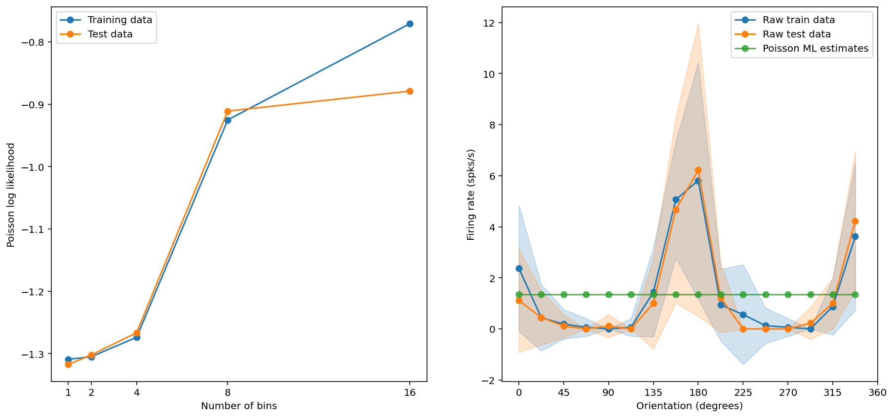
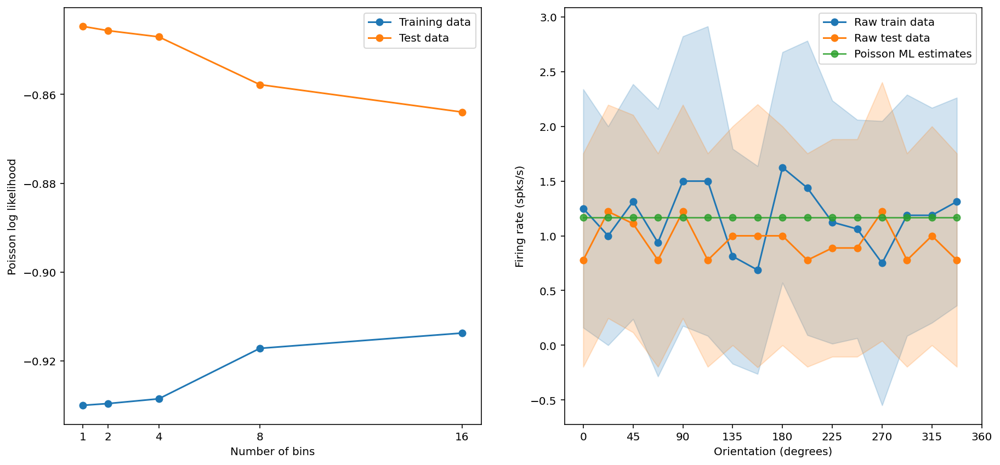
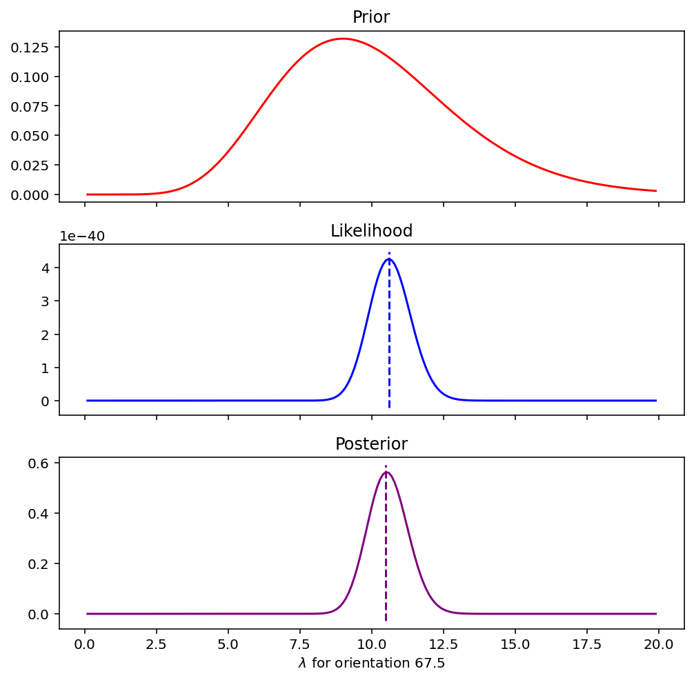
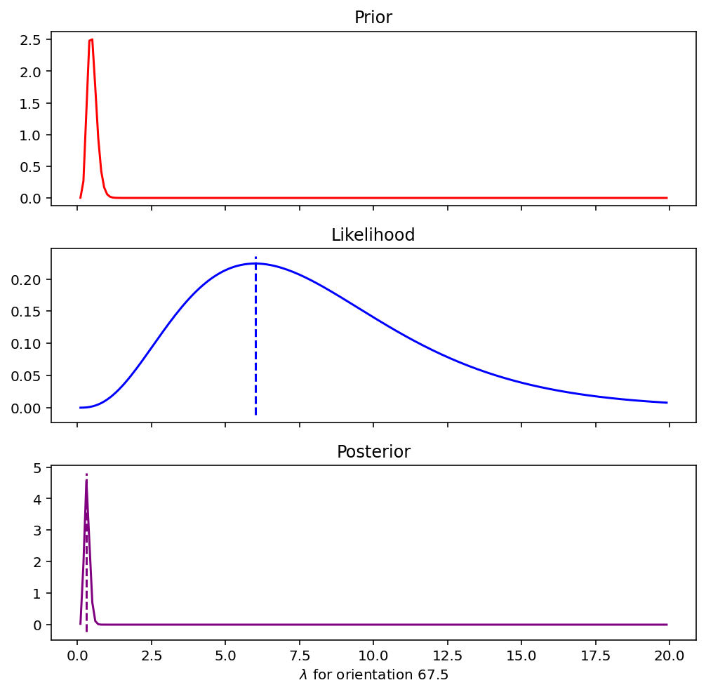

# Exercise 1 Write Up

Joshua Cook

2022-02-02

---

## Poisson vs. Gaussian likelihood

Below is the derivation of the maximum likelihood estimate for $\lambda_j$. The strategy is the same as was demonstrated for the Gaussian distribution: take the derivative of the log-likelihood w.r.t $\lambda_j$, set the result equal to 0, and solve for $\lambda_j$.

1. Derivative of the log-likelihood w.r.t to $\lambda_j$.

\begin{math}
\begin{aligned}
 \frac{d}{d \lambda_j} p(y_{j, 1:N_j} | x_j, \lambda_j) &= \left( \frac{1}{\lambda_j \Delta} \Delta \right) \sum_{n=1}^{N_j} y_{j,n} - N_j \Delta - 0 \\
 &= \frac{1}{\lambda_j} \sum_{n=1}^{N_j} y_{j,n} - N_j \Delta
\end{aligned}
\end{math}

2. Set equal to zero and solve for $\lambda_j$.

\begin{math}
\begin{aligned}
0 &= \frac{d}{d \lambda_j} p(y_{j, 1:N_j} | x_j, \lambda_j) \\
0 &= \frac{1}{\lambda_j} \sum_{n=1}^{N_j} y_{j,n} - N_j \Delta \\
\frac{1}{\lambda_j} \sum_{n=1}^{N_j} y_{j,n} &= N_j \Delta \\
\hat{\lambda}_j &= \frac{1}{N_j \Delta} \sum_{n=1}^{N_j} y_{j,n}
\end{aligned}
\end{math}

Therefore, the MLE for $\lambda_j$ is just the mean of the summed spike counts for orientation $j$.

The likelihood for the Poisson distribution is higher than the Gaussian distribution.
Realizations from the Gaussian distribution can be any real number whereas those from a Poisson distribution are restricted to non-negatives.
A key difference due to these properties of the distributions manifests as the distributions localize near 0 because the likelihood under the Poisson distribution will be restricted by the lower bound whereas the Gaussian distribution is not.
In this case, the Poisson perhaps provides a more natural description of the distribution of spike counts because they are non-negative integer values and the underlying explanatory parameter can be thought of as a rate, a common descriptor for the Poisson parameter $\lambda$.

We used the log-likelihood for measuring performance in CV instead of an error function like MSE because MSE would penalize over-estimates and under-estimates of the same magnitude equally, but our likelihood function, the Poisson distribution, is not symmetrical.
Therefore, the using the log-likelihood is preferable in this situation, because it naturally accounts for the asymmetry of the distribution.

## Effects of binning the orientations

Assuming that bins are combined/split per the strategy described in the exercise, the training log-likelihood cannot decrease by increasing the number of bins because we are calculating the maximum likelihood estimate for $\lambda$.
As the number of bins increases, the MLE covers fewer observations and can become more precise for that subset of data.

For neuron 3, the best model used 16 bins.
The log-likelihood was the highest for both the training and test data with 16 bins (Figure \ref{fig:neuron3}).
There is a larger jump in the training log-likelihood and the testing from 8 to 16 bins, so with a full implementation of CV, it is possible that 8 bins would be superior and 16 is over-fitting.
For neuron 5, the optimal number of bins was 1 because the testing log-likelihood only decreased for increasing number of bins indicating over-fitting (Figure \ref{fig:neuron5}).

{#fig:neuron3 width=75%}

{#fig:neuron5 width=75%}

## Effect of the prior distribution

### Interplay between the prior, likelihood, and posterior

The MLE does not have an informative prior (alternatively, it has a uniform prior), so it is unaffected by changing the prior distribution used for MAP.

The location of the prior distribution determines in what direction the posterior is influenced and the variance indicates how influential the prior is on the posterior.
Generally speaking, $\alpha$ controls the location of the mass of the prior distribution and $\beta$ the width (inversely proportional to the precision).
The prior distribution will pull the posterior towards itself by weighting the probability of each value of $\lambda$.

The less variance in the prior, an indicator of the amount of prior knowledge, the more influential prior data will be on the posterior.
With more observations, the likelihood becomes more influential on the posterior.
With no data, the posterior is the same as the prior distribution.
These dynamics can be viewed by comparing Figure \ref{fig:high-var} with a high variance prior $\text{Gam}(10, 1)$ and Figure \ref{fig:low-var} with a low variance prior $\text{Gam}(10, 20)$, holding the likelihood constant.
On the other hand, reducing the amount of data weakens the likelihood and the posterior appears very similar to the prior (Figure \ref{fig:low-like}).

{#fig:high-var width=50%}

{#fig:low-var width=50%}

{#fig:low-like width=50%}

The prior and posterior are probability distributions and thus must sum to 1.
The likelihood is not a probability distribution because it is conditioned on $\lambda$.
It is proportional to a probability by a constant factor; in Bayesian statistics, this is the marginal likelihood $p(y)$.

The priors could be improved by having a specific prior per neuron based on our knowledge of the biology of these neurons.
Neuron 5 is different from the others in that the number of spikes remains fairly constant across all orientations.
If we had prior knowledge that this was the case, we could provide a prior with a specific average and smaller variance to assist the MAP estimates.

### Regularization

The prior relates directly to regularization in that it restricts the posterior distribution.
It puts weights over values of the parameters in accordance with how likely those values are to be the true value before seeing the data.
In this case, the prior can restrict the estimates for $\lambda$ within reasonable values based off of the known biology instead of implicitly stating that all possible values of $\lambda$ (which includes infinity) are equally likely _a priori_.
For common regularization method such as LASSO, the penalty term is akin to a prior in that is describes our belief that the sum of the coefficients should be small.

In our exercise, the MAP estimates are pulled towards the mean of the prior distribution.
In this case that is fixed at 4.

The regularization of the prior only helps MAP outperform MLE as measured by the fit model's log-likelihood sometimes.
MAP estimates will be partially regularized towards the prior.
The amount of regularization is determined by the variance in the prior.
If the prior is too stringent, it can overly restrict MAP estimates.
On the other hand, the prior can help regularize the MAP estimates compared to MLE when the data is highly variable or sparse (which are related properties of the data).

With less data, the prior helps the MAP estimates substantially.
The MLE becomes less stable with less data and is undefined with no data.
Instead, the MAP estimates are regularized towards the prior.
The prior distribution is acting like our specific domain knowledge and helping the MAP estimates remain "reasonable."

## CV and model evidence

Model evidence and cross-validation do not always pick the same model as best.
One reason for this discrepancy is that with Bayesian model evidence, all of the data can be used to fit the model and the log posterior predictive likelihood can be computed across all data points, not just the held-out test data subset.

The two approaches make slightly different assumptions about the data.
The CV approach has a more frequentist view of the data generation process in that it is measures how well the model performs by estimating how good the model parameters are at predicting the likelihood of observing the test data.
Alternatively, the Bayesian model evidence approach estimates how well the parameters describe the observed data by calculating the likelihood of the data marginalizing over the posterior distributions of the parameters.

The cross-validation approach does not use all of the data to fit the model whereas the Bayesian model evidence does.
Likewise the Bayesian model evidence approach calculates the error on all data points, not just the held-out test data subset.
Further, the model must be fit repeatedly with CV instead of just once as with Bayesian model evidence.
