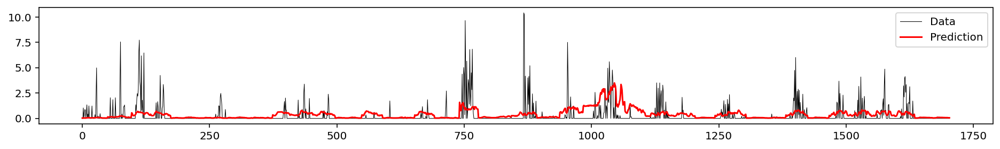
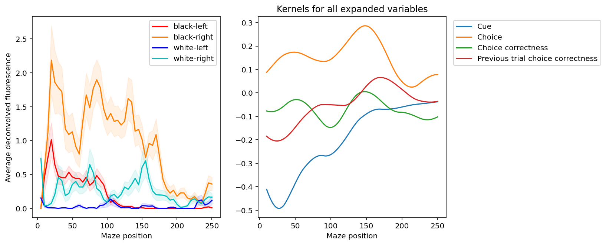
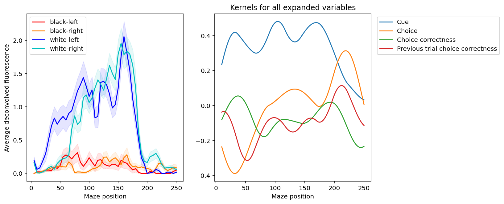

# Exercise 2 Write Up

Joshua Cook

2022-02-23

---

## Section 2: Fitting a basic Poisson GLM

**Qualitatively, do you think that this model predicts the neural recordings well, with the chosen design matrix and model assumptions?**
**What are some things we could try to improve the model?**

The model fits better than randomly guessing or always predicting the global average spike rate, but there is substantial room for improvement (Fig. \ref{fig:simple-model-res}).
One improvement would be to include the spike rates from previous time points so that the model would account for refractory periods and other known phenomena of a neuron's behavior based on its recent past.
Also, including the spike rates of the other neurons for this neuron's predictions could increase accuracy by sharing patterns learned by the other neurons.

{#fig:simple-model-res width=75%}

**How do you interpret the model's performance on the training versus test sets?**

There is some slight over-fitting because the fraction of deviance explained is greater on the training data than the test data (Fig. \ref{fig:simple-model-dev}).
That said, there is visually some correlation between the observed and predicted spike rates in the test data indicating that the model is identifying some real patterns.

**Does it appear to be overfitting to the training data? How could we address overfitting, if it is occurring?**

Over-fitting could be addressed by regularizing the parameters.

{#fig:simple-model-dev width=75%}

## Section 3: Adding regularization with cross-validation

**Did regularization help the model fit the training data better?**
**Why or why not?**

Marginally because the amount of regularization was minimal.

**Did it help fit the test data better?**
**Why or why not?**
**(Hint: The training fit quality and the test fit quality only changed by small amounts with regularization, but both were guaranteed to change in the direction they changed.**
**Try to think about why.)**

The regularization improved the $D^2$ of the model on both the training and test data, but helped the model more on predictions on the test data than on the training data (Fig. \ref{fig:regularized-model-dev}).
The improvement on the training data is slight and could be due to stochastic differences during fitting.
The improvement on the test data is larger (though still small) and was likely attributable to the regularization reducing over-fitting of the model.
The provided "Hint" says that regularization was guaranteed to improve the $D^2$ for both the training and test data, but this does not hold for higher values for $\alpha$.
Therefore, I don't think this is outcome was determined by the formulae for $D^2$ or the structure of the model, but instead due to the heuristic that a bit of regularization often improves model performance.

{#fig:regularized-model-dev width=75%}

## Section 4: Basis expansion

**Compare the kernels to the average activity within each of the 4 trial types.**
**Do the kernels we obtained from the GLM make sense?**

The kernels do seem to make sense when compared to the average calcium activity in the neurons.
For instance, the kernel for "cue" tends to be more negative when the black conditions have the highest calcium activity and more positive when the white conditions have more calcium activity.
Also, the "choice" kernel is more positive when the calcium activity is high and the mouse makes the correct choice.
This is apparent, for example, with neuron 4 (Fig. \ref{fig:n4-basis-expansion}).

{#fig:n4-basis-expansion width=75%}

**What do the kernels tell you that the average activity doesn't?**

The kernels are able to identify associations between experimental conditions and outcomes that are mixed together when looking at the average activities over the course of the maze.
For instance, the activity of neuron 0 is associated with the white cue for most of the maze, but then switches to being associated with right (as in direction) choice at the end of the maze (Fig. \ref{fig:n0-basis-expansion}).
However, this late activity is not necessarily associated with making the correct decision because it is not associated with the black condition choosing to go left.
This pattern, while obscured in the plot of the neuronal activity over the course of the maze, can be identified in the kernels.

{#fig:n0-basis-expansion width=75%}

## Section 5: Activity history

**Describe the temporal tuning function.**
**What does this tell you that you couldn't have known from the average tuning functions at the start of this exercise?**

The temporal tuning function allows the model for a neuron's activity to use the previous activity of the neuron to estimate the current activity.
Using a spline with different amounts of variance in the bases allows the model to identify short-term and long-term patterns.
Incorporating this set of features and finding that it improves the model's performance indicates that each neuron's previous activity influences its current and future activity.
This is hidden in the initial data visualizations between we were looking at neuronal activity averaged over a group of neurons.

## Section 6: Coupling

**Describe the coupling profiles between neurons.**
**What does this tell you that you couldn't have known from the average tuning functions at the start of this exercise?**

There some neurons with positive association in activity and some negative associations (Fig. \ref{fig:neuron-coupling}).
Further, there is a time-dependent component to these associations as determined by the oscillations in the coupling profiles.

{#fig:neuron-coupling width=100%}

**How did your fraction deviance explained change for training and testing sets?**
**What do you conclude from observing those changes?**

The fraction deviance explained increased for both the train and test data.
This indicates that there are measurable correlations between in the activity of the neurons and that the increase in model performance is not due to overfitting, but is instead identifying a repeating pattern.

## Section 7: All neurons

**How does the best regularization strength tend to change for more complex models?**
**Why does that make sense?**

The optimal amount of regularization increases as the models increase in complexity.
For instance, for neuron 0, the optimal values of $\alpha$ were 0.02 for the simple model with CV, 0 for the basis expansion model, 0.1 for the history model, and 0.3 after coupling was added.
This is normal because the parameter space is increasing and the models are more prone to over-fit.

**You added many different features to the design matrix over the course of this exercise.**
**Which ones had the largest effect on model performance for different neurons?**
**What do you conclude about the neural encoding properties?**

The models of the neurons showed differences in the degree of improvement with the addition of each set of features.
For example neuron 11 benefited most from the addition of spike history (Fig. \ref{fig:n11-all-features-comparsion}) whereas neuron 9 had a large improvement with the addition of the basis expansion of the calcium activity and marginal differences with the later additions of spike history and population dynamics (Fig. \ref{fig:n9-all-features-comparsion}).
This diversity of responses indicates that the neurons have distinct dependencies on various inputs that can be further investigated experimentally to fully demonstrate their differential behavior to stimuli.

{#fig:n11-all-features-comparsion width=75%}

{#fig:n9-all-features-comparsion width=75%}
