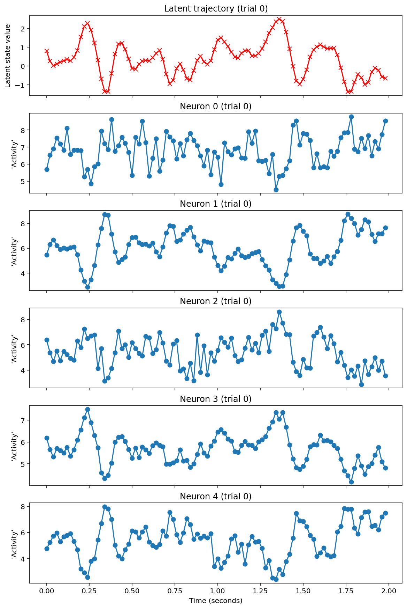
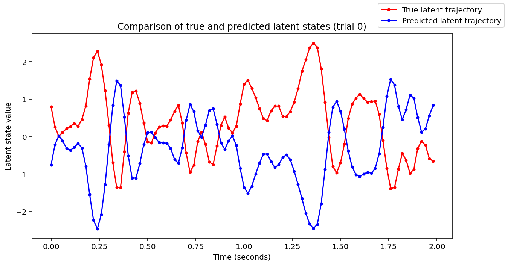
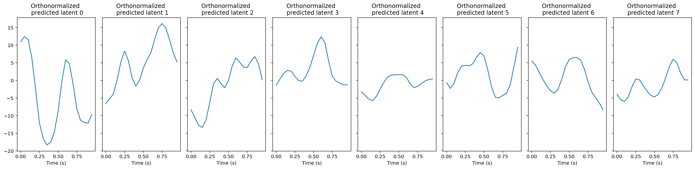
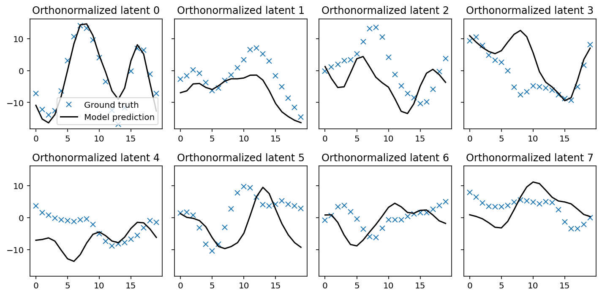
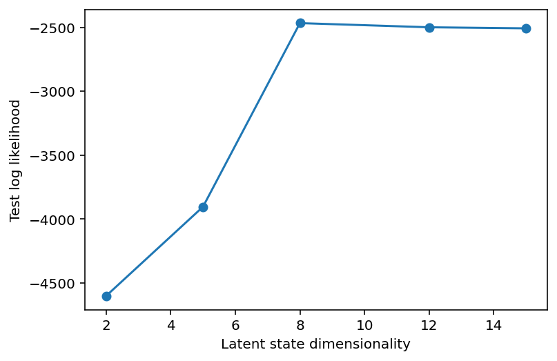
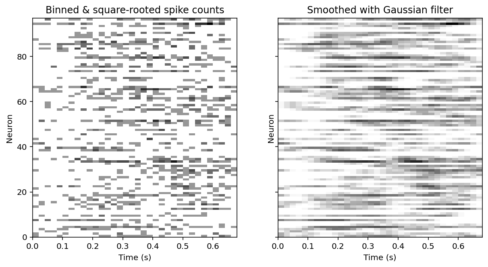
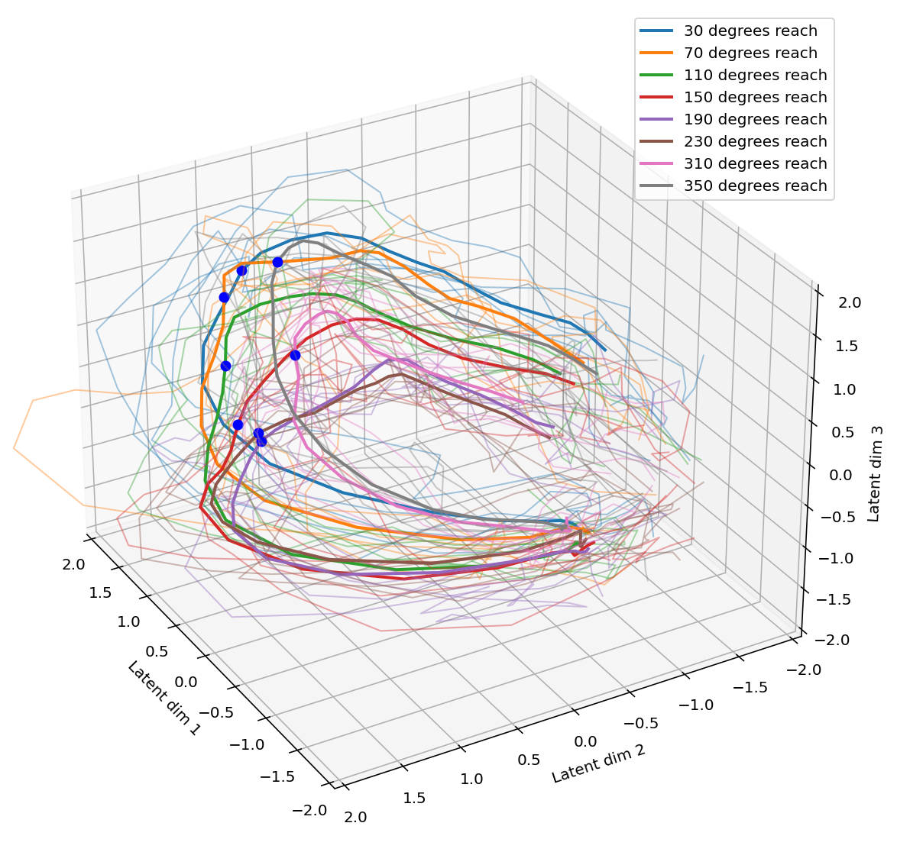
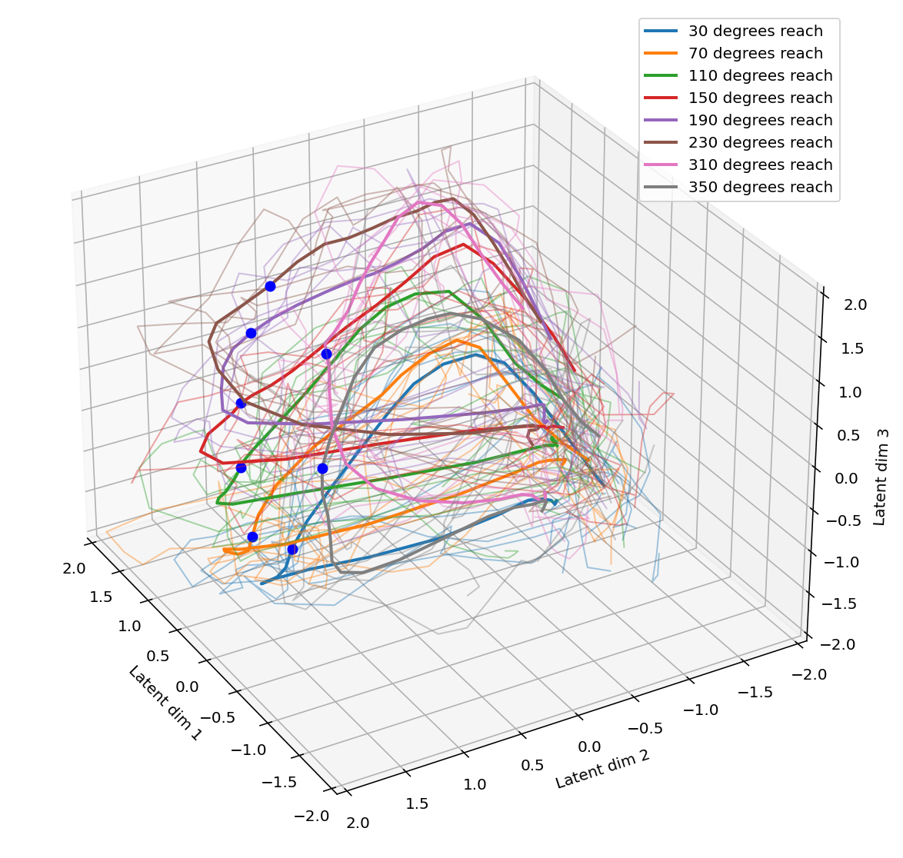
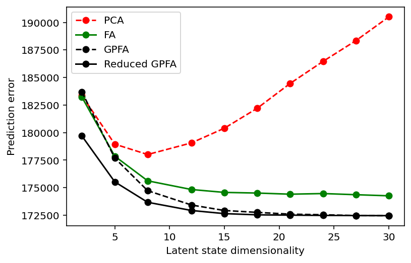

# Exercise 3: Gaussian Process Factor Analysis (GPFA)

> The neural data have been generously provided by the laboratory of Prof. Krishna Shenoy at Stanford University. The data are to be used exclusively for educational purposes in this course.


This exercise has a few parts that will help you develop an intuition for how GPFA works.

**Section 1**: You will generate some synthetic data and then fit the parameters of a GPFA model to your synthetic data to see how well GPFA performs at discovering the true parameters underlying your data.
The synthetic data will come from you using a Gaussian Process to simulate the trajectory of a 1-dimensional latent state over time, and then generating activity traces for a few neurons that are modulated by the value of the latent state.

**Section 2**: You will investigate more complex simulated data driven by a higher dimensional latent space.
We'll look at how to determine the dimensionality of the latent space and how predicted latent states compare to the true ones.

**Section 3**: You will perform a set of analysis steps very similar to what was done in [1] (the paper we read for Session 7, which develops GPFA), but using a different dataset.
Specifically, we'll be using the data from [3].

**Section 4**: Using the real data, you will compare PCA, factor analysis, and GPFA.

Once you have completed the exercise, please describe the results of your exercise, and your interpretation of the results *(suggested length: 450-650 words).*
Use figures to help describe your results; please embed the figures in your text description.
Questions for you to discuss in your write-up are also flagged with **TO-DO:**.

**Submit the write-up before noon on the day of the next session.**

Much of the crucial code is already implemented for you. Just follow the **TO-DO** signs to complete the problem set.

*Acknowledgements: This exercise was adapted by Ella Batty based on a previous version by Jasper Maniates-Selvin and Adam Lowet.*

[1] Yu BM, Cunningham JP, Santhanam G, Ryu SI, Shenoy KV, Sahani M. 2009. Gaussian-process factor analysis
for low-dimensional single-trial analysis of neural population activity. J. Neurophysiol. 102(1):614–35.
<br/>
[2] Lawlor PN, Perich MG, Miller L, Kording KP. 2018. Linear-nonlinear-time-warp-poisson models of neural activity. J. Comput. Neurosci. 45:173–91.
<br/>
[3] Yu, B. M., Kemere C., Santhanam, G., Afshar, A., Ryu, S. I., Meng, T.H., Sahani, M., & Shenoy, K.V. (2007) Mixture of trajectory models for neural decoding of goal-directed movements. Journal of Neurophysiology, 97(5), 3762-3780.

For your convenience, here are all the **TO-DO**s from throughout the exercise.
They will make more sense in context.

* Complete the  `generate_trajectories` function below to generate both the latent trajectories during each trial and the neural activity governed by those latent trajectories according to the GPFA equations in [1].
* Look at neural activity in trial 0 and describe the differences you observe between the first 4 neurons. Inspect equation 1, the data above, and your values for C, d, and R. Discuss how those parameters affect different aspects of the neural activity. Could you predict how much a neuron's activity is correlated with the latent trajectory from looking at the parameters? How? (You don't have to generate plots to demonstrate this, though you might want to do so if you're not sure of the answer.)
* Complete the code below to initialize the GPFA model with the true number of latents used to simulate the data, and fit it.
* In your write-up, discuss how the EM algorithm did at extracting the true parameters. What what we need to further reduce the error in the extracted parameters?
* Compare the true and predicted latent trajectories. There should be one major difference. Could you have seen this coming after observing the one major difference between the true and predicted parameters in Section 1.4? Explain what's going on in your write-up.
* Use code to find the number of trials and number of neurons contained in the spiking data (`spike_trains`).  How many latent trajectories were used to create the data? The latent trajectories are stored in (`latent_trajectories`). The time bin size is 50ms. How many time bins were used for the latent trajectories?
* Complete the following code to get the log likelihood of the fit for the training and testing data. We will divide by the number of training and testing trials so we can directly compare these values.
* The predicted latents don't match the true latents. Did something go wrong or is this expected? Discuss in your write-up
* Complete the line that performs linear regression to combine the predicted latent trajectories to form each of the true latent trajectories (in `latent_trajectories`) on the first test trial. We'll look at the first 3 true latents.
*  Based on this, do the true and predicted latent trajectories seem to span the same 8-dimensional manifold or not? Explain why or why not. Discuss in your write-up.
*  How does the variance change across non-orthonormalized dimensions 1 through 8? How does it change across orthonormalized dimensions 1 through 8? Do you think the fitted model's non-orthonormalized dimension 1 would resemble the ground truth non-orthonormalized dimension 1? Do you think the fitted model's orthonormalized dimension 1 would resemble the ground truth orthonormalized dimension 1? Why or why not? Discuss in your write-up.
* What underlying dimensionality would you assume the neural data has based on these plots?  Do the log-likelihood and prediction errors give similar results? Why might you use one over the other? Discuss in your write-up.
* Do you find this visualization technique helpful for getting a handle on what the latent trajectories look like? Describe what you see - what happens over time and how does it vary by reach? Does it seem like the neural trajectories are different for different reaches? If so, are they well separated? That is, would you be able to tell what the reach direction was just from observing a single trial trajectory? Does the relationship of the mean neural trajectories relate to the relationship of the reach directions? Discuss in your write-up.
* Perform PCA and FA on the smoothed train spike data. Transform the test data and save the matrices as pc_transform and fa_transform.
* Compare the GPFA trajectories to the PCA and FA plots. What's the major visual difference (look at the individual trials, not the trial average)? What difference in the structure of the models explains the visual difference? Discuss in your write-up.
* From this plot, what can you conclude about the dimensionality of the latent state driving activity in the recorded neurons? Do the different models agree or disagree about this dimensionality? Which result do you think you should trust, and why? Discuss in your write-up.
* Why are we using prediction error here instead of log-likelihood? Discuss in your write-up.
* What is the optimal kernel width for this dataset?

## Setup


```python
import copy
import pickle
from itertools import product
from pathlib import Path
from typing import Any, Optional

import ipywidgets as widgets
import matplotlib.pyplot as plt
import neo
import numpy as np
import quantities as pq
import scipy.io as sio
import scipy.ndimage
from elephant.gpfa import GPFA, gpfa_core, gpfa_util
from IPython.display import Image, display
from matplotlib import animation, rc
from mpl_toolkits.mplot3d.art3d import Line3D
from scipy import linalg
from sklearn import linear_model
from sklearn.decomposition import PCA, FactorAnalysis
from sklearn.metrics import r2_score
```


```python
%matplotlib inline
%config InlineBackend.figure_format='retina'

rc("animation", html="html5")

# plot animations or stills?
ANIMATE = False

data_dir = Path("data", "NB316QC_Ex3_data")
```

## Section 1: Generate and fit synthetic data from a 1-dimensional latent space

With any complicated model, it's always a good idea to perform "model recovery": simulate data according to the generative model that you specify, and then run your model on those data to see if you can recover a close approximation to the ground-truth parameters.
We will start by running GPFA on low-dimensional simulated data.

### Section 1.1. Generate parameters for simulated data

In this section, we will create the parameters we will use to simulate data using the GPFA model from [1].

In the function below, `n_latents` is the dimensionality of the latent state, and `n_neurons` is the dimensionality of the observed state, which in this case is the number of neurons. We will use a latent state dimensionality of 1 and generate activity for 5 neurons. The function below takes those dimensionalities as arguments and generates random parameters governing the relationship between the latent and observed variables.

`C`, `d`, and `R` are defined by equation 1 in [1].

`gamma[i]` is related to $\tau_i^2$ from equation 3, but the model is parameterized slightly differently in this code such that `gamma` also includes the time scaling factor for the spacing between time bins. So, gamma[i] $= (\text{timeBinSize}^2 / \tau_i^2)$.

`eps` is $\sigma_{n,i}^2$ from equation 3 and is set to .001 instead of being determined randomly, same as is done in the paper.

We define a random seed so that the generated parameters are always the same. You can try different seeds if you want to see the behavior under different parameters, but please use the default random seed for generating plots for your write-up (so that all students will have the same output).


```python
def create_GP_covariance_matrices(
    n_latents: int, eps: np.ndarray, gamma: list[float]
) -> list[np.ndarray]:
    """Create covariance matrices for GP using the squared exponential kernel."""
    K = []
    time_differences: np.ndarray = np.tile(
        np.arange(1, n_time_bins + 1).reshape((n_time_bins, 1)), (1, n_time_bins)
    ) - np.tile(np.arange(1, n_time_bins + 1), (n_time_bins, 1))
    for i in range(n_latents):
        # `temp` is the term on the left of the `+` sign in equation 3
        # (but as a matrix for all t1, t2 pairs)
        temp = (1 - eps[i]) * np.exp(-gamma[i] / 2 * time_differences**2)
        # K_i has values given by equation 3 of Yu et al.
        K_i = temp + eps[i] * np.identity(time_differences.shape[0])
        K.append(K_i)

    return K
```


```python
def rand_params_generator(
    n_latents: int, n_neurons: int, random_seed: int = 2
) -> tuple[dict[str, np.ndarray], list[np.ndarray]]:
    """Generate parameters to simulate data assuming a GPFA model

    Args:
      n_latents (int): number of latents underlying neural activity
      n_neurons (int): number of observed nuerons
      random_seed (float): random seed to set for reproducibility

    Returns:
      dict, list: dictionary containing all the parameters (keys are param names),
                list of covariance matrices for the GP for each latent

    """
    # Set random seed for reproducibility
    np.random.seed(seed=random_seed)

    # Create parameters we will estimate
    params = {}

    # gamma determines whether the latent trajectories oscillate quickly
    # (large gammas) or vary more smoothly (small gammas)
    params["gamma"] = np.random.uniform(0.1, 0.3, n_latents).tolist()
    params["eps"] = 1e-3 * np.ones((n_latents,))

    params["d"] = 7 + np.random.normal(0, 1, size=(n_neurons,))
    params["C"] = np.random.normal(0, 1, size=(n_neurons, n_latents))
    params["R"] = np.diag(np.abs(np.random.normal(0, 0.4, n_neurons)))

    # Based on eps & gamma, create covariance matrices using eq. 3 from [1]
    K = create_GP_covariance_matrices(n_latents, params["eps"], params["gamma"])

    return params, K
```


```python
# Set up hyperparameters
n_latents = 1
n_neurons = 5
n_time_bins = 100  # number of time bins of data to simulate per trial
time_bin_size = 0.02  # bin size in seconds
n_trials = 10  # number of trials we will simulate

# Create parameters
params, K = rand_params_generator(n_latents, n_neurons)
print(params)
```

    {'gamma': [0.18719898042840075], 'eps': array([0.001]), 'd': array([7.04555144, 6.56516985, 5.04620359, 5.41311831, 5.92554448]), 'C': array([[-0.61722311],
           [-1.50100687],
           [ 0.8935898 ],
           [ 0.73954567],
           [-1.42356496]]), 'R': array([[0.4442911 , 0.        , 0.        , 0.        , 0.        ],
           [0.        , 0.03543203, 0.        , 0.        , 0.        ],
           [0.        , 0.        , 0.54169222, 0.        , 0.        ],
           [0.        , 0.        , 0.        , 0.02330828, 0.        ],
           [0.        , 0.        , 0.        , 0.        , 0.19203394]])}


### Section 1.2: Generate a latent space & neural trajectories

**TO-DO:** Complete the  `generate_trajectories` function below to generate both the latent trajectories during each trial and the neural activity governed by those latent trajectories according to the GPFA equations in [1]. ✅

Note: the neural activity we are generating here is the square-rooted binned spike counts. We'll convert to spike times later.


```python
def generate_trajectories(
    params: dict[str, np.ndarray],
    K: list[np.ndarray],
    n_trials: int,
    n_latents: int,
    n_neurons: int,
    n_time_bins: int,
    random_seed: int = 3,
) -> tuple[np.ndarray, np.ndarray]:
    """Generate latent and neural trajectories given parameters

    Args:
      params (dict): dictionary containing all the parameters (keys are param names)
      K (list): list of covariance matrices for the GP for each latent
      n_trials (int): number of trials of data to simulate
      n_latents (int): number of latent dimensions to simulate
      n_neurons (int): number of neurons to simulate
      n_time_bins (int): number of time steps to simulate
      random_seed (float): random seed to set for reproducibility

    Returns:
      ndarray, ndarray: n_trials x n_latents x n_time_bins array containing latent trajectories,
                n_trials x n_neurons x n_time_bins array containing neural activity
    """
    np.random.seed(seed=random_seed)

    # Initialize storage arrays.
    latent_trajectories = np.zeros((n_trials, n_latents, n_time_bins))
    neural_trajectories = np.zeros((n_trials, n_neurons, n_time_bins))

    C, d, R = params["C"], params["d"], params["R"]

    # Loop through trials.
    for i_trial in range(n_trials):
        # Create latent trajectories by looping through latent dimensions
        for i_latent in range(n_latents):
            # Sample this latent trajectory over n_time_bins using eq 2 from [1].
            latent_trajectories[i_trial, i_latent] = np.random.multivariate_normal(
                mean=np.zeros(n_time_bins), cov=K[i_latent]
            )
        # Create observed neural trajectories by looping through time bins
        for i_t in range(n_time_bins):
            # Sample neural activity for all neurons for this time bin using
            # eq 1 from [1].
            neural_trajectories[i_trial, :, i_t] = np.random.multivariate_normal(
                mean=C.dot(latent_trajectories[i_trial, :, i_t]) + d, cov=R
            )

    return latent_trajectories, neural_trajectories


# Generate simulated data
latent_trajectories, neural_trajectories = generate_trajectories(
    params, K, n_trials, n_latents, n_neurons, n_time_bins
)
```

### Section 1.3: Visualize simulated data

Look at the demo below to visualize the simulated data. You can change the trial you are looking at.


```python
@widgets.interact(i_trial=widgets.IntSlider(value=0, min=0, max=n_trials))
def plot_simulated_data(i_trial: int) -> None:
    fig, ax = plt.subplots(
        n_neurons + 1,
        1,
        sharex=True,
        figsize=(8, 2 * (1 + n_neurons)),
        constrained_layout=True,
    )

    # Plot the latent state
    t_vec = time_bin_size * np.arange(n_time_bins)
    ax[0].plot(t_vec, latent_trajectories[i_trial].T, "rx-")
    ax[0].set_title("Latent trajectory (trial {})".format(i_trial))
    ax[0].set_ylabel("Latent state value")

    # Plot neural activities
    for i_neuron in range(n_neurons):
        ax[i_neuron + 1].plot(t_vec, neural_trajectories[i_trial, i_neuron].T, "o-")
        ax[i_neuron + 1].set_title("Neuron {} (trial {})".format(i_neuron, i_trial))
        ax[i_neuron + 1].set_ylabel("'Activity'")

    ax[n_neurons].set_xlabel("Time (seconds)");
```


    interactive(children=(IntSlider(value=0, description='i_trial', max=10), Output()), _dom_classes=('widget-inte…


```python
plot_simulated_data(i_trial=0)
```





**TO-DO:** Look at neural activity in trial 0 and describe the differences you observe between the first 4 neurons.
Inspect equation 1, the data above, and your values for C, d, and R.
Discuss how those parameters affect different aspects of the neural activity.
Could you predict how much a neuron's activity is correlated with the latent trajectory from looking at the parameters?
How?
(You don't have to generate plots to demonstrate this, though you might want to do so if you're not sure of the answer.) ✅

The primary difference between the neurons is the amount of noise around the underlying curve of the latent process.
This property of the neuron is predominately controlled by the covariance matrix $R$ for $y|x$.
The larger the value along the diagonal, the more variance in the neuron's activity.

The other difference between neurons is how they are correlated with the latent trajectory.
Some are directly and others are inversely proportional, that is, when the latent trajectory goes up, some neurons reliably increase in activity and others decrease.
This is controlled by the sign of the neuron's corresponding value in $C$.
The amplitude of the neurons activity in relation to the latent trajectory is determined by the size of the neuron's value in $C$.

Pretend you didn't already have a plot of the latent state, and just look at the neural activity.
Could you predict the general shape of a latent trajectory that may underlie the observed activity?
Given the strong (anti-)correlation between neuron 1 and neuron 3 on every trial, you could make a pretty good guess that a latent state with a similar trajectory to the neuron 1 and neuron 3 activity could be driving their activity. Note however that there's no way to know if the latent trajectory is positively correlated with neuron 1 or instead is flipped and is positively correlated with neuron 3.
This invariance to sign flips in the latent state is a common feature of state space models.

The goal of GPFA is to be able to do exactly this kind of inference - to predict low-dimensional latent trajectories that are best able to explain the correlations observed in the neural recordings.
Specifically, GPFA fits a timescale parameters ($\tau_i$ in the paper, gamma in this exercise) which govern the smoothness of the latent trajectory in each latent dimension, as well as fitting C, d, and R, which you just discussed in your write-up.
After fitting these parameters to using many trials of data, the most likely latent trajectory can be calculated for any single trial (either one in the training set or not).

### Section 1.4: Estimate parameters using GPFA

We will be using a Python library called [Elephant](https://elephant.readthedocs.io/en/latest/) for GPFA.
This is a library based on the original Matlab code by Byron Yu.

In order to run GPFA, we need to change the format of our neural data.
Right now, we have generated the square root of spike counts ($y$ in [1]), we picked the average value of `d` so these values are mostly positive. GPFA in Elephant requires spike times, not the square root of spike counts.
It handles the binning of spikes and the square-rooting of those spike counts internally.
The following code cell creates spike times from the spike counts.

Additionally, our GPFA implementation requires a very specific data format.
We need a list of lists.
The outer list is over trials, and the inner lists are over neurons.
Each element of the inner list contains the spike times for that trial and that neuron in a special data format, the SpikeTrain data format from another library `neo`.
The following code also puts the data in the required format.
You don't need to change anything in the code.


```python
SpikeTrainData = list[list[neo.SpikeTrain]]


def generate_spike_trains(
    neural_trajectories: np.ndarray,
    n_trials: int,
    n_neurons: int,
    n_time_bins: int,
    time_bin_size: float,
) -> SpikeTrainData:
    # Rectify neural trajectories
    neural_trajectories = neural_trajectories * (neural_trajectories > 0)
    # Create spike counts from neural trajectories
    spike_counts = np.round(neural_trajectories**2).astype("int")
    # Generate spike times
    spike_trains: SpikeTrainData = []

    for i_trial in range(n_trials):
        trial_st = []
        for i_neuron in range(n_neurons):
            neuron_st = []
            for i_bin in range(n_time_bins):
                spike_count = spike_counts[i_trial, i_neuron, i_bin]

                bin_start = i_bin * time_bin_size
                bin_end = (i_bin + 1) * time_bin_size

                neuron_st += list(
                    np.random.uniform(bin_start, bin_end, size=(spike_count,))
                )

            trial_st.append(
                neo.SpikeTrain(
                    neuron_st,
                    units="sec",
                    t_stop=time_bin_size * n_time_bins,
                )
            )

        spike_trains.append(trial_st)

    return spike_trains
```


```python
spike_trains = generate_spike_trains(
    neural_trajectories, n_trials, n_neurons, n_time_bins, time_bin_size
)
```

**TO-DO:** Complete the code below to initialize the GPFA model with the true number of latents used to simulate the data, and fit it. ✅

See the documentation here for help: https://elephant.readthedocs.io/en/latest/reference/_toctree/gpfa/elephant.gpfa.gpfa.GPFA.html#elephant.gpfa.gpfa.GPFA.transform


```python
# Set up bin size in format required by GPFA
bin_size = (time_bin_size * 1000) * pq.ms

# Initialize GPFA
gpfa = GPFA(bin_size=bin_size, x_dim=n_latents)

# Fit GPFA
gpfa.fit(spiketrains=spike_trains)
```

    Initializing parameters using factor analysis...

    Fitting GPFA model...


    GPFA(x_dim=1)


The extracted parameters can be access through a `params_estimated` data attribute. Here we print the extracted parameters and the true parameters to see how well they match.


```python
for param_name in params.keys():
    print(f"True {param_name} \n", params[param_name])
    print(f"Fitted {param_name} of GPFA model\n", gpfa.params_estimated[param_name])
    print("-" * 20)
```

    True gamma
     [0.18719898042840075]
    Fitted gamma of GPFA model
     [0.18893552]
    --------------------
    True eps
     [0.001]
    Fitted eps of GPFA model
     [0.001]
    --------------------
    True d
     [7.04555144 6.56516985 5.04620359 5.41311831 5.92554448]
    Fitted d of GPFA model
     [7.04600079 6.51071264 5.03177859 5.4341881  5.84483911]
    --------------------
    True C
     [[-0.61722311]
     [-1.50100687]
     [ 0.8935898 ]
     [ 0.73954567]
     [-1.42356496]]
    Fitted C of GPFA model
     [[ 0.61278453]
     [ 1.47103102]
     [-0.88446816]
     [-0.72621295]
     [ 1.40630922]]
    --------------------
    True R
     [[0.4442911  0.         0.         0.         0.        ]
     [0.         0.03543203 0.         0.         0.        ]
     [0.         0.         0.54169222 0.         0.        ]
     [0.         0.         0.         0.02330828 0.        ]
     [0.         0.         0.         0.         0.19203394]]
    Fitted R of GPFA model
     [[0.43826359 0.         0.         0.         0.        ]
     [0.         0.0331811  0.         0.         0.        ]
     [0.         0.         0.52131594 0.         0.        ]
     [0.         0.         0.         0.024471   0.        ]
     [0.         0.         0.         0.         0.18756905]]
    --------------------


**TO-DO:** In your write-up, discuss how the EM algorithm did at extracting the true parameters. What would we need to further reduce the error in the extracted parameters? ✅

GPFA was very good at recovering the true parameters of the simulated data.
This is not surprising as the data was created using the generative model described by GPFA.
Better estimates could probably be obtained by increasing the amount of data or limiting the size of variance parameters.
The main discrepancy between the true and estimated parameters is that the signs for the values of $C$ are inverted.
This is possible between the direction of the latent trajectory can be inverted simultaneously to produce the same observed neuron activity.

### Section 1.5: Compare predicted latent trajectory to true trajectory

We can use the `transform` method of the GPFA object to return the predicted latent trajectories based on the estimated parameters:


```python
predicted_latent_trajectories = gpfa.transform(
    spike_trains, returned_data=["latent_variable"]
)
```

Note that we need to specify what we want the returned data to be. We can also return orthogonalized latent trajectories, the binned and square-rooted neural data, and some covariance matrices.

Visualize the predicted vs true latents using the following code. You can change the trial of data you are examining.


```python
@widgets.interact(i_trial=widgets.IntSlider(value=0, min=0, max=n_trials - 1))
def plot_latent_trajectories(i_trial: int) -> None:
    t_vec = time_bin_size * np.arange(n_time_bins)

    fig, ax = plt.subplots(1, 1, figsize=(10, 5))
    ax.plot(
        t_vec, latent_trajectories[i_trial].T, "r.-", label="True latent trajectory"
    )
    ax.plot(
        t_vec,
        predicted_latent_trajectories[i_trial].T,
        "b.-",
        label="Predicted latent trajectory",
    )

    ax.set(
        ylabel="Latent state value",
        xlabel="Time (seconds)",
        title=f"Comparison of true and predicted latent states (trial {i_trial})",
    )
    fig.legend()
```


    interactive(children=(IntSlider(value=0, description='i_trial', max=9), Output()), _dom_classes=('widget-inter…


```python
plot_latent_trajectories(i_trial=0)
```





Hint: Your plot from the cell above for `i_trial` of 0 should look exactly like the image below, but with the predicted latent trajectory as well.
If you don't get exactly this output for the latent trajectory, double check your code (and that you didn't change any random seeds), and if everything still looks right to you, contact Shih-yi.


```python
display(Image(data_dir / "example_predicted_traj.png"))
```


**TO-DO:** Compare the true and predicted latent trajectories. There should be one major difference. Could you have seen this coming after observing the one major difference between the true and predicted parameters in Section 1.4? Explain what's going on. ✅

The major difference is that the real and estimated latent trajectories are inverted.
This was expected because the estimated values for $C$ were the inverse of the true values of $C$.
These two entities are multiplied against each other to relate the latent state to the observed neuronal activity.
The estimates are the inverse of the true parameters, but the multiplication results in the same neuronal activity.

## Section 2: Investigating more complex simulated data

In this section, we'll dive into some more complex simulated data that was generated using 8 latent dimensions (instead of 1).  We'll look again at how predicted latent states compare to the true ones and at how to determine the dimensionality of the latent space.

### Section 2.1: Create higher-dimensional simulated data

Run the next cell to load a larger simulated dataset, generated a similar way to the data in Section 1 but with 8 latents.


```python
with open(data_dir / "section2_simulated_data.pickle", "rb") as file:
    spike_trains = pickle.load(file)
    latent_trajectories = pickle.load(file)
    true_C = pickle.load(file)
```

**TO-DO:** Use code to find the number of trials and number of neurons contained in the spiking data (`spike_trains`).
How many latent trajectories were used to create the data? The latent trajectories are stored in (`latent_trajectories`).
The time bin size is 50 ms.
How many time bins were used for the latent trajectories? ✅

There were 8 latent dimensions with 20 time bins.

Remember that we use the same latent trajectories for every trial.


```python
n_trials = len(spike_trains)
n_neurons = len(spike_trains[0])
n_time_bins = latent_trajectories.shape[2]
time_bin_size = 0.05
n_latents = latent_trajectories.shape[1]
n_true_latent = n_latents

print(f"   n_trials: {n_trials}")
print(f"  n_neurons: {n_neurons}")
print(f"n_time_bins: {n_time_bins}")
print(f"  n_latents: {n_latents}")
```

       n_trials: 5
      n_neurons: 53
    n_time_bins: 20
      n_latents: 8


### Section 2.2: Fitting GPFA

Let's fit GPFA on this data!
Unlike before, we will split the trials into train and test trials.
We should do *k*-fold cross-validation but we want to save some time in this tutorial.
This will take a couple minutes so please be patient.


```python
# Get info on train/test splits
n_train_trials = int(0.8 * n_trials)
n_test_trials = n_trials - n_train_trials
train_inds = np.arange(0, n_train_trials)
test_inds = np.arange(n_train_trials, n_trials)

# Set up bin size in format required by GPFA
bin_size = (time_bin_size * 1000) * pq.ms

# Initialize GPFA
n_latents = 8
gpfa = GPFA(bin_size=bin_size, x_dim=n_latents)

# Fit GPFA on training data
gpfa.fit(spike_trains[:n_train_trials])
```

    Initializing parameters using factor analysis...

    Fitting GPFA model...


    GPFA(bin_size=array(50.) * ms, x_dim=8)


**TO-DO:** Complete the following code to get the log likelihood of the fit for the training and testing data.
We will divide by the number of training and testing trials so we can directly compare these values. ✅

Hints: `spike_trains[n_train_trials:]` gives the test data. Use the `score` method: https://elephant.readthedocs.io/en/latest/reference/_toctree/gpfa/elephant.gpfa.gpfa.GPFA.html#elephant.gpfa.gpfa.GPFA.transform


```python
# Compute log-likelihood on train data.
LL_train = gpfa.score(spike_trains[:n_train_trials])
print(f"Log likelihood of the training set: {LL_train / n_train_trials}")

# Compute log-likelihood on test data
LL_test = gpfa.score(spike_trains[n_train_trials:])
print(f"Log likelihood of the testing set: {LL_test / n_test_trials}")
```

    Log likelihood of the training set: -1001.0948519341218
    Log likelihood of the testing set: -1072.40957698274


### Section 2.3: Visualize GPFA trajectories

Next, let's plot the estimated latent trajectories  over time.
In the first row, each subplot shows the true latent trajectories for one latent dimension.
In the second row, each subplot shows a single latent dimension extracted by GPFA for the first trial.


```python
# Get predicted trajectories
outs = gpfa.transform(
    spike_trains, returned_data=["latent_variable", "latent_variable_orth"]
)
predicted_latent_trajectories = outs["latent_variable"]
predicted_latent_trajectories_orth = outs["latent_variable_orth"]
```


```python
fig, axes = plt.subplots(2, 8, figsize=(20, 5), sharex=True)
t_vec = np.arange(0, n_time_bins) * time_bin_size
i_trial = test_inds[0]
for i_latent in range(n_latents):
    axes[0][i_latent].plot(t_vec, latent_trajectories[i_trial][i_latent])
    axes[0][i_latent].set(title=f"True latent dim {i_latent}")
    axes[1][i_latent].plot(t_vec, predicted_latent_trajectories[i_trial][i_latent])
    axes[1][i_latent].set(title=f"Predicted latent dim {i_latent}", xlabel="Time (s)")

plt.tight_layout()
```


**TO-DO:** The predicted latents don't match the true latents. Did something go wrong or is this expected? ✅

This was expected.
The ordering of the latent dimensions is arbitrary, though GPFA may have automatically ordered the predicted latent trajectories by their explained data covariance metric.
In addition, it is possible that the latent space can be described equally well by multiple different sets of latent state trajectories.

### Section 2.4: Compare model estimates to the ground-truth data

We need a way to compare predicted latent trajectories to true ones to determine if GPFA has extracted the correct underlying low dimensional structure.
As you were asked to think about above, the predicted and true latent trajectories won't necessarily appear similar even if the model fitting went well.
However, the space spanned by the predicted trajectories should be the same as the space spanned by the latent trajectories if the model extracted the overall latent space correctly.

To see whether this is true, we can do two different tests.
As done in the paper, we can perform PCA on the predicted and true latent trajectories to see if the orthonormalized, variance-sorted dimensions match, which should happen if they span the same space.
Or, more directly, we can just ask whether the true latent trajectories can be expressed as linear combinations of the predicted latent trajectories.
Specifically, we can use linear regression to see if the true latent trajectory for a given dimension can be made out of linear combinations of the predicted latent trajectories.

We'll take this second more direct approach first, then do PCA.

**TO-DO:** Complete the line that performs linear regression to combine the predicted latent trajectories to form each of the true latent trajectories (in `latent_trajectories`) on the first test trial.
We'll look at the first 3 true latents.
**Make sure the data is in the right format for sklearn LinearRegression.**
For example, the input should be number of samples by number of features. ✅


```python
i_trial = test_inds[0]  # pick a test trial

# Fit linear regression
linear_reg = linear_model.LinearRegression()
linear_reg.fit(latent_trajectories[i_trial].T, predicted_latent_trajectories[i_trial].T)
linear_combos_of_predicted = linear_reg.predict(latent_trajectories[i_trial].T)

# Visualize
t_vec = np.arange(0, n_time_bins) * time_bin_size
fig, axes = plt.subplots(3, 3, figsize=(15, 10), sharex=True)
axes = axes.flatten()
for i_latent in range(8):
    axes[i_latent].plot(
        t_vec,
        predicted_latent_trajectories[i_trial].T,
        "b",
        label="Predicted latent trajectories",
    )
    axes[i_latent].plot(
        t_vec,
        latent_trajectories[i_trial][i_latent],
        "r",
        linewidth=2,
        label="Actual latent trajectory",
    )
    axes[i_latent].plot(
        t_vec,
        linear_combos_of_predicted[:, i_latent].T,
        "xk",
        label="Fitted linear combo of predicted trajectories",
    )
    axes[i_latent].set(title=f"True latent dim {i_latent}")

axes[i_latent].set(xlabel="Time (s)")
h, l = axes[0].get_legend_handles_labels()
h, l = h[i_latent:], l[i_latent:]
axes[i_latent + 1].axis("Off")
axes[i_latent + 1].legend(h, l);
```


We can loop over trials and compute the average R2 over trials for each latent prediction.


```python
r2 = np.zeros((n_latents,))
for i_trial in test_inds:
    # Fit linear regression
    linear_reg = linear_model.LinearRegression()
    linear_reg.fit(
        predicted_latent_trajectories[i_trial].T, latent_trajectories[i_trial].T
    )
    linear_combos_of_predicted = linear_reg.predict(
        predicted_latent_trajectories[i_trial].T
    )

    r2 += r2_score(
        latent_trajectories[i_trial].T,
        linear_combos_of_predicted,
        multioutput="raw_values",
    )  # linear_reg.score(predicted_latent_trajectories[i_trial].T, latent_trajectories[i_trial].T)
r2 /= len(test_inds)
print("R^2 for each latent dimension, averaged across trials:\n", r2)
```

    R^2 for each latent dimension, averaged across trials:
     [0.99776805 0.99946974 0.99844828 0.99791813 0.9973034  0.99635848
     0.9988694  0.99777907]


**TO-DO:** Based on this, do the true and predicted latent trajectories seem to span the same 8-dimensional manifold or not?
Explain why or why not. ✅

Yes, the predicted latent trajectories spans the true latent manifold.
We know because linear combinations of the true latent trajectories are able to recover the predicted latent trajectories.
This indicates that they describe the same high-dimensional space.

### (Optional) Section 2.5: orthogonal latents

Now let's try the second method of looking at the orthonormalized trajectories. Let's first look at the orthonormalized predicted trajectories.


```python
# Plot predicted latents again
fig, axes = plt.subplots(1, 8, figsize=(20, 5), sharex=True, sharey=True)
t_vec = np.arange(0, n_time_bins) * time_bin_size
i_trial = train_inds[0]
for i_latent in range(n_latents):
    axes[i_latent].plot(t_vec, predicted_latent_trajectories[i_trial][i_latent])
    axes[i_latent].set(title=f"Predicted latent {i_latent}")
plt.tight_layout()

# Predict orthonormalized latents again
fig, axes = plt.subplots(1, 8, figsize=(20, 5), sharex=True, sharey=True)
t_vec = np.arange(0, n_time_bins) * time_bin_size
i_trial = train_inds[0]
for i_latent in range(n_latents):
    axes[i_latent].plot(t_vec, predicted_latent_trajectories_orth[i_trial][i_latent])
    axes[i_latent].set(
        title=f"Orthonormalized \n predicted latent {i_latent}", xlabel="Time (s)"
    )
plt.tight_layout()
```





**TO-DO**: How does the variance change across non-orthonormalized dimensions 1 through 8? How does it change across orthonormalized dimensions 1 through 8? Do you think the fitted model's non-orthonormalized dimension 1 would resemble the ground truth non-orthonormalized dimension 1? Do you think the fitted model's orthonormalized dimension 1 would resemble the ground truth orthonormalized dimension 1? Why or why not? ✅

The variance of the latent dimensions is constrained during fitting to overcome non-identifiability between the scales of $C$ and $\bf{x}$.
Therefore, the variance of the latent dimensions before orthonormalization are all about equal.
The variance appears to reduce across the orthonormalized dimensions.

It does not appear that the non-orthonormalized nor the orthonormalized latent dimensions resemble the corresponding true latent dimension.
This is expected, though, because the ordering for the true trajectories is random.

Let's now get the orthonormalized ground truth dimensions and compare with the orthonormalized predicted dimensions.


```python
i_trial = test_inds[0]

# Orthogonalize the true latents
latent_trajectories_orth, _, _ = gpfa_util.orthonormalize(
    latent_trajectories[i_trial], true_C
)

# Visualize
fig, axes = plt.subplots(2, 4, figsize=(10, 5), sharey=True)
axes = axes.flatten()

for i_latent in range(n_latents):
    axes[i_latent].plot(latent_trajectories_orth[i_latent], "x")
    sq_errs = np.sum(
        (
            latent_trajectories_orth[i_latent]
            - predicted_latent_trajectories_orth[i_trial][i_latent]
        )
        ** 2
    )
    flipped_sq_errs = np.sum(
        (
            -latent_trajectories_orth[i_latent]
            - predicted_latent_trajectories_orth[i_trial][i_latent]
        )
        ** 2
    )

    dim_sign = 1
    if np.sum(flipped_sq_errs) < np.sum(sq_errs):
        dim_sign = -1
    axes[i_latent].plot(
        dim_sign * predicted_latent_trajectories_orth[i_trial][i_latent], "k"
    )
    axes[i_latent].set(title=f"Orthonormalized latent {i_latent}")
axes[0].legend(["Ground truth", "Model prediction"])

plt.tight_layout()
```





Note the match isn't that close as we're in a low-data regime. With more training data, these would resemble each other more.

**TO-DO (optional, because it's a hard question):** In general, we find a good match between the n'th principal component of the true latent space and the n'th principal component of the predicted latent space. However, the match isn't perfect, with some trajectories appearing quite off. What might be causing these discrepancies, despite the very high R^2 values we got in the linear regression test above? (Hint: "amount of variance" or "rotation" might be useful phrases to use in an answer.)

### Section 2.6: Recover the dimensionality of the underlying latent space

Finally, let's forget we simulated this data and estimate the dimensionality of the underlying space from the spike data.

We want to fit GPFA models with different assumed latent dimensionality and compare the log-likelihood. This code loops over different latent dimensions and fits GPFA models of each dimension. It'll take a couple minutes to run. `gpfas` is a dictionary where the keys are the number of latents and the values are the fitted GPFA models.


```python
n_latents_to_try = [2, 5, 8, 12, 15]
gpfas = {}
for n_latents in n_latents_to_try:
    gpfas[n_latents] = GPFA(x_dim=n_latents)
    gpfas[n_latents].fit(spike_trains[:n_train_trials])
```

    Initializing parameters using factor analysis...

    Fitting GPFA model...
    Initializing parameters using factor analysis...

    Fitting GPFA model...
    Initializing parameters using factor analysis...

    Fitting GPFA model...
    Initializing parameters using factor analysis...

    Fitting GPFA model...
    Initializing parameters using factor analysis...

    Fitting GPFA model...


#### Section 2.6.1: Test log-likelihood

Let's first look at the log-likelihood of each GPFA model


```python
# Gather log-likelihoods of the GPFA models
log_likelihoods = []
for n_latents in n_latents_to_try:
    test_LL = gpfas[n_latents].score(spike_trains[n_train_trials:])
    log_likelihoods.append(test_LL)

# Visualize
fig, ax = plt.subplots(1, 1)
ax.plot(n_latents_to_try, log_likelihoods, "-o")
ax.set(xlabel="Latent state dimensionality", ylabel="Test log likelihood");
```





```python
print(log_likelihoods)
```

    [-4602.191692305778, -3904.1732457754124, -2466.5464388557193, -2499.083981740485, -2507.331518990668]


#### Section 2.6.2: Test leave-neuron-out prediction error

Now we'll use leave-neuron-out prediction error as in [1].
We will leave one neuron out at a time, compute the latent trajectories, and predict that neuron's activity.
The prediction error is then the summed squared difference between the true (square-rooted binned) neural responses and the predicted responses on the test data.

In the following cell, we define the helper function `compute_leave_out_neuron_validation` which performs this computation.

We can also predict the neural response just using the first `n` orthogonal trajectories of a model with higher than `n` latent space dimensionality.
This is the reduced GPFA model from [1].


```python
def compute_leave_out_neuron_validation(
    gpfa_model: GPFA,
    test_spike_trains: SpikeTrainData,
    n_orth_latents: Optional[list[int]] = None,
) -> tuple[dict[str, float], dict[str, Any]]:
    n_neurons = gpfa_model.params_estimated["C"].shape[0]
    n_latents = gpfa_model.params_estimated["C"].shape[1]
    n_test_trials = len(test_spike_trains)

    if n_orth_latents is None:
        n_orth_latents = [n_latents]

    # Get y_test for all neurons
    bin_size = gpfa_model.bin_size
    seqs_temp = gpfa_util.get_seqs(test_spike_trains, bin_size)

    # Set up storage
    errors: dict[str, float] = {}
    predictions: dict[str, Any] = {}
    predictions["y_test"] = seqs_temp["y"]
    for n_orth_latent in n_orth_latents:
        errors[f"{n_orth_latent}outof{n_latents}latents"] = 0.0
        predictions[f"y_test_predictions_{n_orth_latent}outof{n_latents}latents"] = [
            None
        ] * n_test_trials
        for i_trial in range(n_test_trials):
            predictions[f"y_test_predictions_{n_orth_latent}outof{n_latents}latents"][
                i_trial
            ] = np.zeros_like(predictions["y_test"][i_trial])

    for leave_out_neuron in range(n_neurons):
        # Get indices leaving out this neuron
        leave_out_indices = [i for i in range(n_neurons) if i != leave_out_neuron]

        # Remove neuron from spike trains
        altered_spike_trains = copy.deepcopy(test_spike_trains)
        for i_trial in range(n_test_trials):
            altered_spike_trains[i_trial] = [
                test_spike_trains[i_trial][i]
                for i in range(n_neurons)
                if i != leave_out_neuron
            ]

        # Alter GPFA C/d/R parameters to remove neuron
        altered_gpfa = copy.deepcopy(gpfa_model)
        altered_gpfa.params_estimated["C"] = altered_gpfa.params_estimated["C"][
            leave_out_indices
        ]
        altered_gpfa.params_estimated["d"] = altered_gpfa.params_estimated["d"][
            leave_out_indices
        ]
        altered_gpfa.params_estimated["R"] = altered_gpfa.params_estimated["R"][
            leave_out_indices
        ]
        altered_gpfa.params_estimated["R"] = altered_gpfa.params_estimated["R"][
            :, leave_out_indices
        ]
        altered_gpfa.has_spikes_bool = altered_gpfa.has_spikes_bool[leave_out_indices]

        # Find latent trajectories without that neuron
        # this is based on gpfa.transform, the only reason we can't use that is we want the full matrix C to orthogonalize
        seqs = gpfa_util.get_seqs(altered_spike_trains, altered_gpfa.bin_size)

        # for seq in seqs:
        #     seq['y'] = seq['y'][altered_gpfa.has_spikes_bool, :]

        seqs, ll = gpfa_core.exact_inference_with_ll(
            seqs, altered_gpfa.params_estimated, get_ll=True
        )
        Corth, seqs = gpfa_core.orthonormalize(gpfa_model.params_estimated, seqs)

        outs = {x: seqs[x] for x in ["y", "latent_variable", "latent_variable_orth"]}

        for n_orth_latent, i_trial in product(n_orth_latents, range(n_test_trials)):
            pred = (
                Corth[leave_out_neuron, : (n_orth_latent + 1)]
                @ outs["latent_variable_orth"][i_trial][: (n_orth_latent + 1)]
                + gpfa_model.params_estimated["d"][leave_out_neuron]
            )
            predictions[f"y_test_predictions_{n_orth_latent}outof{n_latents}latents"][
                i_trial
            ][leave_out_neuron] = pred

    # Compute errors
    for n_orth_latent, i_trial in product(n_orth_latents, range(n_test_trials)):
        errors[f"{n_orth_latent}outof{n_latents}latents"] += np.sum(
            (
                predictions[
                    f"y_test_predictions_{n_orth_latent}outof{n_latents}latents"
                ][i_trial]
                - predictions[f"y_test"][i_trial]
            )
            ** 2
        )

    return errors, predictions
```


```python
# Run leave-neuron-out for reduced GPFA model
errors, predictions = compute_leave_out_neuron_validation(
    gpfas[n_latents_to_try[-1]], spike_trains[n_train_trials:], n_latents_to_try
)

# Run leave-neuron-out for different dim GPFA models
for n_latents in n_latents_to_try:
    these_errors, these_predictions = compute_leave_out_neuron_validation(
        gpfas[n_latents], spike_trains[n_train_trials:]
    )
    errors = {**errors, **these_errors}
    predictions = {**predictions, **these_predictions}
```


```python
fig, ax = plt.subplots(1, 1)
ax.plot(
    n_latents_to_try, [errors[f"{i}outof{i}latents"] for i in n_latents_to_try], "-ok"
)
ax.plot(
    n_latents_to_try,
    [errors[f"{i}outof{n_latents_to_try[-1]}latents"] for i in n_latents_to_try],
    "-og",
)
ax.legend(["GPFA", "Reduced GPFA"])
ax.set(xlabel="Latent state dimensionality", ylabel="Prediction error");
```


```python
[errors[f"{i}outof{i}latents"] for i in n_latents_to_try]
```


    [5347.469111001028,
     3099.3378395191685,
     943.2717364618627,
     987.4529876289027,
     987.198637784959]


**TO-DO:** What underlying dimensionality would you assume the neural data has based on these plots?
Do the log-likelihood and prediction errors give similar results?
Why might you use one over the other? ✅

The test log-likelihood is maximized with 8 dimensions and the prediction error in leave-neuron-out tests is minimized at 8 dimensions so I would assume there to be 8 latent dimensions in this case.
Both metrics give similar results.
If they were instead different, I would prefer the conclusions from the leave-neuron-out metric because it would indicate if there are neuron trajectories not being accounted for.
Meanwhile, I expect the log-likelihood to continue increasing with more latent dimensions because the model is more able to fit the variability in the data.

## Section 3: Investigating real neural data

We will now attempt to apply GPFA to actual neural data.

*Note that you have to do very minimal coding in this section, instead you'll mainly be inspecting output of different analysis.*

The dataset we will be using is from [3] so please check there for more details about the experiment.

The monkey reached in 8 directions to the angles (30 π, 70 π, 110 π, 150 π, 190 π, 230 π, 310 π, 350 π) while motor cortical neural data was recorded. We have 182 trials for each of the 8 reaching angles. For each trial, we have the monkey's arm trajectory over time and the neural data from 98 neurons. The neural data includes both well-isolated single-neuron units (~30% of all units), as well as multi-neuron units.  On each trial, both the neural data and arm trajectory are taken from 300 ms before movement onset until 100 ms after movement end.

### Section 3.1: Load & visualize neural data

We load in the data below. `data` is a numpy array of shape trials x reaches (182 x 8). Each entry has a tuple of the data for that number trial and that reach direction. The first element of the tuple is the trial id. The second element is a spikes matrix, of shape neurons by time bins (97 by varies). Each time bin is 1ms, a zero entry indicates that the unit did not spike in that bin, whereas a one indicates that it did spike one.


```python
data_all = sio.loadmat(data_dir / "dec_G20040508.mat")
data = data_all["trial"]

n_reaches = 8
n_trials = 182
n_neurons = 97
movement_onset = 0.3  # s after data starts
movement_offset = 0.1  # s before data ends

# Set up bin size in format required by GPFA
time_bin_size = 0.02
bin_size = (time_bin_size * 1000) * pq.ms
```

Let's process the spikes into the form required by GPFA.


```python
# Process data by reach
spike_trains_real = np.empty(shape=(n_reaches, n_trials), dtype=object)

for i_reach, i_trial in product(range(n_reaches), range(n_trials)):
    neurons_spikes = []
    spikes = data[i_trial, i_reach][1]
    # Get length of trial and round up to nearest bin.
    t_stop = spikes.shape[1] / 1000
    t_stop = (t_stop // time_bin_size + 1) * time_bin_size
    for i_neuron in range(n_neurons):
        neuron_i_spikes = neo.SpikeTrain(
            np.where(spikes[i_neuron])[0] / 1000, units="sec", t_stop=t_stop
        )
        neurons_spikes.append(neuron_i_spikes)
    spike_trains_real[i_reach, i_trial] = neurons_spikes
```

### Section 3.2: Fitting GPFA

Let's fit one GPFA model for all reach directions. In [1], they fit a different GPFA model for each reach but we'll fit on all reaches so we can examine low-dimensional trajectories for different reach directions.

We will use the first 145 trials of each reach for training data and the last 37 for testing data.

Fitting this model is very time-consuming so we have done it for you and you can load it in. We used this code:

```python
np.random.seed(2)

n_train_trials = 145
n_test_trials = n_trials - n_train_trials

# Initialize GPFA
n_latents = 15
gpfa = GPFA(bin_size=bin_size, x_dim=n_latents)

# Fit GPFA
gpfa.fit(spike_trains_real[:, :n_train_trials].reshape((-1,)))

# Save file
with open('neural_data_15_latents.pickle', 'wb') as handle:
    pickle.dump(gpfa, handle, protocol=pickle.HIGHEST_PROTOCOL)
```


```python
n_train_trials = 145
n_test_trials = n_trials - n_train_trials
n_latents = 15

with open(data_dir / "neural_data_15_latents.pickle", "rb") as handle:
    gpfa = pickle.load(handle)
```

Let's get the trajectories (both orthogonal and standard) and square rooted binned neural data for the training and test trials.


```python
outs = gpfa.transform(
    spike_trains_real[:, :n_train_trials].reshape((-1,)),
    returned_data=["latent_variable", "latent_variable_orth", "y"],
)

latent_trajectories_train, latent_trajectories_orth_train, sqrt_spike_counts_train = (
    outs["latent_variable"].reshape((n_reaches, n_train_trials)),
    outs["latent_variable_orth"].reshape((n_reaches, n_train_trials)),
    outs["y"].reshape((n_reaches, n_train_trials)),
)

outs = gpfa.transform(
    spike_trains_real[:, n_train_trials:].reshape((-1,)),
    returned_data=["latent_variable", "latent_variable_orth", "y"],
)

latent_trajectories_test, latent_trajectories_orth_test, sqrt_spike_counts_test = (
    outs["latent_variable"].reshape((n_reaches, n_test_trials)),
    outs["latent_variable_orth"].reshape((n_reaches, n_test_trials)),
    outs["y"].reshape((n_reaches, n_test_trials)),
)
```

    /usr/local/Caskroom/miniconda/base/envs/neuro316/lib/python3.9/site-packages/elephant/utils.py:290: UserWarning: Correcting 1 rounding errors by shifting the affected spikes into the following bin. You can set tolerance=None to disable this behaviour.
      warnings.warn(f'Correcting {num_corrections} rounding errors by '
    /usr/local/Caskroom/miniconda/base/envs/neuro316/lib/python3.9/site-packages/elephant/utils.py:298: UserWarning: Correcting a rounding error in the calculation of the number of bins by incrementing the value by 1. You can set tolerance=None to disable this behaviour.
      warnings.warn('Correcting a rounding error in the calculation '


### Section 3.3: Plot individual trials of a given reach direction, aligned to behavioral events

Execute the next cell to visualize the latent trajectories. Specifically, it'll show 10 trials for each latent dimension. You can choose the reach direction to display, whether to align to movement onset or offset, and whether to use the standard latents or the orthogonalized latents. The blue dots show the time of movement onset, the green dots show the time of movement offset.

If you want to be able to make each plot outside of the interactive context for easier comparison, you can run the following command:

```python
plot_aligned_latents(
    i_reach,
    alignment,
    latent_type,
    latent_trajectories_test,
    latent_trajectories_orth_test,
    n_latents,
    movement_onset,
    movement_offset,
    time_bin_size
)
```

Just change `i_reach` to the reach number, `alignment` to either `onset` or `offset`, and `latent_type` to either `standard` or `orthogonal`.


```python
def plot_aligned_latents(
    i_reach: int,
    alignment: str,
    latent_type: str,
    latent_trajectories: np.ndarray,
    latent_trajectories_orth: np.ndarray,
    n_latents: int,
    movement_onset: float,
    movement_offset: float,
    time_bin_size: float,
) -> None:
    assert latent_type in ["orthogonal", "standard"]
    assert alignment in ["offset", "onset"]

    n_rows = 3
    n_cols = int(np.ceil(n_latents / 3))

    latents = (
        latent_trajectories_orth[i_reach]
        if latent_type == "orthogonal"
        else latent_trajectories[i_reach]
    )

    onset_bin = int(movement_onset / time_bin_size)
    offset_bin = int(movement_offset / time_bin_size)
    min_time_bin = np.min([latents[i_trial].shape[1] for i_trial in range(10)])
    max_time_bin = np.max([latents[i_trial].shape[1] for i_trial in range(10)])

    fig, axes = plt.subplots(n_rows, n_cols, figsize=(20, 10), sharey=True, sharex=True)
    axes = axes.flatten()

    if alignment == "onset":
        t_vec = time_bin_size * np.arange(max_time_bin)
    else:
        t_vec = time_bin_size * np.arange(-min_time_bin + offset_bin, offset_bin)

    for i_latent, i_trial in product(range(n_latents), range(10)):
        if alignment == "onset":
            this_t_vec = t_vec[: len(latents[i_trial][i_latent])]
            axes[i_latent].plot(this_t_vec, latents[i_trial][i_latent], "k", alpha=0.2)
            aligned_onset_bin = onset_bin
        else:
            this_t_vec = t_vec
            n_time_bins_drop = latents[i_trial].shape[1] - min_time_bin
            aligned_onset_bin = onset_bin - n_time_bins_drop
            axes[i_latent].plot(
                t_vec, latents[i_trial][i_latent, n_time_bins_drop:], "k", alpha=0.2
            )

        axes[i_latent].scatter(
            this_t_vec[aligned_onset_bin],
            latents[i_trial][i_latent, onset_bin],
            c="b",
        )
        axes[i_latent].scatter(
            this_t_vec[-offset_bin], latents[i_trial][i_latent, -offset_bin], c="g"
        )
        axes[i_latent].set(title=f"Latent dim {i_latent}")

    axes[np.round((n_rows - 1) * n_cols + 0.5 * n_cols).astype("int")].set(
        xlabel="Time (s)"
    )
    axes[
        np.round((n_rows - 1) * n_cols + 0.5 * n_cols).astype("int")
    ].xaxis.get_label().set_fontsize(20)

    fig.suptitle(
        f"{latent_type} latent trajectories on test data aligned to movement {alignment}",
        fontsize=20,
    )


@widgets.interact(
    i_reach=widgets.IntSlider(value=0, min=0, max=7, description="Reach Number"),
    alignment=widgets.Dropdown(
        options=[("Movement onset", "onset"), ("Movement offset", "offset")],
        value="onset",
        description="Alignment",
    ),
    latent_type=widgets.Dropdown(
        options=["orthogonal", "standard"],
        value="orthogonal",
        description="Latent type",
    ),
)
def interactive_plot(i_reach: int, alignment: str, latent_type: str) -> None:
    plot_aligned_latents(
        i_reach,
        alignment,
        latent_type,
        latent_trajectories_test,
        latent_trajectories_orth_test,
        n_latents,
        movement_onset,
        movement_offset,
        time_bin_size,
    )
```


    interactive(children=(IntSlider(value=0, description='Reach Number', max=7), Dropdown(description='Alignment',…


### Section 3.4: Plot 3 latent trajectories vs each other

Let's plot the first 3 orthogonal latent trajectories against each other.
We'll first do this for the first reach alone, with blue and green dots denoting movement onset and offset.


```python
def drawframe(n: int) -> tuple[Line3D]:
    for i_trial in range(10):
        lines[i_trial].set_data(latents[i_trial][0, :n], latents[i_trial][1, :n])
        lines[i_trial].set_3d_properties(latents[i_trial][2, :n])
        if n >= onset_bin:
            onset_points[i_trial].set_data(
                [latents[i_trial][0, onset_bin]], [latents[i_trial][1, onset_bin]]
            )
            onset_points[i_trial].set_3d_properties([latents[i_trial][2, onset_bin]])
        if n >= (latents[i_trial].shape[1] - offset_bin):
            offset_points[i_trial].set_data(
                [latents[i_trial][0, -offset_bin]], [latents[i_trial][1, -offset_bin]]
            )
            offset_points[i_trial].set_3d_properties([latents[i_trial][2, -offset_bin]])
    return (lines[0],)
```


```python
onset_bin = int(movement_onset / time_bin_size)
offset_bin = int(movement_offset / time_bin_size)

fig = plt.figure(figsize=(10, 10))
ax = fig.add_subplot(1, 1, 1, projection="3d")

lines = {}
onset_points = {}
offset_points = {}
for i_trial in range(10):
    (lines[i_trial],) = ax.plot([], [], [], "k", alpha=0.2)
    (onset_points[i_trial],) = ax.plot([], [], [], "ob")
    (offset_points[i_trial],) = ax.plot([], [], [], "og")
ax.set(
    xlim=[-2, 2],
    ylim=[-2, 2],
    zlim=[-2, 2],
    xlabel="Latent dim 1",
    ylabel="Latent dim 2",
    zlabel="Latent dim 3",
)

latents = latent_trajectories_orth_test[i_reach]

ax.view_init(elev=30, azim=150)
anim = animation.FuncAnimation(fig, drawframe, frames=50, interval=100, blit=True)
plt.close()
anim
```


<video width="720" height="720" controls autoplay loop>
  <source type="video/mp4" src="data:video/mp4;base64,AAAAIGZ0eXBNNFYgAAACAE00ViBpc29taXNvMmF2YzEAAAAIZnJlZQAA2f5tZGF0AAACrgYF//+q
3EXpvebZSLeWLNgg2SPu73gyNjQgLSBjb3JlIDE2MyByMzA2MCA1ZGI2YWE2IC0gSC4yNjQvTVBF
Ry00IEFWQyBjb2RlYyAtIENvcHlsZWZ0IDIwMDMtMjAyMSAtIGh0dHA6Ly93d3cudmlkZW9sYW4u
b3JnL3gyNjQuaHRtbCAtIG9wdGlvbnM6IGNhYmFjPTEgcmVmPTMgZGVibG9jaz0xOjA6MCBhbmFs
eXNlPTB4MzoweDExMyBtZT1oZXggc3VibWU9NyBwc3k9MSBwc3lfcmQ9MS4wMDowLjAwIG1peGVk
X3JlZj0xIG1lX3JhbmdlPTE2IGNocm9tYV9tZT0xIHRyZWxsaXM9MSA4eDhkY3Q9MSBjcW09MCBk
ZWFkem9uZT0yMSwxMSBmYXN0X3Bza2lwPTEgY2hyb21hX3FwX29mZnNldD0tMiB0aHJlYWRzPTYg
bG9va2FoZWFkX3RocmVhZHM9MSBzbGljZWRfdGhyZWFkcz0wIG5yPTAgZGVjaW1hdGU9MSBpbnRl
cmxhY2VkPTAgYmx1cmF5X2NvbXBhdD0wIGNvbnN0cmFpbmVkX2ludHJhPTAgYmZyYW1lcz0zIGJf
cHlyYW1pZD0yIGJfYWRhcHQ9MSBiX2JpYXM9MCBkaXJlY3Q9MSB3ZWlnaHRiPTEgb3Blbl9nb3A9
MCB3ZWlnaHRwPTIga2V5aW50PTI1MCBrZXlpbnRfbWluPTEwIHNjZW5lY3V0PTQwIGludHJhX3Jl
ZnJlc2g9MCByY19sb29rYWhlYWQ9NDAgcmM9Y3JmIG1idHJlZT0xIGNyZj0yMy4wIHFjb21wPTAu
NjAgcXBtaW49MCBxcG1heD02OSBxcHN0ZXA9NCBpcF9yYXRpbz0xLjQwIGFxPTE6MS4wMACAAACL
UGWIhAAR//73iB8yy2n5OtdyEeetLq0fUO5GcV6kvf4gAAADAAADAAADAzSyCkX1Rzvzg8AAAAMD
PACDgTcEfBVgjgOb+t/D6Jw+HyTqXjyIN2sgMbQYGAz9mM/iXaQYJPet/nru7PNOLJ/xMtNwQOQH
M1PBiV4C7hJbZxiF2LAjumGKtmJ0l3BQLT4QbgN5aDJTmP7QRjulEhjKs6I/jCtoY8aCEM+Eik93
Uxc1wcE421dbGCqcF2b9/+gMnWO7YVzlRVskpy1tc2SXpb22ml2LA9J14zNI3P4R3EUW94yp/0ae
4wx23gKdXKVSMNH8mv3Jj+bD0Z76zJPYhixRiEo3S/Qj9tYKCJGb1Mttnykt5dHtitjGUcUVMOvj
aw2I6ALxzh7YjKwVYuqAg3MJvyBUAD4S1X9R11iO0kM99ox2JuF/0Hsfo/c973sQrYfHGJAA8Qnt
2MooMAH4OMDpbKKb7WBT1hfohqO7ckJ07Zauscz3zRzjY+A9E6+wY894im5p5XZzbX6srP0RuGBy
Sxn9i5J8VvgiYdWZELTTPPvSdatgRUO7qvobsigrQTeZlQlHWnBuK1Ol9Z34IePZdl0t+2KGOkxL
aVqQ9SAdOZU3fkKfl/ktqcDF9n//cjAq1o5E6MUnGUvt5zImEQuBospbr9AflseErE4NbuaHEJsU
wvbxJLKwk2Ki9fDgQHhdd9iKZxRThd3Lcu6LauyqGMJkdtiHuPF5w1olCwhXsz6dPLhzLtBD5mUq
q3/we8wb1v01Q+19SXXyx776+cN/KwBN9xm//8cCZ8aV9nqyl5aFHBFLE/X/czK6Jp5oROgqTPxf
u1ZH+o5TpmK+kyNP427kc+1aj7wfAPUA7k2OepMAGtLLi2+9tBWIhpQlLNvntETvC6IMUNyTF0HT
PB9qtWJRQIuT49nPslBrQYM8DICPrfa/e0Sh5csEzlEgCWxmy6gXTqAA8dURbntmO0dVds25k9c4
VM4AzN+hRyhmvtSgT0EkoVdjwp4FVZdbAoj9Awjy7wEZKKYjDokC7mdrL2BisESibXLyJjEdLp57
O/vAn5mtEr8GjFHyeMVtv/svQiKdImVKYdEDotlSqSDVDFtOUy+2hDDgN2I1zw5h0DNxV9NAH8HO
5Qnh7Z2PBfY8BwNjYuqw/viBDS4h8w1SpgtKRuq7/ex2jfJKkjfvtqZYYFdfGgTeu4tkk8riwXu0
BJO0ACWfWo9A6jsfF30Nm9blG3cQXdUUvtVfcJ6nWObImrahMMn8gDwFhAO6+PCf9WUvu4xNDpEF
ePPvO/7gXfpIV0u/+tEx8uw0G6YOOIEwgKpekiJ5wHRJnte/qHDnEzc7Gg/roksznEliX4gQ7Tjs
h32OnSM1nlWu9DdIC/fBOj2nzf2leBH1md0bXRL9kRfL4Z9vDD6KiR+3DnIt77GnkNltHxhzUU0N
xtAjangSVlCLLxX85ME9zvmtgdc6rZF2U41v+tCitETHz9zeW4MOxEc88SxPv/eb4+0y/D7IjofX
0BfsCOT8bVtPHmQexitTvY9aXmuOmS/15ev5Ds8mbJ+fN+te5vp332k5N7GdiBSC75OdrYqcvoKz
0QXZu5lE8lNJCg4bY2WsJAzjSFftlkGNFRwSHd+BSwU5tLMjA21pjYng4TH6A6JNxTcdvY43zlQm
179JlhdzyA3qXSQkwMGc03W0wsISk6G+CG5/l1qUhq43hfvXgvJG8fyNJFwSSuCDfjoSx7Kp8Vom
i3lBL1lzYYFdLiwawkCLtdEoRmqxsstJzVi2hkR0XVAPXdYH1agRyMiG6WKtOE5gTfME0CUydKj7
Qc8605xjHuiZ5bxg8CFU/SiJ/s7L25tlPgUB4+nlEdjn4mMD+bjSaNwGZIIUWRbJCZx7E7DDx3nx
XVCGdz+hOktMzrzSIPtfmOZpMD97Kvg1ycCrZaSdJgJYfE5dD9UFY6GDSjqmmnXcj1pL6/o2khZg
S98bNs5PwSxHlOPo7XqP5YQBj1xCw41hJZ2opo1mtMn4SLolXFgRY2mkXX/+VVRJIkoarIHLl/vV
jlj0rbcdd24dVGahgyUmtFlCA/tO9Ba6KmmWq1KVz8Qddd9zSroJ9fkhEVZS4UStP332JxVL/StZ
nsRjL/Zr4uMNj2ve6no0x23mJ6RdvvIwudXG+RN/qlTJ+Mnzn782oNFL4y8X6SWM6A1GqH7FRfwd
XBF4pZ1A7BgQzaOStSWROY8WLO4pbTovYcDDYhmRdymE7Ct3+kVDVJ+iE6wwAqyXEsvDzX0i4U/4
F5lKjOmqIZFiKjaUSJMZXzT4+Dq3fkA8cLtEWPxzKxxvsT12MljZszGwKNL/oMJkXmf2/XqIKpJm
NnJm0R9/lJj7pd7ljm2d48ps946vQy1BXniB0ynJ2In16vmMgYj441c5ezvxmWlXsw42VauI+egU
GhZ4XGQmtqJaZi10Flt4lvC/xAmGHAaBJ4x0bo98oKX/WM0QjoFroRAw3zGmK4PQ75SHIAZTtECM
MORIF6FgggBSwEMTbIEnSdithTY4AD5vqJQiNyUY/MxoGsXz+kA/YWN6aUO5fxZpY1h3YioXv8fs
gegPz73FlFQSaMonSvbHjCKNXgu37j1IEACkkfoCfjWHOcKdJZfbls2m7+zmGuW7k3t8jvDFuHHs
kHvh0TsAY/hweTnzNJiygowwmOYd+rJ8SJZpnHXb8VTfBP2fZ52wreqD2EOnMG68D8ohwiZzXstG
BLEy4kyKAAGptXq4eeyQokR9LoXnQ4ZVA4+Szi92mB6ijmQGxzrh1nPp8SxmIesKWHc/wLDJGWyV
fLKHAlfogyJNFfdmaFbc/9MVAKMl8lp+Xi3qzSDkxMqT0UT+WO9VACJYcLAgVdMHimAmzX3suPct
b68hXXgjxkihP93FWe8MGuzqEZr6izWT2gra0Gk+9/w7VsYxtybaPqEgzNJxf9h4ozBSEuoXNk0e
mgKBec/tIVx5umzXe5wecO/dMhT3+4Obzx/SLOH6sdy51t3o1EfGIfbB4PLViAh12HFV4fqFfRPi
Y3jHL6DbaNHSHMgOYvveDqfIqUdb9hTDSGbSoOTiALqvPZnXt4eCRfwl5V9cLuppycmQie8aS5us
Qw4ohL81rXsuk6UowwshB9WRf7B7CLy8xJyYrQ1iQymqLBnydZBnBedNEsXBZXnXp+JNHSzV/cXi
P+tdTGlpPTiQl+mGoOtM8shBMVpnhbHeJ5UJuOvK8zLW7fkB/3CckZxmVbl13PJPDfPT4G3xYdZE
sOegTaPt+OoffLViqXudYYgypP+2Iopm75VtwUNgqtDdQwMXpTVkWp8s8Sp6twYnQizD24Z9f/qS
NyuM/lBuMHmhi/z5ab/N2q+ncBCjUBVspx7E3w2xZewmeTKKFOTjsCB+C1V+mcZD5v/oP69+VHwb
bCgfyiKGrxrnSrLGcaqGtgsEyElXM/eOlF72WOylVC4FIkdjmkR7ZOxyNDo0jrYDex/p5Kb9FlZO
pfkDX+YAcA7D0cMmQa/N3f6t5b98OsWVVz3FC7bDvdhmmau8PbN+rH46yptlSIXDm0bSQH+HEbm7
5jgON3AymWx5Hw+8YbGpyCSDjQtC0onu3CrdD6MKwS7pqoW/LoWyf76oaeGuj+pXxBBDtAxDRcx7
nGHsehRyvLMVS3YnLkW4XYAFu9+ol2o4qHyplvtHCm5UZSvTNCni73Zy9BVnvCEn4WSkiDCgXNQJ
dnuwU/xg2x1iI3yH4Z9Uh1+E9j0/4W1XGGvIMJa6EhJiRc8ojYumS+/qIQYfCV0Oly6aZaOC0mge
RhU56DhTyhwP2tgc8fxoBFVBs8qAb5MwYHaJ9y96/Vbboqey7jnECZ2u7RJ8l2waUe01cB8ZpeH+
Ccq5udGr34VdJhVXfMjAh3V6UFTHGGGWyhkXrs6R2s8P4LmIbXnY1OGXo3E4YJYlNGi3F8Jcu6D3
l3Xm8dno9acGMk46G4C/1iO/pTyCOPDf3Cc+YIpgs7oBgyNTLyijJQPiBq5PRRYeSjAAI7m3wkaK
d8k0Jr6+67vImc6/7dGrOPc9QhReUvloM3vaK44Si3gNa2jHpGMXrYzcQtFlHjx6+NrGg4LdxmWC
gfmPYAs5kS1sddLAPYJ+/FqKkGf1kGfo4kb14KLJSq+sSc8i0aPHB3fj1aCwyM0J6WkZsrOmFkNc
atEUFmBAdK15rJInvNtg+PKohDezgwzD2BD/qET5QfdhxVZCOOqs4Qk8jERbcFiWDM8zekjJFcE8
r8VfRKKY1Hvr2vjaxacyyNL0prTHLv8ylUrBosVXWEOJYbpzER3yTAcDGQlAzuPCzZrtKMf+dA34
vH07ZEf25qx6sFyoM4ABkgoALZ98ffwNt5pnCckozudwte+SK3Z8Mj+1ASkdP6WfxDoZegafpvNp
Mwbyb4e/JUckgKvxurdePxCh3LNNIbKnEv7+fw3wKno7BymXGM53Ihtuk5MLLgKSq8SCfL5YT+s2
B9mcOokfdKKUMEkrDgSRcXmx0cdRYFP33aJNZXB1v21XXH3FEfRaGXm4VlwtWISTV+3+o/JiGkPO
TilJHOwluwMKgrw4pNeRjd97JSzYLb1DtB9Dx09gWL+2+jA3gf8wAf+e/sKT9owwrSMitpOkoGJM
lAB+0EY4PDbPSnZM4t6q7Ke06vJcFNTIdJE3T0RDprs24mvuwRKuudnzfw3kbshRl1/H+9EoykXG
rSds9jpqWM6cPO/H4pi+OxIIDkl7l6TM3g1g21qAIqmcWzcIpSUcfNYKP6aQiJXInM1KySamB33M
IGgDbDFWEZ7XfbhqOQX2xj36Ua3E6cH97+y55XS7y6ll80ArSwsu6p0XXK9tbisNU0/74zTmdI/I
lhJ7izigme6EsK9HgaAIEzmqndepJRrAXBD5yz1ifZ495z9CbjYZywNxW1ZmfRIA/FwsoGhglC8H
xOV8jRTqqsTGIyjMKjlZG4/lTl1pUFAdUqb4tkeghgw2Aijm5j4SVgxoNj+t60YY8aXCHmUBqe4W
K4ofBbqA8uirMvLeCAAE6HgxcuV/5v+yPl5Un7F70g1RkgLv3JetULUJjUFvzN1OYedKBfIMTkxw
uZtIR6gv5zStxDTcUG3r5VVFBDhb4bgMz9Gza/RUw+Hr4BoaUaUDKktMfyRRV/A+wxYm9qDKCltP
49LpsYrmA4SqKp5cFYR/3Qe6dxxHWNM1eBP0DFql0PyECi+/l2mK9R0WLbOtzDIYk8f9QfDb7tiW
9eIKcp1ASSKilkdrkpF61KAjmO8+FQgazbtGayX6xbr42JCpC++HxLKvIlZ8MQLonLeCGF6SxBmv
eePDzt0IFXkfqjgPFuEBP1k4bQOjwplEE8hFKxIZq0jPWB4fECzRhb4SuuiP34Q5IpH1cffUFoct
6j9gnB+nEgcpdUluHksBOim1Pjc+LIjeddV1/l25lNmNk3xnh78QNx1GcDtgPeoH/LRPNVIXxtRc
BRoJR23hbqz/9D00D1HdgE1WG9Z+v5nK8Q811x91XfEjAqa0LWtvTPeCf0A2NlTVj/paZnR/5+2K
uLfyV7kwjc/RCAc4/1d/40xs1lBV6VXLnpLGk4xD2Y7qdV9DHjvBR3utl+4RmygTip5yP5zxYUWZ
DOf/uh46FyA5Kdt7q3rWfNKJo3hd1LNepgixIhRHMycx6vLLYHbIs5WLjz92XdjKD7eOinTNwAxX
Mcy8j6IECKo0VHQ5V8i67NUjohanYjf647OyFnswlJMQ3B/+kOAzQ1ijJRMhQqb31Xb5BuDW9wW7
yeU8d8hw8wFmrjpDXK/BOgOajyyvPKoaL9xOVr/yncHP/H+H2wzbjKq8fft93k7aCdPaO9OzTQUM
tRYJf3q2N3fW1FeaH6bSuV0HYIanYJoggnJ/++yhceiJVfDleS8WIBq45DPUiBlXZ6p0xRCkv1dj
iMyFlESrrDCHcc4CKR1UieZFQMgPHbyV0gJlQMJ2I4Y/yfsjwEzf5HzMffSDNt5kMQP1MY5MyBDr
vozfe7xFoIG23iHKJC38SPCmjjyIYg/74ysgm4vs8mrIf9lLLys4oZ/BUbEvv2q9zn5J99lOwSjy
Zy4vfZI4MMkqG271wRoAZT8ZJNlxTlxIkcRhZVrQTowySgu8Y+5oeeqMyRhfMe6bMLmXCBGgoSXy
AI7B3doq1j2AGsUbFNq56GYihtu/SaNj5lqzF83E69e++B7Ycuom8FuqZB9HYoAjbHcZW3ehmqok
3s1+IhH6Ku8rnVUyzwDmQUdNnjJ+Vors7sVQFlHHGvDW4RdthXeDhzEcizRHUYleCloqZNfcoGDm
9ng6qnXLLqPFpNbD9/Kse9FZTMvZLoYsmsGLqCrpEmq9acGyS88gjb3hgl5AhfTj1ES3Kx47pTAc
QPNPlHQNPdKy2c39GrfkFbYVGn/t/8NLWoUoBVmv1vFOewBwpGU6MOmrtf6DQv25rmqj/aGI3TGr
pNcedokuLRzPqhrjbidausOzx8L0VmPXUJydh6AUkaiA6QPf8ljcUxq8A0C4AhXfV4RJb37RZR8P
Lt6t1RTOhhJ0tK53kT2HD+9A6XcV9E6Q3HCUMLhYdTeGD/lp6zI2ftvBlijwyX3gS4OT+1jQCr/z
3M1ng7qgJtG1489DTNGob1GcUdFT/kWpv/r0+B2ZJ94O0zjrFen8YUO51SAlk5yIuuXahszHPLzh
uK06hEhkqhbgcJ6I7ny6O1exloA9REcKJ4WdWfNju6nxIC/d6uTKkuKk8xbBgONRqbl1JmpSbPv8
PVKNqoeFuV4K7hdeWqOvcpqdPVwXpoxuZ3bkCnVn6NV5P7+/Fa0g0Wb20jpfjQtWsQRM1t/ym8uf
646ENhAjp7VD871GNj97UrjQL9qs/9Ornkk/m5HcZsYwvm7WQB1zXC+wjrozSZ7dnM1osvRw6Qb8
yVR1aQQ/SyyxRQOVgL9L5BKlPZ41LuoMfwuVnN8M8IESYSbrr2bcMujn4UypQveSSafWprFwuIJQ
kHlwIhP1USQ9eOCofSil3/bwPo11T1DN3G1aN4TveuFB15BqfWlvvafpb+HAXDAkwui7bmpWdH1N
SEWmEkL5Mzd40/3sVlWjdksIgfd+S4XhvBPk1zapX7A/CSbMtbFaagYRLhnHV7sGHGTKtTVW67Nd
vg3rCJdQ/4jVgZZQOB6Lnl9PS5jl1dxPTYeYf4FS73Z3dLxiHqi8Y5pNaJGElE8ShIV87bGetj7Y
ZI7cjuOqqZ+UrW9Q2Vfo0XtAv9FtDYNNJOUdiodt4v3L7ZLNW9da1vUuenDz2wUovgV+FXkL4rCP
ccYo0FQZvUAjEtodj+zAtg0THNvjA9vN+Pg+HqyE/JTZLQ3Lr8QSNfpfZYqrCGKR7YYVqaHpBBbT
BtR36WgZN9j+TlUZcn1ld+f0HVrwfqRrQzV7hdE1y/qTfTuOrE4naORA+DhfvN6sXYrjZ+IL+9VY
0lrVNGKc3D83twr3fo5GbYSJ17MLtjvGpdxRQCeWrZl4i+wzkg9klkTLKXotrwc6UlfmaTrjx8gJ
EZWNQ7H9Pbfyeair3AmypMPAX/haE8aRH+4pjM6RVy+fd2wf1hBKZmuKWdSiVYVQG4DlIWmeOF2/
eg97nBwQzKbOLs8o1xW9W6fFsuuPOGCqwq7WQ3Wj8xJLFPGegSdhDPGgDW0kw4aXYwjjufL4R9FC
QWXtBuT5CWufPOAjS8lzbF/4AjMMqNU+HiTTIZQqoq0cUpb8W3xinEXENdw6isUE2PzgtHBEA60y
gJAtZrjtqStQ6EMITAyqt9sKeLRVHx1EgmDKkzjYdMBHpBem3QRQP++Kq9m8fsjcWYKLGOgyleNM
a9mNLm2gbjMyiK4tmNcfA2VK6RM4heh+tq4VpBwydsLbro1R2XOO0R8yAYpdtmLiLDQ9aKEGJo/v
BXMpRp/2udjTk9plWtmoPXJSXm6xioq5Rhv3Bbvp5wNO5yi07iuyfoKZQFv3y1OPn7a5CvJjxoaV
JdFTrSxO3jx7yQjJF/TalqoIqD4O6jP0XrFKkEURdfpxCreHwMFlSJrAviCndza0PsTlsbSR7nH+
2TskhtID3iPjwn/ichWWaG1+N67iwdZhZHsErRFwhf0+mKCG8kIoTTyqs+StPnoCEhsO0n1/1589
d9WS5ehOliLffzItfWPfV4sQVgsFshAgx3o5GnzyylXy2Zd0p9SHBPTPcCQweziNF+Bwkc/ZVkXC
gljPHgBLC5CGPb8DAHDRjggUr6pSVaJQgY44nC5vq4l4EItzYXliD3/dTkPpdg7cwyCJfCCNyvIf
qbyIEE/XHOcbu/Y6bN/49sPj/wnMr1LhQpzgtk4NLIRILPnNucXEU7jSVe7JvifM4vomjHthwsdA
4DTG5OuRLdW94XWwTakMwtfN3k6yorO7mBy7HGx2t+ujSP8S/owiskpGroVBtsKJAmsa+7bEX7fs
RWP7EjvhHFaF1lPhz+81rmoKX9+Xwpdu+UXEKb3Dq8aVwSlJbPlcaCnuxecDx2IZra7luOLKEGBo
pdMYk27uwNefK1I4QbymDRod/3+mIcHbmizdm0HTxGXdOafz41KQOSMHiVIcz6JtU4M+vMlo0+a3
h2X/NPZgIag0QWVUET0E83qTn97NVNV/JitlXaPUIp3Pehr74Ci2WrJEWnsbaVR/B8/9A3s8DB77
Q5xzFwOQgJFnbaRQC0qaW8xhT3nqoob8wWY3xDWy2oMHP64+RzW8eXAwrRRcV0SknDWDr/8AwwAv
BFzbIyTWR0VE7wukfu4p//iOrbAXyf7eR9/SiVYCyQ8n4SVvQKzCK2NMOBrzLQBTxhf4rYgZ7nhs
XTUROr8/abAVzCEH/1EUnTLJ+Feyh5f9Lk8eZ05pHPE3SDq+ruSNLuOb2J649fZMpQMyG0cUv/dv
NsbZDEYmzDGCJcskUKF9Sy77JRoss1j2/YMWP2tLYXTAd7SbW2afiu2lmEezmqElHh9m2XqvoAFm
Mgmcb1AablAttCUyXl933qBPVTgUJno6erzkL5BTM6CgvezTYtTlkAYa6ttP0v7f5nd/W29opIKc
z3whb2CSpBzkdAczIUCyClxoO28KRmBrh4fkTJHSnrgV/U9CYCGhoDafeWswJB0vFbDGgTH3AArZ
eCT5OLkde0Od187zi7wm1rvI5lYgQj1UYlaVa2Kybt+6z+Vvhvu8pVughK0WcP0r1Drx7gh8vwWC
YgBQk/YbkT+E9MvdasCOlgPhBDOderlzpS6dP4Oy5z5hF/kTEbVVXWaSsdy6GwwbGVLu9/uzh4e0
QUrTae5oooe5bowO899YY7aybZR6WrxEY3ayGyMuk1QtOyxSU2Z1RdGYO7M5aq0MXyUw/UeMzk4o
nSUvEfoKOJ9iE8P4bpqpm/W5w+NmwVU5TPO/p0zYLy3hBKyfHfCYnnDcaq6e6npyEUTy/ljsuovY
Li4ByMYxUldRIDKEQoOqsalSxALrXNIbSxe5j1UrHTWfSbwXVXhez484GDFF12NBod7r52Wl0ZrN
Kcgqq0RH+xhfafIQBhlUkFr17ndpl+QBm5PgImG4v+Pk6P49m6rab+xDAAUZY0Twec7Dd9HGn53Y
wAh5NNOIng25YEdbP3f+mlgj6xPl/le1vuW8i2Yk0mzZEKuEylJXwEK2Jvg0dGKgmXdtKi52O1Us
FBceAu04XwYo7SB2OMNgXv0IzOIlB66JmVELlead5X8ExnbgfB0PHChA5XnHul081BMKsWZX4414
9SmAM402tF0f5EXfztUtNK0SYFm3MfsU5Fcsz6hznuqCCtJMr1v+kgxvHvR9pbU1Xl9vrwxd37hB
4WC+nvM18yggdFZYQkrkbzq6Xd/Kf806tna13q+5KdGJKdyroYBERBjsGefkLYagAMfPzsU532Jx
7wXnBNw/+FGwJogN+3gRENVqRvN863DXnUjWimQf7uD/YGYozpo/BUMDvy+oNcprnx7gQFZx8xNH
lxOT5Ix93mB4/ejRizrcGZQLiLbLWWH3RWoSmrhIRQftm21pJQ3XbW6ourDUXoEfmWEA283mNoyr
Lst0jCM2V306Xt7024+x64GjtaOZ2XQj7R7LXp6yiJh4rGVvhCEItbSdxHSigMuH55PSQTbk3lLP
S1tJnB06s68CNWmWKWifMYlX4LJd06KAo2PEjasqHnwPESVB9yUG42bt930xq65N2dl6a9JYGq/d
PBEbeSPPAzAtB/nhgHdVWvm9Ja5ocQA8lrUcikJj6FWnjAWwGO9Z2l9UNEBQgGDZHIcNn6RDfC8x
9/xGTcwuTMy6j6FgITbKeWpYaAmnX/lU3ZQ53qBjQgGB/dSY9nCYGNRCesnGKvneMMkJ2pdoBqOh
YtYXvhKLBnxiZjitlQZ2DXYmJaOhZFAkOPrF6t4sLUA7Vb8SgK//duyZC5TfkH0S7tIneiWd2PX0
tP7EpSljPzXp25z6B65/9Uewx6iVeB4RPtMb+mn9u4bRwuM/PvljetOTmDP8HMvLpBCAl+tnjUg5
JwZh4QQbml/JOod2NirW+cDIMmvqzv3U/Z9sxtIsPePpbuGMPb6WeovMVFZPcY7SDa87LJWaT/di
z9HXM95bYF+O1MSKQkwqO/3QqTTEIGZm3cyJXnKcMVQ+bymx+Xomeu5sJ0cT1rfuyUYrxFZLNI1r
KVn+iGnO7OFtxiu59nI69FyrNDpj9nxBb7o0q84UZmTdOOdzZ9An6J5xla8LMyOXK4eUfGPKZy8t
LzcshoSZoRjs12bqf1fBd4ZARNDFcdvwD1EoAvaOTPCbnDnOp+CYWuoAobd85AIZjyruKM0nM36Z
BFCmCR5uDldVDBwozzyoVDcy+wD0wO/V3G7B6ujd0fTGX0YioVvqIRAQ20z4p/DuTSFo8A5XQgK9
Gh/QRv1G4XvKcXFT+srWgsFufaQjNn3bXU2txTTLRAhTjS1DVn8IplQl8Qv81fICDLfG9MmiB3Ca
/rx6285hLBlnCYENypLlnQ+iwzHFcZYmr5TRxW+A/aYeoICpoLje0MVZ28Xio3LIii6VqqXW52Rd
sCoOrrW/pHosD1kOGdH4K69CLvsgHxWfbSZILADwd4xIHVWbv7BGUNhNKMy49OnjEyu7X5wMRnDc
lp7ykKuqsAvoQzHB7KCCDIm2XOGKH9OElCzR502b1BGDLFFZTxcB/1HoghVqWXwkTYSTsfeMwuCk
wsKI8AAbPglIS/2yBoDLP8zt3jr3gsS/l3J68W1ULV6vJ1xqTjtsuzPXvxuc1PMc0EOAxeEMQXei
c6z0avXl+MINf4vnPNyHPDRzs0xeWv8vQcQN8VLdwOMPnWUJFlU8INom34CHMNHrb3k19y9TmCHD
nnf9qQLUFvmL4dPmlz5Frc6ObyjGSPiddSVrH/uGBTaqE6TODXDg7C1dat6gnLHwk540xWMpy9wi
iO9IkdKqTuPeEjOQwwlQjpuUp+/FULUsaXw2Bj+AHPH7E4dAIrIRhc2JyXMGu01pdZB8qNJSLFR3
RfNjmVkoKhV/bC1+SW91S85GiFAeflrO1Pcz4m0askpNJNLMr1f7JHQ6z1g54OT3Gjs/MX2whfsT
sIrYGKd/s9iFHEe7Lj48GoHtjdVZ+0QgEM3nYM2HD0GYDhp3S7bz/pDWEz9A95jR493nC7EVAwl7
zjbKDKi2/wIcEmA7xvxan6EZ1t/uQx/cR/G54K90K0UuNYcU2nTEQFmNDXxPmaDDaFm4n5V3Gxh1
Fun2R/E5Tw3DLFDV2BL2i+gGDYVwbwfZlLQ/FTrDv069P8l9fggQAXqpZgwdwH/2QUQoFPhS6vmT
r/yGH+4P72/3/2d/NBf+Z/5V3vc0nTRyZaAp8G70B/ZLVt4/dx6NPt0+BsCf0hMFDHYf2OL4sGlo
LrXrKSWdfPO1tVEaFJgmWsFnR6iW9QC33ftLKLDD9K4fRl5qb3I2zbyjMHNnDq7d7lK0BkVdiaHO
aaDX7PJbsRIiJOgmSqFlSeDEBt98DvJnqFeHdmUFAnBm8BPBuJ1FcybAVcM74+Czfy/SaFxxzZUv
vuOwu/LfQ9ZCx+F3GJXA5yvA/9QWntL/xBoPI4tGrtBZkLOM8xf9VOftmb6ac9VB5sqtEDPY9s6e
9rQDUO3rD3mN1fPt21hVakW1u/nqs4AzGmsTHZRkY7v0yqSMkIEuF0iZ4epOP7JyURLlZwFOGIad
l7VQDTYxJU0tu2zN3RIlB2iqu3i7VTsKlyz4en0WDCGZBIvkGDwcvz9+Xomu1wOnExUOK6yHY8uR
GaKLFadc7mZFlNJdFqkyOuVT8tvXePsWmlot7Q5kT9WbQr6ksP5uF4XIbsCMMwyFPhkHWpHa/siz
Q4t08bQaruzapYW3Zst8khZYpEvu/wQ0FN4fJ610L7cxKEJ7sZRx/1QQGf1GcdV/ThERSFYnRLHe
XkYSZXEiNOfyvNUawpBLvRAK/KkSqMs4ErKct2RcUW+Wld+t4zDCTTUDgqeRhOc2VURZK6wfX4GK
LdN9FRJI/Ey/SVRoA+yeUmdA3ohV2x2obP4guERAXez2JUJhaMP4IKkhIDqyvI/0dJgKccUlmtYh
LDLrTjayVnoQ4g83TYrrnihCUtcYTHO/nt+FcjyQq/0UlZN0RjKlEEZtJL5m9w8IKGr8nm3tI0/U
OKKC0fJCy7Yro6sFmi7LucovoH7dS6uILv/MxTvAN7eee4J/A6vWxXcbhDRrgvK27aiuSan/deLD
rUaYau/zflsprDqU82N7hdVn/Xknx7ezCuW3rs2whIDKOK0h2D91bqCr7kTDrjA/hLBiCooA0EVF
U/f2j2lo7XFOMbvrEr7ACqZQtBhvs/VDZovSZpey9+JD5/l8bWzQX3guJUE2lqNfRAOYiZRTK+lI
OL79nIpX+ddnt6k85vbWt7sKEY4A/dZbpsgvyDASRCAMxH+cqrH/tCuT0BdS2HqVqCOI3Vr5j1Vh
DJbMEIz3w5dyYVEBu9eAuhkr26Lr4Uv20AEg6THrC1wknaM3ePlvqj7aiVG85aOypAYAZi+WndBH
trMKIwUbKECcP1HJLp0ZZ314yFaQaXHJvqowlDE7u6f6sAyvkvoqjaR/aB9cPSoIY7wWukEpUDbN
DM3YIbcA0K1exVxUD1SgpO6SiQZjoxIYrcPjhm8Ubb5/JGgpoRBrVHhI7ubrbWk4CRE8Z94b6DDg
Z5jM+KMJ5yqeMRcWDupvNrahZhJv36XzIiRjjPli6C0pre14bGNSw5AfdwFNhi+uqbbysTKvXdfY
OUvjBUpVjh45jsaB8VtEJwChPRqRq1XWY390ODSz/TXb+23rF5kQRi9CdHtyuefgvec4uEiMpLnH
qOWxoQaSrDQ237m6dIz6uTHig7ra6G7DwC45sJmwUXYg8UnhkgOABlOjXqv5DxgaMoZVcgBMCXS9
J5oH3AFH9Otpw7BuA1T66Oxk4LxX6PNCO1UkQE3ua/+rMf/YK+hmKa8I6t8StkLbyWFbZjr1yIOa
KfL31jx87Tn2JAHK7P2a1hHeG0m91pu2Xgh3+BUtiT2h7WU/n1VSI7Bpn35uf/c+HPljSWQ2vCpI
FVaNSLB6glFgvMtHlYwHflm/StPV12TWlebvp4BHSr1wIIh+teEqOwzMw6BNOJR0RLq5OmDxH/FK
RxHJsE/AtaGpBL7kjAn08EJpoynnwZxqzUw1ZMjPlgq/Wrpi+fttnvf44pqOF0Wnsj/+BdE5z7hZ
r5so+PFB5rC3dM4A1AHjF+vBHj3mSCbXRgZRnVUDyVJ1s3MLVyDdtyPI+vV3SCv0duwwLggtka8k
HmP6gq5ZlpWhBHK6JTJIODdFuNFACRf7mIkoYIowvut5CEej1HDMWtpI3kVeSo7dDOCYb6jVZ1Xz
8rkiiArnIZlkXUAiiRu4jvptZJIvrlroUXhyt0b7dpvnLubYXs6P8PlapFTRV6Q3GQTHcQBwfphh
ortD3/fHW+nNKzy3IaV0F3xwAiLKvZWYUSgF/tjeI9W0FhgELdbUoBi6JFXA90WmoQffM6MTqZIk
JHnKwYDz1LavJeQhZIYYuFRC6otr7pqOeTtZezwQkeiJBrk5FN87T/RUVKg1RZMYjrZpV+v2RPiG
8mt2WjRA9diHwp8Phey21Jx0wr6Yshocej9AKbszhzVpscMJPokrJ7yV4Z0i1BFmjrzim4Oq/KAt
/nszz2V67HvoKtuWiX5qXY00LcPPTWhmmnsgmev8x1Ol861Akp3agKaqX5CuEuhaarMQbyTEYpdq
0tP6HaFQ5Xr9ZCMcdQQBzVfZChiThoilrcyTPnyrgwTpcj/40TKsniTTAKLXe7cZU+3qotf3gWE0
1EClSACKKik7hH+brC0jcmkNRg06jbrZ1ovxXKQ+oFKZlAafiOh7QKuHCSvL9J3AEgKMwd67uL5l
Za/TyUGovzDpF3ERaGIQ0oBv9sE4mTTqXan1qFGvdB445fL0GPHxG19aXx+TD7wKn2rSV0Uogkor
7FHYS5PWRc4IxINqWLjQvMpHRhlnL5rSCpbzHg7kds9ttnqPy9BoWgLnYU8pivA4ErSjRspjz9hk
9gGlkbvo4VvwB7ipjA0mlD/iuAtkNY2r30uabr4W6kFA/950CaQWvjRo4FwjlCbSvVIPX9x8UNor
PNOWRSb+ghtLu914RYsYGUXIW5yF9sbMo/FjlhSHMa0HXXcJGSmwE8Fh2GIm2BN2VQ8xCaTcOFNq
dFihOIeMzz/4RxK1I2MCTAAdC58iE9x9jdmXvlxB1n0G8ev0dW6bd8K0rltSUJqkYYTmOhDKm9cO
yDtqLXxf/HcXe5e2Q5Pl49E9lxnYzbfvWxA1k+QRBOp92Ua+wC/M1Jbs9dgKQZU2wbFS0gORP7uK
ezvQaNlVj8HNj+rkZ5sniVwJumkZV2UTOt2tq3O38gk9EujZXGK/0MI0q5Oe4SX4bs8t+MLcQLOR
X9IPj8rc3ghx5pNkqKe+WuGb6v5Pk480JjikORX3qUDufKiDswjR0QlgGZGa8hV+LZb1o16cwxCt
LUZM9I7AnCKbpwXlzqwdgFcbT84q+PSlx3OdAj93WwAqde8GkT+yXdgNhstqNym97n7kHU8+M/FV
I/xExZ5z8Vm4w4lPCjsxNGZY9P1N1jP1Y9AU8XL1Q6cnE4qzqOC8TA1S9G4vxWAlZuX0op57SrB1
oU5Yx4qw8tGeQvzyX84sTi7pqekCS1tSUVdY4zSWPmD067AHwm2xkGpRUeNKiqiuFW8YWrD0ERWG
lkdaoFoy+9bwEMjasDkB3RNt6CL8cKv/5AGz77P/IRNZf5V7mtPU2MfW/E5NCGr7o7D0JwNQpNbN
H6Z9KJ7dHGaBu/e9vLgNqwcYNX9AlL+DYsnXbLhUXyVLr4Fy65F2pDaH43EoNETGzy8qd2g5MogP
w2GDrCgELsF3hkK7ISzEHPW1L+POkKhWKMNcFJe3exsvH5t0+I1W1kbFQEZ7aTpInkbgm3Zb+jWb
N8jrVNtJIxvVVmmOl9blpyCQkE7W0Lu/jeeW9Ghj/PM95gDRWTfnr2vphgB4aHZRnVuYI38sN128
pp1TR4QbyLEnHxjz2DBhIPDPtXUeMWu7an1/AZSi/hqfLbQFB8P4pW/t7oBEePch+A8bou2Y/nnK
t7UQzbKNIRHSz2maF0HVjhSlZPJIOHkGMnKH52yo0HeqSEN7MHLyoKIp3rMyWRr9WDs8EiIZ4yBQ
qN+YUXyERiuvHt2USFqR7mDkGmimBs8gs1vGyAclXJk7r8xmP5jegbUqgtfidEdOmfnFDDITvPF8
BI43ufbjtYxkrntgsZMvjCAZ+ZWjfSGjI7dKi4QCT3mmKuEKXs09PTDmQwlaztPjboDuK9XF6c/D
ZrMWOie5ZQ+MUDDOa5FJB7VAqzZ5mBnBjmsWlhUmBLJguSXX960pRaIPX9f/dX2mlgj86sNnloIy
aZWuA3+VELMAVhbSxzzOZ3k9SrJnzM3e0hgbaN27Vh0gFQgn4bPdQNmugMv0Sv2fFP9ojgjWKVMP
JkHXfg3b9NTprrvx+VuaAOl0mW0Md44yk4MIA+Vx+haLTMjbr8yjps2tva3WzI7x/y6otzvtgrOC
e4s0TSMBe26qTvh3xB3cEybA2699baASdDUuF9UJdnaYueOdhkGWxPq5o083YT3/U7aoHcCv5/bL
2O3zglwNj4Z/stTfUkL3ZwAnFyld0KEEF49TG9E7hosspTsHNEPuKho6wIOdvwCZIFQ22H/lmhJz
7Z7AiudaQyJwxEHXyetp1kLP6uhXBbsZ+aaU6RHOLwS1L7e9XYozw3wB+g2uRE/gYkIvD3iHn2kX
hh1SrzItLR1gXgaa+fCJNQ++n5w4OKg92Ak3ZK07/mGoQXJDmtk2MadHix6p94zpewFpJ/yat891
Y1rC8f6UzNpwKAyDrfR0uY4jpk7/celIrG+8p4DTLsrVvbg1rg9X3yO9SfxQq2ntzev4s6hm4ruW
c4sp1R/a+eZS27EYeNWIrBYrwu3G8Y6QRHSUJ5J+LzRQEzOnHtur5wKait4zy7ENui85Hwsh2WCy
DtethqqlpwosIyvEH2irsuVKqDUWbRvAqKWHUYua+zUwmhTMRPfdNPwQwgM7D/UYJ+L5KN/wP09g
YF1+ovJ1bYf/YkMI3GfWsZn80ukqzSQa/e9GQiNJDVhcwXEf57w77Mk16BKmwFA2pPFoz3toAVpw
jjvroMIQXlF/fSg0/oWL5YuZQDq1MsA+L7/+joyUheca4MQryxPeXwK9GkA86o2CiZpq89SiLneR
hjpQR5bLjeSRKh5HZLa/RGCtqKKnoWueBkjLt/wh/KBIpoGRKFUGzZBW9LVetgEKQRowgycLG09k
X9KY+MCtaSguLULOIPd7OsyN296/zrxKBUjcZW5UiaNhtPtFUaSkyV0DvZMK6+6t4nlBvtR7s7DR
INCVPs8zI+Hj/s76xeoacMxY+YhHIoN/cjr2mHpFpzjmAROd4X2anMtYRfgOnKFOJLeRMIB2ceHA
87y/dRlwSECdFKNnw6lZhhR/eQgv87uVBeTE5v7zej22OnjzaM28Rr814ywijU/0n4NHetbTcgxF
cNehRxBejeB5iboCNIxBB72Q/lehEf2wEAvzIofRFbsb2NjzsoWv/vQYbLLBAU0nzmv5OBeOwE9t
e96v2xZiGWn+SPRzK4KRTPokhDUfCZkbvn+K3QiOmQUIz96i6XKvwaLEqqfbbSYPy98SUPvn2bl4
AjHqRW1RVZdQfP+u6UeK9ruNjjcJtwAnH3wOW3EXfMti2agDO8XF9bBjRcjmHZ2fP9GbSGykQUIb
3Qgn2zQF5T9rHQ1mVGpcFWpNCQLng/PY1u+aFeiHTxddNVu0oT/ZdyOlPbwq4a9e85R9+EpQBTl7
AnTG6HBWwSuZlgt/1PkCcaKMFNYNGv27sUHeUOL23PUr1IgQS9I45L31PRRVG2ybcsM7GXdY/Cvn
35rVP4/RNYw6z/oVBt+7jxmLWqiWVxlVf4zLEiUbxSFCEVndQJiIZCJmIRglu1tLSzzv2ixzls4Q
E2QD/YfOIT3oFaijsO3/3VXq6/63k5XlwRe9E63BZxNqjI/Z/HrUUrlCEjDOJwvmO6R2EQX/uWvD
l6yC2rqRYEtyfw8KagV+W/PfNOhTY89mALQKFmaOMXiI5EHk618G+2ET6gaNeUqKMxvQbZyUiYvx
jJHqle666FQux+5JKwyAIdHZetz8/eB5jAKX1pXIV8W69YWIVgFnmerMmdPIGGjT3epaNVSm/5hp
4tp1BlQMuHq51h+8k2F6FhoQQ7QHIl5F3xGMnlsrpBwiy8yAuripDkt71ePBcMm0g4wQ1xAqiX6U
XzxlkHtwIKrHoLm5aCCQcCktYGQbCDCl2Hu4eorK9cAcpZ/SCE4EIq11oAWq5sAok553w66P/Nx/
JJdjEW6MO5imTAMXpC6VwGdt4ZcDHmggYiuCK9usFvZ0HfLX8U31N9OZtzl2mGcIxA1UO1nBI0Gg
lJG/rxfjLH2W6J6ZCE60G2jMVY7hVyB/tCYg9nYIdXCrxXPc5aswHBO2NhqeXBfhw5az5fdXHbdK
1b3vMfqwePIO8KqnzwW0dhcsCeFiT47WgIu5Z+29uUjLOZt6FeeJeazKoBNLDxl+A4HuyGeoBOmD
AeXruYlR8nXlCbG/hTfWPIvamv211S0EVFPiSmR0Fcub+N2oh8b+qwnZLHA9c5wn4LIjF3Ap6ffU
ohZzzVuaAuubmlJYG29C8ljL0oai7NoUXl4EvjmT24wFHcEdgSP6nbWaVNsWXyC3mBR/ARuhAJ/j
rnbndxySjor878/AhwJLpHfBM8kg2FrCsvDTEW3h5k6oHb92MMHWbsYoqk88BjLrRZiavk+ivUvY
ip8ReBFAFpEuBmvjcPGanHLTien5GodtV4R8aY9q88W74xyLBpUWM8xTi0DySQusugqz3kv929lb
RydL+jXAfYVbdaFkvP3fpQKMvjXgPmhVsuv9kHDz3Cy8IqAdT5BUcK2e2JRDn5HL1JiGGd1nRQO4
i1TvUtrATN94dxNg0zyZJLBnZLZea443+mqQReeTqYC7DgNCTXtEMxzZ13xNttepWpUxd9U3T1RH
mKV1h/hTcRZ0IJhEB3qFU5+VAATS7mq4RtyYQ1jxHQLS5I0AmzRKZNyR5SKOq70l3MxjmOeeif+g
G46yaxEiw6LnaZP5v6G/EXMq1ZUDPMl/OU7fpbcW6gEGiz7AZ8wG896ghnWqY8ry+Z86g77KczV8
6CmfmxKr/+6bAw7kYkwu/4VSnN0joepj31CnwkDloigrAv/oIef7tZSVTOu/zP4lYEk5Xtn8x0PV
YXhI3gWQxVUOlfOGbvXYYEkvv+Hj7YTBn1fDb2bmt9Q7Of/YXhX3YNuqb82M41BGUimnydpDZopu
8OsD4TiVjixN9JgkXGasnEcepK+lSKKkZRKkt87XdqLhPMEblP4tuFQtq5BgRdzfUT5lHLHAd+PL
orERPm9stmSJazmO2iHhnXr/Kz+oX3pGgf1Igm6CHI16DIZnsJ+ZNp9qBsgHaKdcn2i/eHP+iMww
E+y8+FsfVOML8rb/SlZu8xVEPrOTTypFJ+DKkdWtwgD5QdkbeHPCkzHl+z/7gNcJmDpqWJQL1BED
VupamA0dmbw6eyKjIsD29JSWUuAY+gbL1Nt69IcvrTBjeYENN8riBTBSQ99NSiGLuAx62EZEXzul
W6x5mmruC8OsGJTqTf+V5F7518epHKFubrUqG7PkPYH/wxTkErZtagieT/i4hvbZKD+yRNqa3eRC
D+e+bXmM30GH8xi0AFGzZ3GrHFQzyIsL5RlpwL6FFwyVgB5ZBrnWRKCegoZD97125j3P8r9bOTF3
0nlRI6Cag0G70JbsZ7RRAjEdPkbY5f8Q2qv1DD99IQeycMiGhQiNFVnXJY9MY2WHnypgaEbv5FiT
sij9jkmGyBPiMthm40ABN+9gQTC6B4WX52FlVHS+U2rsN/UZyRrkBfWF7Luj51S6/wEl0CMRUehv
gn1HR36KrwWZxEm/h8PbjJ3IxtZMW/5XL4EcpTP/NXoBUus3OWY75d529+ELAijgYTx6OHPXBr+X
P5X+nSdHokiG/SfRDHXpG3oMTU2CKFp2mS1U9bo5tSlPzbkkg/1nrqUy9Yt65RbQEuPJhRwBb0n+
WJ6giIFKbUoY2r5NEKm5HwbPHjK6ROoLX2ZTCUpI5g3ag5A9RJBDeTot8DwsqP0Gmn/ILjruptF7
JPFMSHV/fGEV/V5lwLMXzvIKdMKoACfb0iLzHv59D2juJv/b9bPTjDAdwsN7HGpojILhNuideejk
stXUoP130Zhq0n8N9ZSQi+ZBeXtXvhH0KRpxY4fFTLFzTZsp7TQojilBcqIZRp/4usRD5Za35Y2O
aIC2PKrEXPltnO0wwtsOGbtsWNzbHLPTm9Ga0cg4XfhytdTbyh+JdF+88XY8Ov3UKmciAxyZeRAf
xk3X96B4y80LxZ1dgRDuc/BJx+nCByawUQYMy+pfj3ZgDXa88V0DG4XZd6VEu7NiM++Nb3Me3Ow7
nyej52jZBNq4nq0sst8+D5heacfX8rcYuAZZ0+l8uwTeqbpU4tlwJYg+lYVNa07TbXM6LYU7vE++
ryyvKe9PJwm5W1fZBEjjrzVI0SoqIE8OhDeTxpoox7kHry48jAfYszc5DO+DnIynrmLgYlKQyRxq
ADUof9lz+4WGbPq73eNecVt4zrQHEn1kYaJ5x2yfwiDiMhPiO/LDnLtZ2p+9Qf7NvUyMrBlTgbm5
N3Rnc1dBAYyevgruRxPQdzgnfAt/64GqOf/7phnHBGpdel3lreUIBAIsISuX0p37tr1y6jngX5qk
o9MJ/mc/4ue3OqP/cUDb+2A8VCd6/FFY5FHTqmr3Ux2IEfwXCTRUVxOuJJoC6XD74W9t5mbSznTE
M4xf0ruMSh5zWWgkn9kx69fIDMgnDGXwbCKnWypzZcpnLlabbccQmKoeKkBsEAYqyxuV2RC+E83z
NmIlWk1VbgYABuVi7d7JiZ1VDh0IOpagBR2vgs8DXysW+bCaTW98hH9PSFnVRMGWSY7du7pTl3c/
XwjvnvdWUGdXsBVLPRWJFdrKCor5loOvi7psqudQsoJiez4+Kd9/dN85TwKhVLLElITSDMJYChII
okhqdp8OmX3efF2miteM8Uf+OGKWPhvt7hWi6CQDyGxv5z+lRhC7gViA+WQpJo8BQnbQ0X1hUspp
ACpUDBLEV92KBHk8EODf57SMNaO7BtXaA4mUm0Riqt1MFpEYh2yqXIFU2VqfSkgvc7m0bFiDt6dY
BfimgQ1BOSS4ZJ1LRPpA+6XW2LNTue/y5sUKt6CCnbCBMPFZ8Qvzg/VhMQ38ek2zTnRljF5JsPfv
Rih9pkTwypuR3jvY6vHAtlNOPhLia6VJoYT3x+6OfRanYgNOUpc6gIgW4uXPKCeuved5LKfyl/lP
QwENjqvkVLT76A5hDO5WS1wIBJ81QXudSIdLkVNXRi/RLdEFzBMup1CAstuBsO2dPi3bgGFx4MEv
o0pgimMA9PPNuTSaWUimr245KfLtzTba/YrG/1e4a+5C3MZX8Qs64IP9fr+5eFBo47jbKticCLVh
ufKwGc4gHYMVbi13/5xBQ9VKIyfWaYWHGFGah7OQ3/HEjQ64eeWgStjKEARGfZ3IE51AW8grGMdN
GMJaC7aBDaJ56VeP7b4/8acNiD1L280z/BowkddEYaXscVckIpXk8DH+GTRpcGWboxJyZueB3bel
0mT9fSZf4R8h1mJHoim3Jl63FWAVsAFXu7JJdBtSYb5uOHRI39zJNpooUJk3PG1Aa998ORCo2AgD
LURxLz+ro3zTO5vBBu3MF/nTxlnIfMG7MdvEU36ZxMevRQgP5xxTYQVI7ShnY7oYevuzkYe4c/ev
NWv4pj7jN7ICkjiy0Q+s0VfwLZRpILs7rW+8Cbs5k7vm4X0ptjEELUg8dDBhpdEeNsagw6nbNWeo
om0A7zW6lEDwbWl0sUOMSxctjTOMH4NYr6M+T5NfwLSvctVj6Y7xTvFY87VFKZfskqSl1iGAhYV+
0Mz+80LySr+EBckAZcfGyL6hwF2bAVAOA6z3nx/AokWeFNn2UEnmG6H17ZxzGESMD0TjDQMNuj1d
4w34htqAjz1vdqHdDOA7d7mLXeUEmnG0pPCVqy35u/d75HjkeZouTQ8LspAI2Rq7zrT7tWewNoSO
fQtn35ckks17Q9RmxXip6UtrlgOIhUMHjWnXnCy3V5fvsTI4QR8cIvaycgUDL9OBmYBZGspsFHNC
0W93p/rxjIP4b6lFejeXLrlntCyn+pWH8fy/OT+mvk1rB2gafkvPI1e0ijtAHYzBZsPBnjvuT1Ky
dFiUJAuA7uHx0T0tv7tcWIGET29+EF2k5EmditBuLteVhzhTKLcHCm6FUd0GHSxUYUMj/1Nq0qsg
ZzmBjDWy8+e+sGOwFDWHmY1fQfnRBkkf3y1L3GVPpsW1w0hbARAjdL+gkVTarh+GUpsFEQ2igs/V
GhmNZppIwxbSo/jrG1pTdHk+2wZzImCVH8VvRlnjUtsMLgfKbE2LcF1267/Fv/JUOXA/qoxmHaHh
jOsKCszwa3jtXvJUXWokRC5tDVT5229KBJCrXoKif3us+oXxU6iUIIjkSWlr+XLGjVWH3NOPzxSr
lDp4uglZJvog8mwrqPPsgDgEkRKFz2WIvNepC5UAe2XBbzyExG6ReWs3v6S26u8QDVweQAop/ZN4
zU1PYBksHwqAgqV1DEAXKGWPx8X1W2q1BWaL+00QWFtuRzHX955i1O4MZeeodD9s8gs8LzgXWitg
B0PzH8XpOxgMsAjVbftRiB9C0DLRv48GP+Ylck5BLYtIBL33SVD/Qh+cx/z7qiAfwkk3vdD7Nu6D
bD1DAU4Rdp87WOq0+iN8T0nNmSeu6pmS7UVaBQyyBr9pdSuycRi4zIpCYSYWjpCL4KBM8FqZY8F6
7Ln85L/xHfirGegswLk29NPhz4O0MQhtlIrJqSoa6QnZvGvDTaa8VwiMRwMCjEP7Hr8yMSHlqewa
mWkP/5iY7aDRQO4ytTMG53J8gw/gmqX5s2p1oLI2XyZfuB/18PsJg7VQRy0qCi8zFihpO5SZIqFl
g8RZ5Q7CY6bWC86fo7qeVe7oQ/WWId0leXp7N4Yg0S4Qv8Jmd3jNUd3Rq64uxjtp3jG9G+TEGTQF
EBOyjyrXl3FhokOCZjtej2We0kxeLc4vZU61c3UfAGdO9cEY5jSJJ06X34Xtj8bgHgCtOYip21Yc
HvsQOTn/QGKj3xwUDG4kE8ftAdV0amTqtmz31GQzZEFlGi3wutQ4tEv5dchglhAusErS6d68KmRP
V8+/MHSM/UV3f3eelFXrcZbfFAfh/EwEtaU//e+R34f4sgNX4pwzakqnmgXWlfxc4Qec05oa47qV
joRUGS0HdTj+VFN6z18Ed6Ml3m/mtTI7hki4V4VHXZfVPEAqEEAFK/RtSHS76ZaYLN9wTjsiTGoJ
YWlNBIlLyLTq4t1pEA0H4hDqRTg13MfYnPAiIzX8OgzAbHEA9h+wDmaqDtNL1npqA8EWbw2MJmo7
UrJOXd2H6r8S9jDtVC+z53QMD7WznspJr7kfelHC/7JBZ93u144pNUB3lz0uE9GkrpnHEYE9OU70
UMsaZTmoujCt1FLq0jJBb20QMRUFSKGMLGk8qyPOP/tfi6bGIL3ZeFor61VFyn6985e+CnoZlqah
fHzCyEFpmTqrRHybrzxm+Qof8F2Ykxl6VIaLVqV+lRtMFlb0uMlcT4+eEzokIYhZOZzfh8nK+P2i
ax4MDMwV5BEGWTbrGRNMLXyTnsd9132oTXZND2fIff1V+r3WaXV+yH/+SXc27wF59yAbuEPMucIG
lhZbmiz7TrdoaE/P3y0R9ItCNoubD2XMMKPSiQfeiPu9+YbzIu1Seua23oz93SjhoTqhox8kw/C6
if53+DEky8BLAV0f6BK1sU8v0RYwJKnienlFBpq8f0NWCa37jg3DgWOEat6uWKbhvskop3A1U1/Z
UQkSkXezuN++mGhM7uv31DFsGJsCYF4lsWf8YO28m2VH1pFceYHHJ1Za69GW6jmOd29T3BSG+39J
3Gq5Wh5iXdN0fot5Ha8SsN6KmFnpuV13sVEsaVGesvpjcft6lmVFGNk0utTQ2Gpa1rDNvDu3eTrt
xvR5gEbBTwKpFZOKtrIA/J/CrzG91w4t9QclQu3eMfQ2jaSyJwHnmonWNmkNOpofSDUkUFg89AXo
8rfx7FbJkr1x2JXW8K7Y2AoTVQwNSBFjFdTbZYXkWy4JOLMxGSziOt065r4HdWMiPSRINGisVQ0D
wTczTTtpjO3UNVY/SLc8MQcn1648mXP/Jm2oMzG6T5XYqohV3ZJ617puoAC/VvkeXCnwhKwLHvOu
QI53JPovpKI1OWs0UQLpd1EvYYqOZb2VPBTTJuplu5jGnDb8qyXizg2MOaY91V4PyVMWGJbzwtT5
M0ZvB7RzNbBsfZM+j0uJ2Nxt42slEKfMio4rEvm7L2LNycz8Eb2LrNj5fGngIIDaNMtL44duNK56
vPK1RKph55WLxWbPB/tkTunR5wDK6zIb4Ti0tbDROWV/C4Zmqre+lIjBCbZCuInkwi9cySaLHJjI
kn1V9e3q5zSOTerk9MBhHhvSRU+Ul+BFe42ajV3WgcZJ0A5axg8Yluo/frFUfG7eylhja7Vqk1vO
5bKKHy1h12pydPZzF8QCZ0aONMNv3N8He+2qQkJc+GUCGMsEQZx57JRde6e24e0ZKNlgdqBo50JR
yZ65/w/ccYrSvspYGL/AAqgvyBaDYAx6gxf5ZJhSNEUEbG1UqQG/wwc0Mopcn/SyUaPM7VQksmn9
+OjEd8jdZHkR6usjtdy4bGqsZLMl5KgX8M2xYKSra1WBs1tZc5ZbvkbKVJxr0Q2DZb86KABFmCmV
Dp6YAXtwUBVMOetTYr9jWXhDqsElLOe5B9EWszl2X5T8Zx5ByYovTX10LMz3Op5ckSVjWUrJpVcz
+1MFbxhSBVi4i4/RYrOGA85Cw/cDI/A0LuqSI2FHUzAxyGycYhd13fbhhmF22ozxO/E+59TLdCmD
Dkf8FkSVNq3fpTWcYyWlfuhZdzNcMLgbnBJ9RnYqc3fWUdd6ciBX4Hp/ba5ol6eqnfULC0DV2Pq4
/FxhMKHS89nzirn0de4deWobvIW6UEwXrbqepFyhPQ1ln0umastfFhV/Bh/Ri18gI5b8pJEzeeJy
7eZvGraUQSjkP6g4L9qDOHM9FHJXy0wdSe4V7xhvf9XuMTQZH/rz1ow9IPnePZrvNKk/HXS/8IKN
efL9OJugOmuaYJAlTNKfQreNnQAQWAfz9bXZhOBIJACGenq/AMREOt9uzb03tcp47UDApjeJS94+
iPkFqtT3o76UZgQxfB6iU7pFakmuK/xR2wFqjuaRILZ6zQS9iSXM8TBFeoO5BEPtGZM/rl6zAeLm
hDPOuwewlBflNwJQPsfO4IeLNY7Su9brTK2DqehWWgLfN9Q091WBkKed78KLgEcpmd0+5yMWO1OD
1E3QN/Wl3/pbahuXS2KSgfrVnMrwMSRKKZIJEEr4HBYR57Y8FgSyFg1NGmb+7wDD20IgyMajC9G2
0tjZ29fVyDv7XO62bav9zgfpV39mGnyPw6KsBa6Ir5sMVCe+k1mQshOBgPnzPHajiWl8ZSZ5eUcg
Lays6OqrqTUaNC5nDJopA5uU4Zvlcex+1G9pI+NEcSPZ46yH2Xb1Gvry11R/menym23IvVefN9OW
flBz2ONuDFw+RObF6vExFDZiYjCtdIwAZYZt3IVhJww5V/iPn/NbecEhHMc3FMf4y3h2p/HiSmRP
U4ev+CgNoVnNEnUQAmdMpHGeEafFc3387FKQTceb59MP00jHyHDCA7gSEzE1WVwyJTsh6eLpVlCF
I92rwt4hRsG5giZgewgM5vqV2h1xkoKCMnPw4uH3Jy0XSrdH75++dCU0n7qqqnwqiOXYHf+oT/lq
FYzQ7Fq9RO+m1UUjyrnG7+lACIxUcZp75plMHwfEL0YbDJbhtnZdlDQfg0BVmEoPqpHWKF4QzRwe
67yBg4aUls7qMudcHAafORif6CIWdtPx3LKJa46/DiDNqcs6xm/+VSJ3sjDnTeITH3ApZKwUPcZp
9Eoo0iYpWQpJ1/GXcdcLuR+KDb5AnJAyb4E9rPUgFJ4464lEf3LbeoqFshRxGHUJQ3Ded4/zk3/A
kLH08FDceJt/xANwdkrgfNG8BN6pg5fnwyuovo0/AGm6oQ5VIfCCQ3fuPDHME7p2ZTTFudi0k3Xi
jobwBDQnGcAbH/waKtOGdndylJai8zj4vB6RMFwUJBMyHwpVaR2n0qprC1Jx3iEqII9C+jJaEJhi
xomECCnmVSKv5uUnwMZfu2XDFZJ7s/Hw/2KL9hQt/iXkwQhcg5fr1Bm4DcW6GPDVsdZskC4E3AlK
gjDW/a++x6XGqI05/6AtWLRriS6B4d+3DsPmtxZVjIx49t4ADwOdiLFPVjVKjW118CaG496WWu2j
xMtVSwvbFMzPcveygjWWy3YubvZTB1RXhyjp/Rb+lVUv8HGqw73CnHC4+YiFPP0GjKYsUi69sIhq
bOkkNXOMXN9q8533PPzEaytgXp1Bbk5st6iclGav+/g+/6jfb0lpPWjoSdlPErjqWjFo2NL/vfIQ
3br9YOQo7e/ieRsTgwRDpD4IA75jpLcTKQco+NcjgaCLNJZBbNOLRjvlE34b9JCcYjxbVmrBmMN2
Wr64UdR8W2Z4CrC5Bu5gFj8BLpXNxMx+MG7+KAIhrq1qkyvh4YTHx7u+t5hzFqnnOZagFk+/1xm2
iYyp8z8q6tOEijBWLoYWs395mxpUAtSg9uGRtei/RPkZBtMgxm1jmdFjbRRYrJUvJVZD2DgXFM/y
k3/t13Ma29Mam+jPBa6+vyZ6oXSYm1tqelASTPtbVbwChTGDfY6+gQVO18fDVqYCCNKpeL0dqpmq
K5Ku9hI3/b+FkSGuoGLFO63ZjXlw/bGVu7QB2SaaMx+rdJYfU3MB9XX1Xf5laBlqP4g4utDOQ3O0
Y3iQEHysCUg2lmNnOEOSLo73aqkLkpe42reyE4i/ZIei5Ojc8tUzG6lKokaZ2rklIYipLJmt8olT
crOypZiCv13lhOYmLgQqpG9dgwYlsUval9lYbIDUVN6twShQd7h9W9v27+tzu/x9u1MWT1uHmjjN
UlObyEVCaNADZorz7S+QG3ECg7Ao041dUgwh8MZjYMMrYpKIxn4fFRMNS9Bq0tQiJ1JgaMN8RbD+
otIc36rGlLZNwncnM4dVFUyNdw7+Rtq/PylI0g7TsEid8q28ld6jkHCgVjYhUqbIaIg0r2NE9gdH
fGjPNKTT5DhCuAJdsTJwaayRnaB5r1gDFHL9i8RmAaPATY+xnk0KohCBaRv8I9Bk/9B5NDi7LQOT
axkUxwBQkwV4AgEErWJDgQ+nTc+8SZzY+z8CC/Cs6844648oNTIFvJal3aOHwFi/gH/O1iTaxHDs
99TS6WhnMi5xUrIG7Fo/akHT8/pB23sFCdbJ7ruxdy89/XEslOYuO+iI1mAG1e0QUpXiaBHGflRl
UDO+Rk9XkafLDRh9/7LQI3PnULg5Ab8vAoKi0/T7/EzujGjdJafAP2ynTNDWjdpJq0zUDNB7AR7a
a8pQJ6cyWEdyAP3Euquu3hKAU21u1TKQXLx+A8QSZ76s6LuJpU6fNOSV3usoIwWzKiwfIGiJQ9k8
U/4KtzlyXoRih/H6CMgDBqlggLyeVFDRoJZ+zoA98dR9LstuRituL+wnaWDu+TkXJdKmj4SQ0BWK
Af9QnkowKyOqyyb+5rL/aDXtI/vNnia2D0Bt/gHz/citnkEolIeFlYSnC0sR6vYjfSql9zk3pKhL
FxURSL0ztqTm8QLnyP1zoq+vHpU+2AFS95hoRVO7SPEAYaakTPLf57MrMtHnyJKf74BR/RTlGueU
vSIU+qvlM842CkJB51Zn78YIM2O1IKQ9sO7+tcxPViPS1nKZI3+ZuVfC6H4zlvaVu5nhhhbpk7DP
QbXyJVoRvnCyZWgoUv3KhnIMYHd+vm6eWyHU0Wi305PXBgtEIi+hixItpwPodkuiQdMAhOrCQxye
xi19LOnPIhjLHRURxOWMKMPlJT3W8nghO30Ptta0rqltg6NG614ALnZ8XIJHxdQFrevMcOIttuhe
7GKN85GTCiF2lt7b3IToOXizelGa09S/88sVT7JIL/QcvCjOeI0Ns9A6xNM1uwpYm6v+zJqlA/vW
N9hkUSa8x3+DxefSfb+lili/oZx9Fhdu6cOASIWVBEBTYUbcyLKbR4hL6mo+aADS8uhfVPtpIIa+
paLJOgUH55VYP4mTjmSWK8kd698to8hIcfVQf1lJpCPLeCwkyYajCJJz1V3Jj/2KzLnrz4Ef2N/y
b/6Z7bK96zCFYEp1dG8BYHZAawc6u7NCZjeuWB5NOIpIO8ysu8H7rMqOEZnLNYkt9ojqu82EDLtB
+UimtrInGF7ABDKRUev74MN1gFOP3tdLZJdWCQg76eDCpfae2cPsJQtg0x6an9WBIhsHo8Hu8N4a
C0N+4gD703HQgqXUyNIcUWNoYgtwEU4vJShou0pXdBMCP7MS/XOnxr7xWHIH2LYSOiQMAR5xkcJ3
e5ROfR3+qxuj19GSXIsAe9I8NNbcPEu4yzay7swIPjZOy3y9Qp2PFnf26e3BBYoI85slELdMmIev
/ZbXSwt4EkU2UoXpu3zFI7+IyMADaLx6Cbm0DMh4gXGnf+Qm8wGsBvqosLxtXKnTH6G1ayAa0ZnK
DXxxx+Q9qza2gvdxH/Gep7BtEcBCRGkY4kQaS1ptzMDyL5XfCLq4WbZtDu28XX3B1sm/Bo3vc7G7
MDMdb1uMwKMfzO3nuHfmgxmRGZKDvF2hPhWLgIEVvaTWh2itGH9QznjZdd6HaqxKPtzZPV6T/HQZ
G50CvUqucD605uRGQhVrwIDslrVt8PalY+BQYLluRGAwUre1OobZAGU5P0g27XCvQIFsPXMGg+Z/
6xeUk9nadTmNy4rRpqtq64PdsS3DUjnH1ZD/gJhZfPrPcv6ignwf7ww/is2KpYRz7sFBdNspGzPu
5lqnCf+35KyuzmM52CUapOatkNXKen5DCiBp9wuFf4FgqiqwLuHLQOY0FcB8KBU0hUH0dhlu37bH
PZ+UsKgd74e753gex0EXnar68WoBwCZR22gxoqaasMYTSgb0oDfXRMYz8jSbb86yTAW4VQuWoswU
/7k35edfdyw76rOWivjoQqk3t4Mbg9oGsmvgbxjS5Io+lfQe3r9I5goe16oXQSBaQaYUz3THvdxm
DbzqVnKW7E0D6UWLpPlv21PLvkvYi+WZVk5KvH6388velpEFkpJHghRlhT2R7KpqCNRL8kTGejxn
8b/uYOJpTZfKi1jOf60GS6I+lxLAgq+iIYtzCZ9QY9QbwRfGp4iJKvbws6rtyQDD95OZxxtcoOfg
01g5xzu7+YNb1yvvYC9rOpH72tDni35+0v/IEFyxdmo9m+aNOq/uDqkF87EUVZGb50rTAWxDIxVS
BUrtO/UxKzSnoL0JJ14qs2dfzYLUwDzMEwFTjZeiDlRHUURtRzXer95s+AZZKZzD4+wtDDci4MEC
tyqQhtFylg8dVNwOmfneFnZ7Kd0TlcdEhXJl34usNWr5ODzZxE3H4GaVKWrhGcpaaLI1wm7MBx4s
HBzKyGFBp7I9S1/IQb8hzitHronzjP3ydio6o0m4ly71z0U9qaVmMhgm9OWWjswEoKq8fE4wK6j4
rYYhgl+uE9lVcHEU7XkdMGUYbQJeQIV8DXT37dGnMifcW9PX25n2rIQyETp4gGc/YgKIhtOzxhNn
QLaXV5pIQ8qK8puV21oPetY396i+WgqRhEnJeansGCd/pHvFQkO/mjuWV3Tog1HSUu90Ej7pAoOV
R0ZaSCbw576zDost7a7I/GAphaq5gnqCrqhEXHw2BlwCriJNQQK+CNTCgFg+j/eKW5FdMIoWtDrR
xolGMNj6fp8KDx9OByI9J4Bpl7CuTbyWMlyuq/mBYDDWAmL7cOoqV/w+k69uoa/MvxKCH89cWOjy
N1D/mgOdHB76AVAwxA+yQDG6rdUc+CPlfLC8pKu+s3UqTrCLMoFuUfdS9urMX75bTHRsGvPiyN51
WmNN47JuFZ5CeKlQssoN3VtdShhhl0xtb6yV8JFWK3Fu349OzcnfcXf1mAbd5JveQfQSGV7/2+Dt
3vvZKp9xrEhcK41YHVForhN5+Oipf1rEW7/rWhrWFE5btqR0Cbts+Pe7LfRr0hm/Uhd48QIZm5k7
WX7Nho7/QU/uuJdfI8ZUP4Hj2ZqXBBmMSto1vmfxw8MoevVshe6ownj8l/6v8EqRjHkuQmh4mmTW
2rXhZopEoZudpOD7Lizc/Merzw1sptcTzlfjSWO7VBr4q6CoVU5inZW7CKRupndo7n1ys8rQiLUa
6X2/Si4yTpjjlX8CuMBcfKNBWD8F/rq2AjQXW0uGi8SQnK27iPzUT6I4D1r3M7xKGlJr830ThqAO
nDqod93+OdJmNQke+8iGrPX3TOKUp/vfX1Cphbyd+UUyj0fHh8KAETrbiLfkLcUSxI5Hn/1k32GW
DxDtHbp3fy4tZTdL/PhQ/5kgOuJoJW2nE9co8pA40yehwbF8a5AxlyD/4qois1Ek/9vxi+Ga66aG
xtGvoKDeQe0YeXTZpBGgfyepSw2lSoL8znftVKhgJBKliCc/FYZP+nuvk02+5CrNwmmka1GNvDXB
iLGmJ0qdIudwBW2DUfxCY6Lh6HR6Pz3kEYWemfxmRrNViOn/Wq5/DBp1SxDWvnsFJ4wzWVA3wpM2
bRO79nfpcLdV17C/EkSAxxvzcsNf9zaxWwvFqO1ccd0yV46Ei/wva2DRlJ3cpNMPY4syUXXqxBzz
gY3/TH3aMe/RL/Xm6hlxGh284d8iGDni9tc11K3IdOPzhITB225YBTfrFfsnrsbTuNzwcEtz4rJ+
Uz5/EXHM0eL7Z/Ref1IIpAohR+F7CE4VpT6BEt+DWfjag6QDmgHByRXMqBRORczFRq+av+Q6aBgs
j6qwMomjSkoNiWiIrOE0Y2fjGcy7x9UnuikxCdevXXcjhDOVZQIAuYOlQHwActPVAkjytiOOdOc7
8MyLTOTbXMJtVuDGBX//B3sHFibjTEvSEAxT8H5Kel1rLrw9zy+FrOtRN8GIzdQ710eH9BTfx1YS
cmjD/1TEi3KNaAAkWVnMMT/gYLit5SbmZts+qrIUpii8LWKWMOohrS9txK4zbuG4SveMkIzbHBus
/n4xyphGuMb12YmCR29BRWfKTbNBQXq4cn203kIpgnzG/3Qh4id0Hzq3rVvnJ/I8sj4UoWn5xP8l
dD567xkwvGJ4+8j0AUlzh6OQTn10iuJ1YrpDwJvMoA0cQ2un1ii/jySSBZFwZKjqXlH338tXMHr0
nN2NmurYHhUEZ//jnAOXcg/94pUVjSnE+4NyIr89XnFNRyJQ655tMfPItJWBjNoakcJln/5irYQt
/eCQBONVvB1MJKVr8vckbymjshOTJR0EucPszhxnNeufoxml9zOzTLnd/B1iNC7rwYniFeFkwS+q
dx0xzhsA31qE09tRG2i0wJchXfPdZcXCZR4wmgMkl3QrcYEjLMkTmX82gdkhcCvf7WZj9R2v+o8r
bZMM/gVs1QWh2WjNsRUw12Z/lg/zo2w9k0vKf9PZyc753T0zklH0frl0yEgbZ8+4hoB3u7aiw1vv
lfd+aNge4Bl1cseCF6ntcx8LG3R4kbBXTH9Q4Hr5I8cM5ChdLqF1DoPyCjVmdzlJO3k5KdUeSwmi
C7dSYyLsVd5/iE5cKY/0C798lF671o3Jw0C2vKz8zzCDts5m5HaRHuo2vNjmWlLBnL3sdJ1FrJ+I
WogtvltNxaL0TVOh925htNcGVWyePcNOmmfj6JF1Czpz0fkHTRds+jS+JZmiOPMZefk3e3aKYIwc
ePSnfgyx7CEc8S2+IOb5msK3sgzBs/ybIwpDbj4ncLl+9YsQXGZCBvd1T09ZtkFAb88eCcCZ5gSJ
o2bCFq/KuNhFsdHhbEs6ksbQnwto4CciZzvkuyzOmYa9VXDHUYvu5QFiwxGTk1FE1ZMlM+XEFfxn
pDxOQ5gZVimzalkTajZCqGWm7sgzWrK1EC1zHO3r9gG2nOTsNZ1QgVfee0E5y97yxg6rVpWNiapl
rHw9c9JZHGwN/rQCl/XoLChaoFjowg0vEzZuci3BaxA8pFtYq5fECNhmWET8vbVhlz6NarOyEdil
h5Tf3zjWPAXzg298sMebNHsWrIj7iX4OIg7SU2BAyJ124MZeNVX2PsRqQwguNwh4UpSpELv/x0tZ
41SeZGVwx5dTPwmCuyJoDllxpMVdJF7JVFlxishjtspqfUaEPUU7ugSwVuZSmoc7TIbO6OCEMOYP
wpVQh/nc0dqobLiNEHmZoa1eZxUkOld/i0yhjw1jdM9xwR4aZl3EbzKGmmE80IQu7MICYEdXcTxB
W9CBzr0GwCMd1DPy6/DuOvM5hn+xHdUFZ1mAq31yXx1TaJCt+PPBG5a/BX5P4W0MxWK7Og7XpLIU
XrWR4GE+q12vEFJglukLtY/Cn7qlfBw6Yg54FbjrcerkfJmOGTXZkO14evjyEV/sA7/H8VkKzogQ
aGntZCVrv+UCeEwYuvg4HOR1Stcgb8hQldgeGltVmNOKyH0mj1KNEqPIwyuHNhg8QigDJ8W1CJ9m
Ir1zkKzr0CU61ucjpvRS0sdXN++/4x28InPKyjvf2azRQ7zYzb4kFW4Ww+S8qcbiJizVGpr9unyK
UurkDwNVZZUUVt4u/3YXTu1k7Vul5VX604NQwP9lj7UeZNAt8Uwba5EjcR4Z3J4hseXMolMxl5KV
ThGpC7nMCOkExhL/xo0h1vE6bO9jfqlsu0wB17N6rgm3iYg/jZ6UXMdrIMhNRE3eboCMZsQz5CUN
D1bIbtuCk/TqRW1i5M44WxgG2sxMMMYxOhI3di7iKoi0qI/SZt0p/ubMqWJxNCKUMDKGp7sIKA/v
QrxfOOpfAIMCno0J9Xby1k77cii7w6hyDeIgWnAyy063MATNTDy6InxlnOA20zGkFI2Y6aPogw3G
X/x97u2Y90iCBz4IPzliiz3iTHbqX9e4JvpQmb9wOyNfV2hloO1xy3yJxLN9dyLLIr0BqGFugTMj
j8nqFTq6lKWqwc5Dts1aOKYkRNfat77RQLxpbOs9J5s/lQPPcURZxKdqpaPATOIxgA2M57jWncdi
kKR5btogvdYGYKUwkOVZBWlVDrgbH5rJuONhwgj+QkEdep4Xrl+CxO5QL+A89mGaN6cZ4dUAy+xe
Vxwb41G/jzgLsXbMQLRXlvH92QQ8aMmu2XJlnEuObQakzJ7h9PSdt9kaf343GTkHChlHdBTDe4vB
/nApZcfGGutD++fkYajjozLoc1sxFz2wAVEvzqDzjydS0duxmZfAP+h4YzNQfXPpCJhu6SIxlzNM
7EFqdlnxgvnu6vTPwU/O/g/5bCpkCy5lUhw0ZH+PjO+uFfe6z80kQAmSCfC2NCtPPiVfdmYHKR6j
vX4mUI4VgDsLrfPL1ypcw40MJrqaPwrbjurW8hG8QIhoPrlEqvRiA44NDPx/Bb91YwYoniqKhRdY
+vO5WUOeJ2LZHyvdcH4Yqb5czwxRXGRMy1iJcjtln/2uMBvlzV8JoqVnMW/xTZhXrXGZq2M9iTNr
hOk/YWPG8Nbq2ZtivShD1H4IJLYa1Oz1MI92nW8ErofWePjBIZ/tp+f0/sBFb5161rjTufo/ONVq
3U6YVFUINyovAHpcbKOp20DRqbRf0h6f95ddFr9z+MZQQYOuHoYB+y815KIy2jkaRF75u+GURlB6
A7qkCmW3GOcT+zAMIfeL6J000smPQ/WH9bZfZoNtTPWu7h1C3uMzVUhYnuhCCRzc8rOQbzDJFqQ9
UOmRBvVzrD6Xrr2u/tIbTFjtRjemDkaJkuTShRgCclkWXjyzIEoCUqjVlV/xGfTEOA8OkO5JM3Yt
YqKlQOecwVFw5qzQPvsKaT46tqZfhnvboIySc4vvGcZMDpjj5VQQn97PNSpP4ZTQjzMOWFUnHNAs
EddV69Y6HkkCs+USTMyZEvZQUfkFK9zd4NSoFunBhVSeGllbfPR8FGfLTWBfwCGl/nGU6ht3QNAt
opjWGStkHx4bnM/2Ro7vEPWQ/sZEHTa55HKFz0SMbTR6QTI+ljP0C4nLpA2kcTjpaIFD7Uw6c7dM
IJ+tFjyHPP2jEgLWludVBXsACf/leclk/+XiBiraoVzgyiMndkrk+s8d6jVe50oi7tRU774wJySl
OQW1cC2emObQEc17MDgC887qS1SqqdPljhslr+ES+9oRzf11TPu1FpsEnVuf5A84i6U8782akZq8
KrRFF+EP4AUiJ2F5W1+8Cq6DHqR+MquR/FrJOlaJBOkYyLfLHN06qDxqdUHQQhQBqfNJbagdjZ85
hDZLG7bl2vw0lG1w7mZIjhX5mBqcwKHiFmrKc+N9YokQrbCNgOQOb6WtCQvR7/5+Bh4NqkGoAAyR
gmKqcY3D8OQZ38VOGodX/CkmCt3/+cvB1VT9aZOY2GSm1MgFysweDUDdHn0NXBAmq8owP99ZR60E
mVIkq7XAfEw/OwWmJlYKK4ysfP/EHkfyo7HO144NJRBAPMYoo2hqBzSYUfsUjgg9F4CiobCq3+wv
4fVTPq9/29wBZfY8k9eWgCYszIOIMucV83NJ3zNJ2p4MvFdT39uLUxf9EW0AGhQv+L1Wwe7j98DY
QC9t48ZiaUulfsqV4OOBRVy5syjL3bsSWqrNjBIlQ66F3DoUifmYaBuEsZ+akLUOalAYKV8VjY5E
6pmD4NrTfBf7UWFIg+sazq/8qZMXznXjv98754AdCLWYBwCVOjMbhwpf+YgjI3TG50DkNt8S7xOf
ZeoHUE+CE40T2OQzREzXwg9XCVA0Y8SIt2e3xgYjSn1GbSjB0xGkNkpxwhv2KIideML3txpgf8dN
0RoDdiclvlxB+S8iiVlcW6FgcwLoXYgdP+8zv7QPSqvcNGvU1mPpi6v35bxTVGaR/lb4pwN9fA1e
eOBWH396Ilrxyn5CX1R8XVOQhr3wmjgeI+mh7oDmOzeD+ewZDAxb9+7oLX8wIoLXHtvA+imyFygg
wj7QDa20TjDb0z9Ktqg5UhovboPrMg/EHj2+CBJp0ncfO2eMwCvAmlH+pib6Vsh0Fjt3/EjQ0EUC
tZp8bp+zDe/bjlmmhr2V0sfglmYFDJfocjLFcYmSo7iuTONiJ1eBBwmMyiyywOdPzbPhc+iu9x1x
5VSrmq64Sc5tNhJNTT2bcpuPqH946XFTFR+TNK0GdjcINRGTkyo+iHvrFoC4CM6R/CRu5GhfCGEd
X/44bQIjOKODJSY5lE9zMhMPyWecpBYdE60CJN+1HC1tUBTrbufyTVGfw9CqTpBi2JP9lR7lkUXI
DcPstkmz7F9Ffl4S430bOaFu8S3J4kFr5lHmnNn9haUjXHr4XD+CUGNVwNfV8WoghcO3JQU+6xi+
Su2tBmwho7KF/DR7oVz2rIUfq2jGfM2C8KdepZemB4/zYrKegEXJF49gIIZ1ZJUYySzEjR3Flpil
SQnmZVgAzO0MkGhwbCSua4u9ZdNA+/vNi96A3n2MdZ1be50lCyutHMmr/IJM7rZcDmKIhP/DAwBC
7HaS8eIFCvMG9j8hgtkr4rK/qN3ytSW8E2O9B9NwxWWcWhsMKg2jtDli30q7xnmCLrNAOrRQ8Jc3
o08w8s7NBj/Tcqj8tNKsayQE4eVfhENrSGSBW0Dv0zIQLGvKD+tNfLswrBE7vjvBhy8Ni2KRQ2eQ
UuNi8jnOurYsAEswKfdKQi7eNmP5sQaCBg/SzMAP06JUPrCeOzi1LGUdnVJBSXs04ioifC424m4i
1vSjOrWAn4buhhC/1dhlhRiK1u+Ch1UKYg5phKwv6wkGVyumrwubar179W3wVLFcYdOX07ehYLbk
2ikH8WxByp/bm6dBTbzBIZ0QYBZHXPa+3y845PAW3vcJ0gVPP/8Viq1am8hLuhUUjlOre1VmSoCz
OA7ynvrlcGrv1/b2PInPMIsTl+Q3PqrONSnx0Zhel9/76t4GsPizkphAlBdbDwRIrgy1sG2O8OdD
TBrG+VEWYNm25DOejYpCfoZqcLnwwYE07WPaGBYTtBWd6g6bx0IXE3o5GsmD2GVoCvAHT9dNueMI
HSj9fyrAasTSoOwhIt92C4P6A7DRmOVnW1KWLnHF+W9YwovBcAS8fLZ3DZGulNEiUekSVN7DqNSK
WQctzAvHjvv9nJ6D5ilVha04oR63UcPHUxoMnE8CdT9OtwYIUXcTYs1eNdg6l0IYfDikICIQSmhG
KgwxBaU5pVh2lGBsILFEftH69fxhVkLIbEaosRdcVD454Y1p0K/OG+39Ed/Z7WtqZwMAixum0eix
k2ZMYzNp8NjxS3kVzwkNnDWr6rDZjNdgeFR4mzjz9+kr84tOPsjqSJxbbsULOhZUCoXXe6v9atrL
kbwN+1arJ6DjKL+2a2U+2NOv9/NgEXgTNsgLDAe6Okv/mshGldvZ6IVlmjWJHp25WBJn70YIs/SF
FH/kUEO5WYnMg/deqIvZ0xiKNwyIIxT+Mp/wv8NynfwlumqHIOGYUocOYS7kl5aPip/Vhn05mk+q
tl6grblUK47y+sLTN5bYp7cRhvUX+EZRECGo33Dm2XwmtU7QJ/jKXOozqB8Gz29DaONYS0/t+jM7
apIU/LJnVkUoRrZoyBAsagS/P3PK2T5VI4z3qdLBLeFa0kMrXDvhRTt1vDO+sHMyYXf/nwfcZexj
jHOSnC86LxxOLk174wSxzoC3il5LrADnW+nZ12uTH7rLycoHX7Fz3102YqMhLp2clzbGkNoeIYA/
yEsC/Cp0oyMm5w+j7drGMz8lbOYONruVtjBaJRtL6a1dk6ehYWI8c5DxE+X5hqEzMqj7pUcOFIw8
jC0vPyRP7fzaOSfKFUc7/k5Giv0jOVKoqPu5m+AeDsBcx0TznhMtV/Pa+OOyOtgIHLV53gRMewep
RYn+LrQU6orHOaY2o8hKQzamc6MM/kGVeslmCWb1Do1G+hn4zUKJ55ltHL2/INb7GoYR8uWUlmNc
UH+GYCYrosPB5n2E3NBVaghNsIFgevrRA1yW7+LgSP1udfwQDEI9C5tOMFbFMZUEq7zoOUno8y/i
c2liXZSEkYjFJ7Xtqfmv13KuhmjiWkO13H698/fXWh7zNsa9vGZ2FQ6pG1w5e4p+So7fF7R7zx+O
WvQQXDmAqpy8PzYb/sAqqdo8rlBt5JgDv947TmWxZ8SNQLBG6R8hBhgnQ7WfnFvGo/IpKLACufLZ
B75urE/CDC4GiJEob9PjWvqMqFLnHIGXZqEW+8SXt/FhnI6JJOtFjvqWf+jGLJA9Oz5adWIbWpuY
UBi3Kn4i14em2snD2yEjVjZ3Anv1mW0j5xt1bWz8y9ijty93xSCsEN3pA6A0ud4OxcKaIjhOgb/h
FEnsi49wAT/Xo3ND1uYaYdyIhgips4zWsj1efrhOpxCPF4XOUWtYRv52RkIqODRs5yykuGFsh26C
RVlPeFBa2sagpomRlQpos1+UC33S8+2TzqafqhMYDbKcEKf+ONFv6/QDyZ7Gn5xyB3uRlEDCCIkY
y66I1Z3DskDyb3ll3FYMxn8UyEHAsBUONWYfxMTunGcJ1asKTbwFw7Mrkfbjhz97XQjy2h4OZjcL
4TJGS+DZPw5ebh3fbucXROo5DMY9j7LQ1sPurn8J25dywDL40C7vXEq1E7CR7P+RF2aqOOIVPC6I
e+3JnRysGSabhSTtMuSrjWLdFlL5NtkXP6A6FheJx8JpogCjB9RihIZqof0IRX1w/UkMHNy6y792
9FOG5r2A+aD94YYEZjXJv1LKSffAuK0uC4Dci4QtDo9K78mflBoRAWM00pOSiAGmTpkMk9tsVwnI
ZDvQi3qRr6k4sahrMdp+JSCT9/QBfz7S1y78nT0C/W6AXdKHp/5Cd2PGCzeX4cd/L3v71JeDw2uR
yuoOmBYEbgqVNQikWQHEE5xKDafG0WCLZl18Lhqu8zGmy3/ds7o8xNJZlQdyc35fYiVRnMtUsulJ
WvBuXDkDU8VcLF44hB0eiEDlLv2hKrnsZXdXIqxyLzEHtlbI+7ncRrj5ekhuPTsBJX//Jned7rMe
EP9oyEkwwLSEL8X7mrCzwlh/c9A/Jingc9y/DdRELFxY05hkRbVpBvD71IMLe7OdhpFuYbSAOqMn
eUn5QxEBK3UHKAAvmclog7FXgImlpICmsGHoUsg6MYwaTZiyUY4curYVzoud/ruJGCaY2U+7CwlF
oz1egYg/HHtA8pwhTEw9sdAWYMlgsk+0YLqX/qvAlfzPZ+r/E0pFaWNk41MaQP9IduKDyhtg3HHk
vuL1XfHSbT5fjihB4rOq6i443DWInZpx7eyXkVB6inCKY9CL/rFBDRH2YitoY0o6n/qk/JYxQ91k
cVMzeWBgkgyTGkX6+Vt6E9LRZBol0LGqIF+WVPsnfdsJuMKfMAAy5/xDcSBrKCwAmSpvOOZmKJUA
kfltG15Ci8zh+Q9z4ddhejoYR1GMWuVqqZ4QUtLiOiXUXX/T7KCQaeAQU7w9oWJ199MUTxJjjdcK
KsuUzaL3Ijqx9kmmyPG0X94p7T8ftAJU4gfpEB77i5M4OcMlNp6jMJQi7j7eJTtlcKxjcP8Nu+Iv
8hveQrwYbJYzpBTSXtGdBVFPLpp9uWEwM8zCzQQfEvpoUX5NE9+t86FJcUjYzKe/v96bxj5h/+3A
fiaTwnCFjmOuu0tbrSnrIavffcg+YT8E1WtB3ikx+QHOTqy+FG0OlXt2O/geGxVl/e4LDV35WPPx
5FmUIkPipiGkpizJ8s7xzHMJ+EAOqHUaHCclQuv+2QjY0NPowxcD4mn/oCr+tYLqjXG0xqNB2f96
8rmwMKN4sktDh2dGFLjqGnWNJplgGjQiBqHBC3M7F5Lx3sn/PjyFJ/xA0zwiNSvvkru1D2bjRtS3
pNOYRBEtVZmZHJ9vL+FIEVz3d1nQNh3ByoeHKot+kQGvNXKdconq3J5NY+dGkVDjquEmQs44OBGD
MCuZSJfB8PD/KHuZeJFL0Dwp8oL7/Z2bc21Yu3ZwD4nHnz0b09Svv2KdieDpQ/RQ/WT34qACC5lZ
uRJMEs9ri4aB5Eskss3OR+Z/klP9515lTIIP2/ZTgrPkVNoGTQOVs7dQqACb0v9RZYJVEMYkbuvw
oZFoIx7aq0kT16CBqbWQ6RP7dBDG1mXdE3RnB7w/RLCMAuIOM1J3pKPyZ2sim8ELiMf78p1R0DOI
T6Nin2j05CXAu3uGiP0ydwScKF+SilH3aaxftxJ53ysTft5Ib3GzBNWoGRyZUb0wiPtxbsb68tDQ
9G5vHn/eSxgLMh/JHaD1bZblGS6f5qIAM/1CrI4Ur/bcUU9fxEcaOZDzo1PyQ/din0VgC4BaHZbg
vSvj7dYptWNHgKass0prMv4J62qZa+tNtjB7aEh03uX0IwNMs8Op0cCKVzmTUTSq3YMC9WexxoGB
EJU2fufo2A8lpcYsh+Wkuz8t2dKjVmxUsnOMJuK4i7EY2ffXPdRlpaIKyhVfbQtQ3vA3n5a95jzO
v4uJ2c8rVWHF6P7u7Q7v/wDz50BKHXs9J7o6rmcDZHB97xp3pGBfMuOFjgCj/LUI7r2lUQ/DPACp
uB/N58JmE1mUL22sDu0634jM9mvf9/kS5DpXpRb/1/Qs+EAd634lFUDayDJmbLC2c5pnvu6S5bIE
/uJrJAxelP6cr+ieVposd5TaPoq07oERmV5vJI0cBQSCe//uhmxSwsnZ26DhmCThncHZ6xAaQEOO
AGtCXYLbxNyoxzaAR5LQSyWGtwdO/WQOyt/tMAZu6/DuIj3tI1hPLKRBg/PpxWwf+oOIxlTzAlQd
a76dYjMFX8l55Xnk3t7uCam7P3kNRuI9Zz90HdTkPiEb2RLhQsMbphTRXsF2yOojcrttAgwFScuN
HQaalxaYh5TfBIuFpVgDWf3qk4HGVu6juQSRoGES6EJ+KrLethjgd/V3t+o/8Ea3RLWJadVuNG/w
d2MlyCFRLIXgeJY7qcDv1GMe3P0rkvGZPPAwU/IVgt9+FQkqHatKO3QCUSbufOoHGmWJ63M5gwhY
b0dz9RYXweFF6zVRBm79+TM2bgnYDDTsvW4XtyDYHXt5ttE98AxW83hX4A2yAzCZ6UAqrQOS9ILp
byAGWTHXz+2zJCnsSM/h7OrAU+9kuhXD6cqszuaXkeAmwzSSWCOy5btyH/5okW4lUstbezdKA7mT
U2zPwqe9ZW65WFW0aFgduIYzPOAM594XhrJW5Dnk9DVWzkQvRa4qakbgxG5QJ3N9xX+mgFmdtDra
VFaqOw+0Av1vmPYDBnWiX30QGLDs2zBom1dIWVE6Udp22ezoxfLMD//C7k0HfnJ3EkBxq3tn+XU3
FQNVxpHf31V9JeuciSaKq/cvHYRArV/AiF+/qCfncOXBUjh/y/Bhr5VkxT/sJX9A3EpGiyQE3ADJ
hp904E+1WPaTayiymJfdUgkKc2STHL5hcG7LI6/6JXZmhAXlUCz0dhR+4doSLxCkfb9wxbTxJ3xp
KwpiUsNOZQXbaDq79RBnx+cWHUNMoMtMy15RrM+4USDtxj1mBvA+5/kTct7z87pi1Xh6J9jZjYBh
FzO3Fddy35vLT2GVIpLST+ThGlHr3pknJiTu8wTrG/IiFMKEHM8Yqmj//X3Xyh62B39QMtGCIoxD
1ppxRoRAeyEJm1yr1Uj14MY+T/mqCSZozqdJUMelZMUWugPae6X51hunBbVTrKJ/5jYTEN7ILTOj
Vk8LVc/TaCu7prWjMAKpTbFbeAfo79acJUd7/745eIGORpcpvUixPNkJgtynqpCEwNVsoKe5x9Pc
PGK3xKkOcLctH1vUE+J31IJvCbMy/B9GIrVTD0V4QhHTCeTJfSekpVb/5tPyboh6IElNskqJYotL
TUP1v4LO323q2AfRDf9hNZX0njvhWpARvXO9CiHBdlk0prSvMZqtAP/x10rgWVmfAZYpSsk4Ajgt
FlCp08O6FWC0PMQVgn20NpYQI1gMCDHXprEFor5FlAea3kpvFDabYtMkGb8F5W8MPP1S2tyE4YXp
3oxinnWDI1AlG5bLyCaqFAGB48KmIMBcvT3lqOfuk5VjjC32DeY/aw/CeAbaUAxyN+0lQLkCaZsR
IChz6aOV5qwljk41wBcun1W7Jw7m1ZqADYNs2NOSAUTi310ObMzzkYDM870xVBXjPRBoEfqcW4hP
4I+5uk5wKKmKXjMQZF4GOoCk45pFpix832ljtDx+vXs5WT6ZyuYpgot6tB+ZV7jas44kRQqZJn0l
RtBHtEntkJYPp7Xdx8GX/oEuavTDeekBMXfJZEGA6A+e8UmI9D5JDeK/fGL5Tn5hJJMXm1nuEnfO
uFYbI+yvLmqxMQ6fTVY8zZEO5W8Gu2PgvSJxp/41SNyc7EGGixBHW0Lrxfcr3XCGgazy+VJ7JuWG
6TFUnj5ph4Flf3V2ImX+hFfapLJuFp3GkYvAlQXrmPPlu6aLOjj9MJIXxZZHmeFSa3pcW44GiCTN
x1b6eJgRV9zaLP/9sMS/ppGdL2toBGngj+e6RmEgkK5mUGTjlU9JgBMFliy00sRhRTcy04Nbmh6s
xF1k6AQldWcgLRLM47/KsatUrn8OngiXM/bswOidw5oOxd3E++7LhrNBpHFiCtmLFsaWyW2NilB3
dv4E6lGzXsaPlRbl98vJk9x/o3jGuJqtMbTRKZeLW0y44t4oDzZiV51bdbN/8Kv+zX0SPKAsyw7t
+7MEY/JZcNKcSYc6vklbfqCtsRiYEUr1ujpxU6q/7rCWFdmVit9qE4uxmb3fI5gwmiPfTur1bYUN
pSkEdQo3MPScSRgsKtzwIJJov4B1Bh7fjsuNKweDqoQEK5glt6+zYy1dYrBkHmXL7J/qJZW1MOuB
pVsx+97OH4sAeDxzzEGel+++xjbm0c5npz4jsQ8Mn8WV0Iv4pR6YBJ3z/rD5BhxsahZFtr/23RPm
f071iQLisV4ue9X6xVaPZoLZXUie1wvXt6QGoK7j4vfp2SjCX6lR9F8PwZbumrzrXqxC0pQOIKNG
MXjCYVp3cUcCiXv2cSppvoWdFRB/2rLHfsnm/P+cfif+0eOYzGQQcdOfatn9cMfZ1Y2fFZGKpINB
6j515gPlTyC36cOx2sI9FcsfETsDx7Mrj2pLJlPxF6IcMu6tGQxqCwvd9ma9KMuG54fXJ/fpsa5Y
wGbF0nvJ/dmaPGLZo2Gnu6c5ZKT1B2OkUOHS7zpbt5y+xgqbzOaZCnvAYxforXf8WDpSbGED5jT7
rPAtybS/FZHuUf+kXGuG48yYLBK1TxFkQ0QatQoGy6wvSvxcfOJu14/eZCOqwZjiQu2pDEP/B/QE
13PYa/g21pihwAAO3NI2qw3v2+3U4K+zY7y5kx9we/K2rE0GPMD2EiJ9uQ1O0uZjqkvO0AP4GEgQ
n87F59292UzVU2zAufwsDvhPScnbekRwoYNq4eklBuBu3IroWHtJ3/LuePt1EZvJPUD7K8+VxPEZ
+PWfWavki85yeWUw+3+7wjsfHhjxAbY3LO0VTuO3AQAyXINecsfzEcaxNdMkAFywjFA1KBt4thz+
QIe/PK7w03M197DceNVlmzzdJYngLUqPm8uD8+orpcl+LFQim6wOj3cMwZbfn77R0jyswcfdYY9k
UdYs5Y9wlcGPzhAA4V+8JoDmguULtCG2iaWyNj6S9+ZcEce5SWeAOWpfuVc0SoNHstuoJbbYK2Ot
/VxECnY6VZLDUMTnrBd7eLsCJr2uHxXwjCed3FoeZ+Xsn6hbVHreZ+17pVDu65Cng7J3bYbmbaGS
tpl6U7s9H//3OIy9buYbQf+1Y7SmYl7WXtezQV+p72aHFTywdqZD2vWxrx3p/OQZT0l5Kthn46+W
MaI68eemoorU94HG1VJ3Qyn61sD/0X+xJOcb2JblrNBcIUDWcvpX00Dp2k7nnWnqcc6kglfO+G0f
4PGUy3p0SVBUlzSreJ1ByXQBRS8XsYbVS2AwuCz2pjSlmkOAjn53lUmO+g5x9NX/yex25172N0iX
/F8Mfoqxk/EIITfMQ3gfIrxssc5P76zSyLM+BNwlcIsTL7nh98RDDY2+EjFqZRplSA4xY3NrHNCN
jNJwF42qPugSz29GiX26ozUupnZLoRoeeTHmQ6iTberYQuWkUqAsCeaemzeSMv/Dy2BKwiUyzWdQ
EXvEYQpd3QNhYplf0xrsuoQBigf4u0pgI2DVpcULZz5+57wAttODOk8p7SOXY3Ur2rOdwm4af9+6
4vnvR5sXNpzifGzRIep583UJ0G9rZ4UAihGrvMrZWBXhGLrD0WpJD8n24oObH01CPdxAkXJLNRGb
G3F0BdWW8zvrQliAetvFphnAzn1q6FXeXc0aN26V5KErIEMu6FrCuRBmb/4/eWAdUPDljTpM3ZR8
QbY5fFGwT8gE0WwytjU+ac52e75/2vpKd3PgII2gMLTPUjv6/+WI5V3mc4QVDjQP44NHM7rqDIr4
IajZczHX1Zyp+R+jarQEhmR/UtkRwpze+6Q0IqeeANlIlDyDi0dtUVIcmvYH7p/PuqfHM+Czphvd
muCpTLxIuuGvCvZir2CVmFUTIh932hRR9tB7ylx2EUfI/OcITFGSXvNX85fSa1l846z3nP/Kdp+Y
2x6aXMHcGHuyGnlZ8kBKq4c/7lstLpgCm7FrE1HLqbTE6jfviSUDhBcPa4vI+5ZmK9h2aFMBb/uB
Q7P2RHwJUqyluhuvxjDTLWQGFUYz//+1peg+cdzyPdURO42/xXlvvdVr2pni//WlvLERu6gAxIVN
wJ0LfvPVZvcGIotQsQAaSJnM9UjTAl4mlqWZomIiafmRaB9ccb1m89zVIcTOF+i1tA76F6EbCls4
rsx45zUXRmPHsTV1WLCmelszbptR9t+2gKhCLDCLABbOQ6d6EhkQ2+rAVk4mxhm89MPZYBBMHX7S
TLFraVmJjIIh24E6uPnQrPgk2frpCYY+BMcgBshwzsLAzoLeBcdsZPFCBk/a4Bb29P0PP+fCdDsQ
qiQqMfb62JM1R+pBK/74EFRw1bWWQiXn5Ih0o6JSKYkGepMP9rN8QUNf9oqXGaUm7CPrSBvg3MTj
XxZiXkgfLhzSoklCF0P+jRbKvEM8RIUA8S5ibGUZSi0fSI/Qc6BcuQSbyC3XmcA5WSkvniXNuBUx
WZjQZS38mB9VgXFDjjuKT9P/rX971z37qucgv26nG+wGHsBDlnu29wBqJVtZ3Po6IEpx/B6fQJwk
Trse/L7SgFjkurDHaEL00mYakC6QRzhv6Yj34/oAyQtgxVuPJh6/QqQhNm1mSf+ItipDbFN7SZdW
j3qW85xhUZ9F70gatL4cjoRMSHxu9c8QkHYffOBkvBJ1LRTSD2Kn7ly93V9vN8/PBA7ifrUYF9Dy
x9y+ZBtOaO1ka6qGGNfi4zF4fQpQNeewmjYkjtnJATOzcE68CBcTfjGeJf4Vivl4pgGPzJKX7tUD
QktiLAD30BQtdmr4rRGcuT2wcyIo0KjklnHDaWpIeMb0W6jJpQE8OHeE32n9KTKHRGOkvtsWfn0Q
oEzPHmcUsR//G7qda6LDUk1UOx1EXqMSQ0OcB9/zx+VGUqOlDK3/P6tYZHCTtZsCnO+ID++j/iKK
brBxlvqx7++BAOIczFC58DeTrd976HpoHJIr2UhPKJ425SOXdfvBvQ67tnMTJrZBEyeE7F81F9ou
mpi+oeHhNPEems4c4J2CPIKFHa6W0VuGAlXF6XOgFTWkwH5cQ59rLw8OTRBBYTSUHR2BqF/PKmLx
9RCsoBu11/8d8CtZ7xLA+i/33SI5iEMDzuiNvh/5fzxnnxx7y2WGOQdsThroiDvN2AfHuZjqF6hW
drUtMuev4JcCn3fiQ4b1ADEX6th1SsqsXxw/78OJs4lTL/Q0KPFXpvIwdTSWeoAmRShfYEcBpJTN
sfT5XOeVreuTQA6S1rWYj9Ihe82csQ4yJXN9ux2qF/O6NWTanZMcM1w25HPzi/Qq6wcS1jipGVWN
BaUolkdjN3BjSC9vXGLOzNxp/fWF4HZjiE/h7zL8do/5H7ROaUQQZcjXfEookfdt9Q2uTaLWy88Y
mivV8hYzbnpsLQWK4TJ/lczEFeSO1w7Trj2AOx7LqIV5b7jZdZJCp9c/C4flQ9VSG02269btOQSM
r47+ATlX85+GV/B2AQEYrGs96yCKEPS4bEpcC99/wV+kLuxp+BhRXBOQWQ7iccghs9hO9S1fsB8x
FZnC5GcbT+7bkh7oL5uKBwOy1IT92IqCzIqc+w3ziy8nB+PhMYdZ3ltmEI8e2H2kpqSBck9TeNEK
if0TjfS/8/oGtEiFEI+ml6K5vje1BVzF7hnMXOqgDxQUXA7atqpCgBGAsy2p0YQqYRvF0tEPqkDf
NsBylAuaRhGrObduKm8dSMEjeQl/AdC8VLFumIXkrkycxTkMpAKRGchQPtFU8yM4Gge+w53C/yoN
bftrpi855pndZ8Fx2J9xq92EOOpJPTOtI7L1uNxNQdF8c7B7D3VYgP50vBynz5SzW+tn5kxMS8j3
F+B1kUCcjoBKz69CuTOQGuGgDG65brwQUm8np3YONsIdLwhq1bQPfHjvW8OJ/ASNJDJdzknxy9Ag
gnH+SHW1Te+FLazJrnS7R9+ZVI/qWflK1yp8Mz6M+jOxJ34U4HyMNdEotaqS29GjZPvaDCGGLW8K
N6gQMwr/2Bi97R9UzirduXmdRBNb+4G3j3T8KcqAyyhPxCmakznrkjxDMhkmCxzvnW/HTXwOB857
PJNl3stNyXJIDS8bgJLOF73HF5XoPkS6A9EbwC64JGxqkGpOzxjKKisiHkSJJbHicXMrT5FdIPZr
yih+yDJLWQZ6Bq6fCWZlb+Y8ZaoRqLkYpfRfD/jvtYJBjbJT2a/7lDZmATd2fvmrGZPhVF61oQ2W
PW+k++zcBG0e53xmE7CFzd9ZzZbWHpNX/qbRawiaWZyuhzr3HaAGa9dYPBAAMwjD1ejllluiqi7H
GwbWPkUmob5u/Vqetdod4aF+7KmFNf7eMRdhW5yKWnsFpgsuAu90/z8IrTrdqXSQIXsf8nWvHhcq
1YY5ZcwaUnOhFXFrZpOjeXb5BLYZZ8oXWopkNZ1VUT3KozZdQIW/1zVpRl4U8UZKSwCC1ReSs80i
wr8+j/Kg+b6LBlMGlrSUytesC/cbdMagR1m0EtlkODB74ltN8Mk6SfskEgCLf6qixUIZOoheBldq
qhtx/NpGj6+zLENGT+b5wuyp/k8hPk7ajFzR8uXnKQLtPVOICizkw85Te0eUo7np1ROxKFHpgl1e
h/8/Lx1S++HFqA5oZA6fnru8jvZM5OdLAl6kTN74oitw9vMB3auzw+oKQ61ydY/3yhBIwYaJZOky
YqSXnUaIRz2SAB/zI6lgfj6o98d3rFDESqiA15EPvjctUpQIGe3sMcIXGFgxnxqygcqvYG1Qx7Aw
kMGxIWrqFhScdhU3hcG60bR/Mey5Z0T087pEuhb1c9ZgkQ59z1bYK3OaxQ3TRt14wFy4u75UJjIw
CpZ/Dg6Np8o3v+c420/wz6wbEveAFQAt7Srp5VhA5qhgxGeDQUO43tUEVfMxKfSFL5F2TwPySK8b
ac1vgGA5n/6bpfL+entnWJfIc4oAUfnosgQuJQ3WPE9rsXYyna7ZHbG6ffqXaQU1bBgxlH1lLStN
kXj1G28Xegwv8bJ1VnJrgGIkZKAOvbVbLKHuQul/J53gPaJ1fGnCNr0j0gHCtwC6woTgDYyFDfg9
Deb3wC+yX0TfjfW16VeHiIgsRUxj2CwixqLNlk0EQ0AStTI2Ey1LvPqutSQy8q09XEk6veRXYyJT
kw9ppRSrbPpei26MSEh8te0iKdG3GYXJHKv9Lxg3iOoES3RLhwCxrw+eeECvE4zEZCTu46lmf4bL
6jlpa7vOAQWaABITFZ+F8mtUigZnvrvvkbbw7W83DUBXQMOb7jWZOERA7pYydwrjedBiekSAtKy/
t5h+WjMBQRx/4L2QYJRmXfc3drXIjh1ILG3fwtS2PP694qFHhOZFZtLhBUJ5ieC1k4EHbrBFLW6M
rU7GfWna5bR7SbVgvcy+BajwDF05XcQFByovZLIh7CgT/t5ggJri79Gal4EsDMyOLLniBUx2gyPq
CaAQGVVLs+M1t7ckE8ABGUit5FEsgatg/9UoZfeCjVNxe6o47qn2lprabJi8D+hUgLHE2HWIdr9e
BlYi+kg1RzUBlycBmf1GyYYTl2RAvis6d0y3O0A3BFZvquyzE8u6eY+WwKXZXUplQJs60cljTbl5
/UWlXKjLAwLVLS9cONLJc3XRc07SDM1YjfSAHjB83c8KafZsU6hfPxxjev5jDrGDjJm6Zn91nhsb
OZKzY/1Aba3CiDCV6k3HduPNn5eFSDYDXE2SSEZ5aKVxAiJ7zW1Sr5zqCTBGdO8//ChSpCvPu/Yo
e4ZmdgYLdoXBoFyg1Lyr74IOOSnksGPhQFqeRJhQGcpdPrV/OijzDmrcNZmrTf/ukvbht8eKKQ7/
MHeyjC4AefLOi9DfabcGK/kr7uEUCQrbdi9Zn75argInFlO9RhFV5TJx624dhKsUItF7pfytYr4a
mKNxQnbmitDrdi2uA/rzTEpLpOxUZ5ylB8Wy0xWBVcbXahh+k2CaD6BGWVXq3bhib7+ob9/LjdEr
/ps3PZU18e21BbH92lOjx8Cthv5MTCje6nVJB3dh2shq1SxGWTxpPmU23FN5mCOtAR0YLmnLJWFE
w702VD3RmDbuWtks/t/vf1cQsC3W3WXLGPPgjAq5M/Bv9e5ZMlS9fFo6/pd1uJnxgLvUXw2eOfuQ
4RZpKkuCGyuj8CioLul+7CTbinIzeF/gZDNfzBv2q5Qc8f/T7GDupbgCxkgfcxrPtI9SDCYR4ayu
0YwKRtDydwN9Vm9+XrmhYAAAAwAAAwAAAwAAAwAAAwAAAwAAAwATcQAABUxBmiRsQR/+tSqAAAAq
Y4YMBjfLO1D4G6KyOOGnaHf7G5U6ZRs9P7zOug2L5cy+ru6xbdp7VXEy334uwk6/tvjEBeek3B3j
AcdUvvdTi+BhnMDLsw0t2eVvQxC6DJrOrQNELlDi8xbK3mZhDevm3SI5iL9ldxu0a75RurL6F/2q
pd1jCeecXMzzv8Qas7GqrKQpfK+vrmO8Bo7d+l3+6SmsrrohReyeCbVBOBC7drGh8RTHCBNnmox4
bRFGi8G83NbVTrct3QM4N0yEQUzIJpt0F039dV8lTbzB87zaUJqWK4IrQGNZRCfpbfQoejP8h9Ue
Ad314d6cO6SebeZXEbv8rZqQQ7mYIfJWx0Gsj/Plj2gj0ifLmALDYwCgIBHa+Q5bdPWyFoHHkO3H
BXDeqUZzaLys2sQq3TRyJPR4vTCn/EdcWkQ2h8n0XS+6dKN9dI/oMqEG9zwSKCNIWj9VGbTbsUqy
N5LRPL8BNIdblId1K61SrRkB3xVukDviwfI3WXyQHhtCBY/VS1ANVD4HX48LIeLDnYioOcxyRT8t
D//UtTOBOjxb39x8TSUzVQsLOuXrOEmVq+Op43FaPVNnIuRS2E+blaeSrvwE2r6dIDwAJZFrGrCc
4kWCCowoF53cJSmMyriAQj0qlJby8FHbgLiUd2yG1UekIzxkmSfb8jBA6eGpMmh60dRqRga+2aO8
O8Cwqf8w9MJ1T/rZ3flT4Xl6UPuV6tXyZuG7jJzEV03UIXZP9JVh+ANTD6Kzns9KX/HgvYCIu6YL
/AYvfEF9UPCQeGTAycLzqw+fr0aYtHaguEQlZ5AtIlOZ6csaqnerEK7HxHXYev21GRcYCWRV0Q8a
cZV/7oyyyoZ02X+HbQzfEb+tGtP96/qeJubnneKDa/iaYjCZT/aDUgu0Zl3P5U0Z0Sk7Xn8ok+10
YwY//jSdOXpeggheYlinHDEOEN96fQSuvX/G1cedhTKDkIL/6+27w0K6Nk77AFx5Gwa2S99q8BWg
nahFkQq0jZtdtFjqV9+KYJajhRQ0lP3CnVvosT5nwYwfWCkMcsqtlGhKdnY6yMG7HxZWCeooXLE5
1LMGDHYoqbi2zO7CFh1TJQHEBgMNNGfgUWQXC3ak1kOwAo3G7Jzad1lfq8yLKJMXa8OY0SxK380c
4DvZnAGZEww7Dsvo/vGTndBjIGEE8zaf+606cCoHB0zuwzadFEm+4PVrQC95y/9BoewxEBK3xCm0
O7vd3J4U7bEjmElNi3FLzYCjNuWFZH2x9sOogxHDzNnnGM+0rKnGoWq2IydC0EOzeDBuMY0sNt8h
IOqCTRQKKQyotTd4OSbpiCLufzr9SiOuOUnP2rqI8AmQsYKkKTctuwyMWH2TU09E9FMFqavr3/bk
tDElgms8brCk0lRB75jgHjQnEvlkr9TLk0FQVSgHX+wU7pItAXKnJxXMubJNEIzUE+Wmumxy2rU9
kCjj8ORdS1jGiFMl4UYRmDxl1rQgF3KD6sF6GbEPptrd+rqoDX9DOvH/bDDM2GNHz6FJWo4we+Vu
lhffiyEQ2FekrQ5zeWZUIT6HDfRRh37OtqwsSHnC3hZ1+H2eU2YHHwGK0eSvFBGlBzGGB9XzEFuS
L17EGKaMzXP4cFtKjoWgw9v7AyBY23WfnOl5tzbqlPChh5+quF4taQvK6vwPKmjMioQEqwk0fJ+8
gGPR4/lg2oUAr2iLJDSGReO92qcsoYsl11ILyYLpRNuSZ1Pp4lwpCQ/tCVRM/1TtJ45geufrGCS4
3wMYD4xbJPtDkgFysvRgTR99cwL4YXF06mEFo7L8BqQAAADDQZ5CeId/AAADAAHd0IFnAJqTSWR9
3VSUAV1KbbSo8S3k9fKmojdxZm6iEcrt+sMRdtRXh++SQKwaFgOfCJ20/2CQlKSpOlLt3Ny95WOa
EqfF2pvuyEId43vXPdDK+qexMNBbEqoekxuMqtwt09JE6/BPbR0qRxK5AhRa2CHbcG5gPDtfJECo
npZ9nk6sFMdKI31iVTZIPAvi1hnj2ZesJQB+P5VD3vJ6nxmDjHQ8Cww9XIWs9LKjjzUwWu5U39yo
14O7AAAAWQGeYXRDfwAAAwAAziFUHanS+0grPCmv5Xo0vAHZTAIaT1BmP5t6RCA2kQNAYEMHyScM
BAyNYFcRnAvCccdZ+Qzu2DXk6VktnewpZCcDbp4gMoOB8UIPhgE3AAAAhAGeY2pDfwAAAwAARWvO
R7QARiepoUS8vNrC8QdcsKrfif7glvP1FlouCeN0WkUmoLUsJ7pytKjkfmNPUfXLPA0kWubIwvVc
4mYnSWFJ1k50ev0Sd23ZU+dJD8IaoPMxhLH+5EZPAyaitbO5MmtvZu5tiFUCDH9uhX6y+KCggkV+
dVMCPwAABCpBmmdJqEFomUwII//+tSqAAAAEoe1/T01AnaNQGAw9Fja3IeiocXKINcsv3SQiw4qi
M/cBW78Ol0n/02Y2ZVxxMGiEZ065IFJ3YjUzhgMpVN9VLz/wZeWs6BBC1wUo25IDbPnRykL4Roqb
sM9SZ8J79I1aHhfZA+iKdQMbXnz0j/PxzjK6gmGfwdtxPxy7+OfUqf5ilaY25aLYbmUlk0U7Si0M
CoA5UJttoTN7a/1z+lbwKe/jAG/HcU6lGT2lRr0TfFFrwC6nGd/qn2/AJrwpuu1Z2QBy0zJrog37
ra+jPI0sPA6QgrcOdKj96d0j2FXfs7X75KfItnbm5e1xaUEIGpegLvjLF9rYeKmZ0UWTczUTkXAW
lO5hEcLM/AKRKCypWCpc1Xvs6iNyS8RY3oJCqnTdcKjzc/uVBtuaZ0qftfEcRZFPwd3ruzAaPGox
/Xz4UY4C+3SprPj6YmlIIEBokeLfF3YaZ73GHsij6uYD2Zc1moCvzhkeQN5LNUYWnjSU5H7yvP0k
aM2Ep/fzNnrVW7dnG9jiZObJAFHkRi5hFLlr0swLlm1+AeenubscnjSdFIe5ecGewf3E7Zv7UjDf
3hjf1BHiRkadkwUwl0BEcLbilW6jdaZzDIeTNqc8ojtoHcDBMn+LTaCv/tpwHcVKu03AM57PqAFo
1OxHcHD7L0/DIsseQ4zZEDBzGCkmR5pbfp8f2DjzjYeBih6hOv48OxR1Y+NTWHiOvow55ff7VE0F
gNvQeP5td9GHQ8h0vGJ82AWOQNgwnqkMzlDQj7dLBZ5bceuzYfeDjytb23+oiVahLD8SgrBnmyh/
l1Vce6chs2jnZ+Q3S4r/mLFAskgzIzYJ5CiuDcrmGVtlKp/z79Y0RfG3OwZH7wVKZeZkqTRHuXDU
nCKQ+shZNVY3LYLESmfoRnIjVlahbRdBO+XV4Tqlsvg+MpH+hYTp90ZFNuHSNN209GY3apl7rStm
UKsYs/rkakAI1oT4PNu7hr2olgusdJAL1BZw1E+K/oHt+xbBY2XN+KHuyu75Hy5CNs//AuNyb8Vd
6HhTff0/LbP1vxb3ORXnMKIOLMneLeT3KUSdqXHxR/hfPz4oNlurkXq6E6ob74E8oyqfx9wmpph8
cLz4ppR8nYzCta0sYVygmgOnl7wrhOQZGpZ/i6HNDw1IVHub9pvmLEcX6e8n2yZhC8NoLR1XAoyN
b8yAYSLv8VYPK2NsJQEJVtyNxCkQh89YIblXDUXwR8V4zpAN7NovmiY3F33fl7yzrBVdKy7dWVUX
JB9rkpGcXRZxolehOzciv0+8L7xzMJ/6YNh0S0XdCZ505OQBI0m3PBURuQoDkDoxCX63Jucx/K+b
+9SWKCq6yYJ90bP2awa3SONS6aAAdXiIXF+ayknZklqXTAOXz2IH5vDb128wABlRAAAArUGehUUR
LDf/AAADABklNXIS7BngRVU44RJQE9+zFouBe0pSt/QQNc3Vy1FwRgGT9W0wLJxdylzQrfj7yMWF
jzHmk9qsKqKiCkvGddFcm2/kgk4Zqyy/0brmiq8++QRJYOw0YdovU2PG4dgs97vJqiCfjGBvzfZR
mCv8fbAiw6z9IRJQunAaFl748gyJfv9k7a/O3XgFAG95IXCyXByw6AhymqobABM+6QWfYAH3AAAA
cgGepmpDfwAAAwAAJrXtJYDXDzAAHFeCPdOh26e5CSINgbQe3IEs2CQ+9CcWuxg588r20QwLVw55
23qaHjRMeJvUAOjlWmMvJ2e4woWIXioZBjOJJkqcuu4jcT2vYHww6w5fjf27RRyw3Csv8PGuAAAa
kQAACTNBmqtJqEFsmUwII//+tSqAAAADAAd1/Q0BIruktZD1cpvxOBLF++LvH17l063wlliYcy9C
icNBLO1E9f7LaEccTpDVgNVD6Q8tZXPGvwq8QcGNQFt+3Ak4NUe3KoH8K47tZ+8iB+SRGXCO6WZU
xlUjgDXjv8BBIXr1hRTZOPYoFZGQ2GKEk2IxwVoySFhKiMJzUxAe3QtmY0Gy/lJ+CMnxD876HHgQ
8vmRBRwrz+dpjYOWslrQQMWm3GOruMa/aUICOBgU0r/nMrGNqwqLkTzTfihOY497Y60t0HHGqLws
yEz3Lzkmk0JIqk3J49706/ZaIXi1VnuKyjkzCSr35xKFjP5RrUYaconcsa8z1FZ8xH2ojq0PBdgI
CNj4lTz1RYwAnJwwm8o3COs5sm7gnqLZwJaDq7O7FArpr7krYm7mboYJnXBznDzVRzBeItnTCORX
7vgb6Me5Aj6G/klTja4Ywl8hWGY1G+Grz+f2v6vBWjxY/26Z7XVcn0MwlrgakcZKFiTPmvX6PO6B
4eJ/Ei0m95+dOxsWqsCzdsGEkzs67EFLLqDixGG2UFVDfhtIH8OTN1nPfzcWKKktyxyPGe05vQ5e
pbb325XZikfbJhqzCcp7U5dQ9sN8nCU3krR9sm0bpQ+csI1Q+30/0gAE12KAutC0fJOnYhfM6vp8
zwFcK+dp6yNXrQ8hejusdix37EjD6te+3wqq3k4HpZuesCb/DgYEFHFcK4n4W427Whz6FOGfnOjS
bQ9nVCG/mBAP2rv4NTugeXwYPf9ixF3yqLixO3ekrAgv10XIr8DYS6C2F2rP7Hqml9TBxqMsEKwC
KDK8PydglnjgciqWyTyd07qzmh6oAXTTBrFiuBSKAv5Y5w61k3FQZ2rhE+8PuVANq/j0tA51FRKK
pgNdmHt4IeA4Z51mTYyFFJ7E4L3Jr2clQvMoOVMV9eoiMRSlA+bofK/6jwEaaA0guR+TSbj/65/D
Ami1dWFsELfHaOuqn6cyQqyTrmAR2fY2tqPNTmM/rHE/6rfhCkze2feVCgv/3iUCM/HMAC1BV6hr
5xKiITaeTuTQg6CX//JVaALp15rPBUV8SOiK7xVu0VzV3FKLWrdkfvIZPex+P0Z0z9KILQ8vUz2u
l0gMM8mBwN6DtLpf6I5EsMZKzpdQrPWuEcnDG/CBtwBvcRzawVCmoLqS7ICu7L/CchH58j0dl6Ku
U1zEhcEA8J+Lgzpg1+cBbCaXxREuN/Jws54W+XRh6ww0eCw/BVrKfGx1TgRohn6RieOfcGpzAh9y
QeomXW0CIZk1cmhAK0G2Pz5ESHP4Ms+BZE9P/odc9KYh52qtJq8V/lH7KdfCgcsqJc+tyS1PXGWx
vK7KO+1FuHGfk/F98Z94fJT0fmjDWhOWfnuvXAmxbOGx79X5DFyeQ+ZzDmFA/lI2Ej42hm32dZkW
J3dOqVyJBZSySmvjOOxQbi3eDx1S4ty936AtmoetmJP11fxbmJc0pfTtz/QrdusuLWq8eZlgLRi7
ov1iLiMbuis2Ao+KaO0D36VCYmzNrs38eqwDo20RbTmOjhYCitRQMHvGqUPUyIHMAULzsNyF+rpw
MolKVxhlJ67T+IUMNZpaY+iwtkEvr8SYvd9EAdYRi5He8BWwobPezx0uxOkH2890Zrbq4S8sZy74
dbjZjpIZCPsBtTphvAkQarh6x9hypRSRoT55RH/ZvRGyljQxsCPjTtwMw+iHudRZ8fjrTT3iByvD
/ENBKhIZ3b+OVbMUOX3VsJYUzcMCWxXlTdIHCXTWX7vQRpqUSf4plAnoQCF/XkVYnFRVcIWmLAja
pSAVFGCStOzaRMeAfKi5it14NobxgLl+GBMl8OIQH0qnuHnvpbwB9e9lziF1p4X7IlAVLPaQm2k9
kJyZr8HYeS1k7eNqZFHAqzXAA3xTaluu0oTN/x36Mf4OwTc+fca/G7TleidBdxHROqjAyxC0Ujs8
olcaxGdWI3zJ6JHnv0apfDGztYbwSRfyVZpFdLaWcjFqxbRdR9i5j/LI6Lgx5Xo0LkW7t2uOQdcL
RpTy0umnNpUaJfIpnETcHIzgnzwp+1iRyb18uCs0BCiqhaVujJtXcT/K0ta/WLcBdJ9njS0PeE4M
kiyEp+SJw2ptL9SoeOWCy6qxTmr8SLKYfwvwra0VzjW72F7s5W4toUvqTOTFUROK3ZacNmwD6b/J
BYY8uBAnIyc6KJfplVrjOv89JjDMQ0f06Kff19hVfT2HlwTpGP/X4zJh1z8vmkaVP6KTgLf76N5E
Pmx//t5nnIkwHVA1nbtNxLxzK4ejKkGU/MYAGQb4dZXvKW01CRbEXLn2CM1Z+yTUikj2Suk3MR9o
JdiATqZvR9og2KHUlyI0Bo0RGR39UpX56bl+HSap5Qy4oVerVBnDSuvtxq7DojJ6/cetBXBitUu6
jwOnOLtpjoqYA7W3qyld8PEAJW6uecZpTHLqtkMlAsrVyp3zh3ECn9GUXe4y2ehywC2e9f0tG8N2
WBLXRj/xE4db5S2F6N4smkWY+AdLE0038njmFX5S55HDQ0KWec2z7yrzi2gT6mDVsQQC9dt5zpBm
XOkzn2EZy/YySv3pfurPozqKaGIxfoIHtNxELPTreoPGk2Lhm99yXab2lzDa9sVgqPGtVaVOsfnR
o8Ezl2KXJD6AsLlY/zxVWaG/YKo7wrefRQAmzueaj/eL7/gGlgjKxi3eakc69C7mptmjh/uWfmpM
vylFz98OQvmUHm/qFSeY069wZ+j0voMGvyogK1mau7WPDJjwm1wOb7oLxwUlYOUYGasO8UJPD8Y9
Q33fvQWreXe2txq8SgVg8RCrjqEJOS9sEQYsZczzT4nNklw9i8R1LEknh/NeDR6VUsdJKGUBf1Wk
nuHjug1j1eeaRQRbsnw1rRAP7x85MDUZ/dj2+q/ghMKkkEmp4pa8dlq91frYnjgt97pcfWak+Ja/
y3j/AJJ6P+3ISLI6mbRrEBtLRalTyFP1eCXhPQ4yXgfHFPvggiUA4x/3qnkFhnVRk+O95FYXWFFq
dgGDoZDJTlnRNrnfJukuv9r774veqRoWEP8fQgQQLldWc0Fyxun6m0QvGgaRBBBjk8snqQ3ocW74
VkoQNiJLZIg4fc5czqKp9jHfGAAAKmAAAACsQZ7JRRUsO/8AAAMAEYpUNNoAVWSkCn8Hs5IdRmni
XtQAHFrBHFpS0f0laoTIswW1FbAMHMLm18l/kkv1SfswuFYQdqByGk6D47buwLPqj8znS6Kvu5k+
SXI0xVNgJN1nnaOQSaUfXryK6DVOHuncjsNA4KoNBlcAwFJdtC46z3sdahpsPPzYKCray0Vg46jZ
DhuGbyGmdBVIr/DAgE18j2SFSIQmQ26gv77BBwAAAIUBnuh0Q38AAAMAACavsfw2sXjY7GsANvo6
hgLgc+4GYaOdcl/ChkIMUOVGMEN2GJ4uixY0k+kLgexiRet9Ug1s0ODSb/t2k3DbSFdGNjUCZ+pl
x9HEZgX5Mm4aAJjF5Po6sHu4/cmCz0NssmsFPKzyzCdBQa+6qLQTKAAQT9P1BJYbwAKnAAAAoAGe
6mpDfwAAAwAAJrXri2/7RRyQL/ImauyYGAHGPqJwTVjKVApDqyOnFmii73vG+bCSeocRpVY6i4nQ
Lgl2y3VPqFVxByD8gvvK6DSMRT22PB2jZF9MKNQIHyIkqsu/DM48PPaBuvd36q7p+sXNMH1onW9+
QEeZCl977RsN7WUH66FKT9GMH9VyAPv1xucxjNSSqEgC5YrF/1ezBTGgK2AAAA6GQZrvSahBbJlM
CCP//rUqgAAAAwAAHzfUkAf958+l8lIy1dwWsuHhdvYW0ZbgRKBIeMxF8jjOPqhL3Rgs9XgpHMG8
jcfHeJpECCE4n1on0R0EMRm7xmjn7kLSJ5WS/7hhHrW+wta0uJb3GJn+opz9ufSV070BJdtSDV9+
rRLOnNf627WRTJW/6EHB+Enqr7TDdaxC+8CGEzCvV384he9qHv2lRluj8vvz4JrbMHzPL8Rky/MZ
b71ZdBdLoM2w7MexoAPu0vQLt4DccvowXuzouSEi5gbkbbFCfVX+HMnUSyYhf1dr796KBIQzeubs
nTNSGToGf2Z1GrsMVq4CRlNZtyZQD7MFTsFG3Y2bQ7ew3wYOwGOwL/dE5Nmg1sXVcnwxTBoZhyke
yX/CMN98sRH2HPm4EL+DHE/IDfPzn80qkr/DyecQKecEl853IJvNNVvNnfsTMho7iXVzweggiK46
junasHWzia9jvH7C+ZubNhP2aM0zZ6NmP8sBjQbi/TnIomHtA+Us0aChql0r+7PsZnF3StX3xWh3
RukifXr290dUk3ZaCM6tlYcKvVYiLpZwZ+lw3KB+t9fyQQ0nqBpf9XPET/6YtsAd5R85FFfxrfc9
uS23G8v+r6XOYY4O9lbDIMTs1CoOiXLwtzhqH/n/oRqCu813qCKPBTbf2McW52dCz9eTt8S35HTC
B+f9CvBI1apNCa5eomhqMyhjBSlPagQUfbBD2H0nmEUt3SflwQHl7uvL4/iXBqAxXiflByfdCNld
UTYXl0iYKhii/qGEqcl2jCDLTG2hpkLmXidOcVEurmphe6Abieta5f+ZC784hvynORpyosPIq5+D
VozElYJoLY3jP7swpE5bN2Sg7zv7BPsQU+Ef8WIi973tcdswO7GjLpGCLCBB14YufTSh3iEjcnUk
xWaPiwvdxd5kDzXa3aA+php62zXTtgpizu8la+CQeycEqoDW9DmH1/iKwsSp4h3tfKe0BDGKYpgd
fO7SmRcZwWSUEACnhEbihkUjtqHLELKdtnXYo5a6hr0BAGFMlW3Jj1f7sC2aDBqZwuwBOUYH/B6E
4dxJoueqZgIvu+oZDznGzCrSzHPVnmxdhk89eNHlIavcjluIRf3Ccph1pzfO+4vlj1rUuicrOYub
fjLZI79nrJioOtZC2q/9Aeh0hhSmjBMzXMmymBryubI+xQrljsCO5ROXroK2gk88kaKMp6v15Jpx
7kgypU13FtrLAy1XKX/DRtEZM1AQ5X4yEf4lqFBGPODtvyVl4CVQXfsged4+hqSjscDSyeYnzzL4
GAhRKxAhKtt2RAUA7hZm33RTPiJXRrA/iedqCh5GY2UeLXcAudRRZiiRplkLdYZzf3Js/PDmVnMu
FjCj+L3MvyH5SiaiPGRBTlW3rJT6mI+WWj5IMgQxQJe2cEc+8Xp9ZZWEeF3ucEca9BuJ2tUHNL2M
tj6uK03Py5bQQqVZpAihLZscY+OhkC5OtX4o8RNAZHKQ3l0uL2675kJT5tp7glmMrrCyjIPhZ8uf
chnBj6p6Bykll8ZHZ52IXTXKJIlWFLtVHczKpa7y+03IjaU6sxDFT5H6xUldrPNc4XTZ16GRTME6
9ImEYUSaLEc7fK93qAXCaENeG4r4A0+p5NZkQ+RCHhdgM5Q5WpEKxq+22BGLJpEu+CJOUQYowRpX
S3UfB+wbVg7TcecHOvQ0QRHsNd0+fcHxYos/4vdyRvHQWujeHltaNAhmkxIQLnp4tdefDZ2ZNpRH
XdTLulOe8A+Vb3Mi94hlVaLRboxCwNLG+JSvN53za/gDxoOBylbFavqIMs9j8+zozFQ7qRHRTcXF
AjI005sWlUc3ieWSC7fdIOAmej/f2MHcM+GSwriugYpZOBN0NTnE/cOvc17OpKSZozsdyLcHb8aS
X/OP/my78puhX6LW/V+/izMWGxbDb20fINskmTv+i8VtkoQZvWD78KqSAcgjrecJHe6myIwix3LO
rtOtkG19Y+JmqSQFbQ5/5Ce4Ns7Jv0Epl9Dcd/YUaepAEL0+MbzxsR0v0NRIiUb12G9V1By6oi3a
uYeHLv17p4yUgVochlztMg+caKJMoB7BLsUko2ogNrfX5KdtsTsqY8PPxBRrrK80KcEMQDC6nrol
3+y316K8s49c7DradoIy2tPuU7pku+thmXYyK6NZAccx0wdZl+u6KeDHMW60yrB+RuqQdtcvJ0EY
bzXUrIW8fUTXIpOOW9OkAOB4gITgVDbk5JdDTjIJNFT5jRiYaMSQUxjQFSEPhwu5JYWjmx+/mXhr
syqwr6UwvAtLsmAG6RJLQ0RDgyUmyWq6F0cD5YgeekvL6oTBGFLfA1+BfYFzlUthPkebgo1LB+wd
IMj14sc9GgWn5KV8tlTFGBgA0gd9BeXSitf0qMd6W7tQmjY6zt1XiO6clNqLBVOKgjrvGhEZqTo1
fxLpsJIh2VyQgbHHeSK7nkwywg4K7uTsaE/r0+Lvea60A7ZONuXOSYYHI+UaPF1E+FzJgqr5m/qP
WmWgDvoSZtDzI/VONdyUabCtGZJ7x3fSAX9DrWWaPBErB6M+uCEVi8D5wN8Xk6HGZ/GbSuV9iFf0
1/rcFrPR1V0NC2PfBTQn1rFXXdTxZ/tRACy62jyhXKSgbpSvn+pFj9FtlocdpoAdQmxK9kGOuXL7
rIYItulIfp2pZyVgXa6Ooq1o7+llo6mlKs1qF/XlBwou28wRUzVOMRtGr5y9KdgZcTB/PE8+1tB2
zH3J2ang/6JUPqTSbNE9dEHVipuHnKQnmifhEnMJ8Z6D5ZWu23biWe/Z6Thj/AU4V+3eqsEVr6vY
7fSvaqQCP1x7zQ5XQ5uMLlN1dW9ZZdqXvfPc5MTXKXeuPypWs8Bd03NMItIaXP2+/PGSFIWHoXM8
C9tkqVckDpCD0B9PFtdEVo1uqbvbUK0Rqp+l4014QHiBjcaDVlAGHi0oNUeko9OkrshFUWhEDqvI
Oy07QwlvsyXCLNLG6uMZ3rERGW8DGD8rfXVvFX/2wCtCqm+Ud17Gdi4tV54DQKLaJqlQDvm+FYHd
pRj1GwO9n3F5ZPd6S8zAYhMgY2kjZNx0duNr/dTOQ3gqMV+o2a5dFq+hS+xwCuhoG6KgfFXdY028
N9sHfdpJHL5RoXYw2LBPvWk24YU+auI2LeziWvKz9UrqvKZDbTt3m/JCpioykKP7n5LBJmbKT0za
dB/A24QSxyhzZduNpX8Ysn94UWvgkEBMiAN8OqD66se7yeCIzkRM6QlgCQoEqvP5oNnVV3uGZ6Hh
symzIyBvEUAUdOaB9aKPrIO58ktIYXSUuf6uXHvQIMa2fAGoqKG6Cadft4Tcpo8OOp6epp+e1D+h
Vd+luI0CmzlS1+lQ8e2c8+ne9Af3vEOjqWYjPxrv2HSbF9MXjbD1IAgn4rXpti5or3MnAITAL4dy
9ObH/y4qmoMlsN2+gk6xeAmH/Ow4IcYyMSdcCiR8uRXttzFjR+dowVDj4wrlzSbJFXRfK1fB8DWz
b6WmVMecjkEH11dkSIitjdnNWQ4KeQnvj07/+KQSEYVkAD8I6X0MIZaEmnor6StDeXTBpiKf1Khh
DFAqveS3m5fBTbHF2gfWiyLUwzi/ssZB5MkF6fKHAR/xVBZrkMcXjJRBiSZyo6kHoPdLr1PRVoo4
3DCxGtGXE/NL+ycDsr3b1B+SW8LUBd2kPORTy4pODLWwI1EQJKG5X6ZwFb8ugiAnKOmwPB0+yoRQ
D3fj1nttmZ2NwlyQ6F+WmMix8sKN5EgMKSSAwof6ht61JygKcYZToS+VTQR+qWFha2ZIf1zW9425
e5XTUT6syazaAtBB4IoVAEU+5FGAkqH6Sa8QLRexI+YEsHjTUQ80fRHcGgjITFTwThFLOaNbzIOb
cOfluvKpOC+d55cN0p6J8I5tefjRSgnI/1MGtf8YZ+x/8czaIghIgPNa8yCh+NnvQCFrEw6g3cBw
uR7aHyl5p5YxbS2Iat9nfvaS9rIFYf/vm3qiYrKsnBaccBlm5gEezq982TNN913nBXMBrG/Sj2IF
FeG4nrHfEtGqY3wP1DJhql3m2kcVgB5lhml+L9+5WyBNDc3BYlTsctQRFklgf8cdkPIpM7l3qYLh
6ANFio3YP7FFAtEOj363z2IMeiEs1LvIMeaCLrqZELNJNjBDTbBPjBkbF3Z3ypG5DgiGz77nTl/f
ZetpACFVO6kfFssUGZfLsx+BjY6fBP9jmdcbjFgrqG/zusRLUDiQrGKw4ld0gnArUHR9JnSrE3aw
1vZCzRxx0WPE6XdH8o5fdqT4oRYwGU2A92E1dkgK95l3OSep7a0lbJT7kE33E34r1HJW1D4R5XiA
UWBRAbSQ2/t+0J7KnAxG5++olw57s7leun+RrBrVcV/BjfktWhJGvUmFZ2k/WHOrWuwqjLjLJxj/
2kX4sXjLhnEQHfLiXEcFAb12tDBCPCqvoDBKAkhrAHFj1gQtU0fIc/pvzs1C3ZIE5k8LybZrLIGu
hbF8GXV8gIOu94y9iTArFWk4bJ8CSfwq8/r7iiXwjiwS8fpNPJ+gHQSvdYoqIAKWrc7ufqUhGjCV
yfc560A9M7Rjn//MFBKcZtX+lS+yy3yJm4v5xJvJc29ROdI6WO2AznMcU+8sKFMgcKzjwfvRNE8A
Y9xnYphikq3mLMOSfJW2DdU35VblHc6m4W20WPJ9SwhBXdaiFQG11eLyDZd2EOhZ3Ycv5GvUUb8Q
89MJswpVsa+HhcTPuDWiXK9C4p0OvTMe2TXJA7sWTxlrlbde2pHLDFPv03KDH1nhCXm2DRASq5i3
Pe0jl29TXABEd/Xx2+lS8svcN0XBT+pHuF1zFdqgVOHBFfh+N3+db2mwHkMwfd3lQw1k93EsAn4J
fOGNjwFg/NoZqsi/+MSbbfsw2LSWqh+qePPm8fBP+hO297CdE3CFU94BN3fOwSxDov9SZEPY9qvE
AAA7oAAAARBBnw1FFSw7/wAAAwARilQ02gBU4txwHxDmVaaIlxdzj1wAh7k2FlY9Kr7yr1Kfnc3H
j5sgqKL5nSJ3Hqj+zn20kbhEgBycWyO9j3erdQxzILQLj5prU4GjE26m71Bq96Z97KOqq+aL3950
wD5QDECaBZK9/tGAaYGWDBxACkemk6s8Aj625ItC3hiWgebGC6917qL5zjDMIKcQ4jSLJoMC1oNM
mv/+a0m1nqg1O4m2vP8dfvn2QG53UA030WFUIpTcgdc3vuQIhmUH+ro3ow82vG7qxLcErQFZPWnK
zzQ9FjZPBIxIyNyaeBygP/tTZDNDJBNJsodYrgiDUKjYwghB3oeJrMf3etR7HqNp2sArYQAAALcB
nyx0Q38AAAMAACavscUrI7Q2uxSmgaACMS1htJfIXENHqTcylLJXLqOiB4Eb36hfOSf86FZ/ZhM1
3epL9O3/XrIER3f4jGjwi3skuTJDVt66nT23f6KsCWdmj5FKB2DxKJ/gaAww/kfCP5MtBLF7BOwo
nuqg2ZVfWwMcU3rhvHt/j3yrK7CH+UmrBDGeeNCHjw55DjnIU+ao6Ifs6OXTFo2i/rsUUzUV6QBM
bdGI2H77PXMwgYEAAADIAZ8uakN/AAADAAAmteuFA+GAVVHRABDkY2RfjvUxvJcuJfGW00kbmnQr
hLPD7vusKl9tv7wVdbROh3fsppST2O7KnFCSg5/gi58buDTT/cwdDmc9xukL4oqtDJEtSlpn8CR1
ZaNdZx1HT6rlJiu+3ewvjMhA4Rx31Pg3rJiy8/HDKGU4weo7Q/AC/5hwDOs9332Yb1kzxjN1c/rj
JztLNk+ZSys9vFvhM4xiIEJL1uWZQRpwsQQ3yFHFQODt6v3eG8Mww+rAi4EAAAY/QZszSahBbJlM
CCP//rUqgAAAAwAAAwAHSf0NAGHD5qBwsW9ct2p+PUEMTkwi6LAbOdzuTfSSCH0K133MYYePkhLG
OhFdXnTkH7E9tb3UzqAPnDB26RhmfoyMmXrZtTlR1nFgm4M5FqAuEEfaGGn1G/swzPAWakOtMh7d
smSw/GIvmDpWKr98sn1yxf/3oe9nwYjLHmsI6x5wyTkilZ39AmGSnXqKR/g1DAqvVKDIgCric9uS
dXtEbJOASn50tRduZKnKfZkWP4kHHXOeiL3tpXkIAIRUKnqrlXp7nJfxWm5/1l4o1C73V+JUaB6h
g7gSi+US2CRzndtTUItfzjb+/vzo3QKXsDkYIvnew19sylIodtiV0c5ZptMPknONifVAy/9lx+Po
9YVzhdPSOY9g6MneiOdOTfBlk68HO4mvI8UVGosJFKjWmYnzX+zDzpZnwMSjp0wZZCj9XP2K8GZd
H5yA46KxOcv4Ul/KdCpncnGK0z1Gg/iMS1vv5jtmeGTNJahVBuZ2yO1Rz0cS9gl8UQMnqzk1JH9V
tlsNhF/EG5AuL0b6xK8SVJQ4dcojrfyJUaSPJPknC85GjykGET/8FwFj2PIDgwFNMjD06rPRopX3
jdKzUqKctladi6J/yHp9XcOBarQZlT/fvx05uHkV/7cxoAtvUcQNiz/WQBKViLHE7gLpjmNis/Es
p/jxQHfgZinX/FWCG1H1n/P6S5U3IZzVTvFecIQq9cNNJGmWkgHGl3ZGcXpXV3Pa/XI3S2lz8yDz
+UIlUkqTReLW2HCqKUCOIvEGYu7UEHzkTS0+DmtCL8Ng8K+ynRZCKpDAomVqduzGLUR/eI4ZFpDP
v/qxnfrn7CcZxwaEbPtqobuLRpgU+CDEM4fgLBU0UwBld/rsJIeZoWDPi1qyNaVFpk0lsB5mIKkH
LuHJYFiYRdBddZSzKUj8LfYHhb4q3ocpDZv3CofJNcED8NJEhzijqMn/yybcIL7cCvvHOTx80/k8
BeTyJ4TaWtewiP8ERv8BYztsVdEzVNJK8QIGEMwLUmtfyDzkqDISHpI31x0DtKoYKd/I2xfcV2dr
pRRUN8gl9XByQ81ZD2RoIaIx9dIgxmd4XCaV2x6X3r1p6L0+CS+PmfEW8b8bKB6ybnqU1am8kEI7
mOtY07nBwdx1HmvXVZt366yzvRHEg3Z9AN1oQ/Cc4fHVSIp4bJ38aY/aXylGoT83n8Xsylu/Nv2e
CwaULfUpJQq1Z/3+PU7FQRRm6L+VvVG5/vKVOUPO7YAFwU5ca/w6c20FGY0tyqkIT4+TVMt3p5Nd
RZEHZV4cNCOWNLFN02wmWQeTpEzYwaXVX7DOfL+5j8j2KgJOxsW8XvFN3NONqHQ+Zh85ciq+/8fd
ypNPvUaKFd/0/Lx0IefeOuq9ol4kWTytbLdIXHA+OKD6lceNMTYK+t8GaqcQwBw0l11U8UuNmGAH
UuFZz1l6HEUN5MZog+RJ+dXA2dPdQ08Sz1MV5D4Pb/chIy4+GGzpfQxCyY6nL2TOeLLop8V3Uphk
yad1/rTBHi1V/Ar8qJ7O5FI8TX1s+DrRq+oW1LDPjeTw34f60NFmuvu7Lh27cggzFDIzWeOcrFU8
sttVU3A2p/0FvrhLWuS1oHcKbjdtn/yuFAP4E8dcyF+UirPUSXkZWZtQYxjSWPCvaOtxSTPFfjoU
KwBMmk6IsD3M+IKYPITjbRFYXE5u/Yus9appmGbwOCjR9zErrRF4CnMOhUHXNHsK1zIJ9m0prk13
ucbD/hC9bTKi8xdQW0ACfAruPxgiCqtvEhI6eYHREtUsRsYxJE2iNjTJGNSllmKiDA8RUz9sg9gK
MvuGjPR9DEEW5mlcXURuMp/i3KBA4iN4wwiwaMZH3D8fXxDmDiOAGUWruFcxnV4/cdVep4xqu+XO
fMH/RdZKne+9KkIpnT0lbZU2M7bVX5PxyyavwVvwW6niAb7coB6ji/BpCSslJAaQxQpnlxOtXi4U
l+iJSV1/+cJ8aNTrzgWo/qqEqNjFiNr5Ygqg+XeZCZRJD82UPfMT6a4TyWXfgNECexLJk3gBK0lv
/bWJkdbrB76OZ5gen+AFznrVWT0xEF79nzpZ7jlf9fx3h0jlyxlo7xAo9AZCPpRAAC7gAAAArEGf
UUUVLDv/AAADABGKVDTaAFTi2RMwbNlgpNpDaiU8jgBacr+5qh2NIc3kAAF+exeaSpzezR+RdiQ7
QsGsehxYilEvZXy5awiZhkpaHVSeavHS1rtHGmhrkslrfyOZY5b2RCpYYCGUUQLGkmdTj9oLleXs
oG96WcfSRBQcEIMjNj1kTRPV944aZyo3wR6m0hoom0oT0747xK8W0M5fH+YGxrOendsUT4kAm4AA
AABXAZ9wdEN/AAADAAAmr7HFAR1k1FqPNHK6ZVLRUEloZJQABD/7UKAX4O8adhkjWE88w58Hit/G
/DPlJ8+oyUpYIPl7BUYOzqe/tQI3nHXHKf2Mjv9QAGrBAAAAewGfcmpDfwAAAwAAJrXrhQD+ELDf
Zj/i99IAAKmo7A39XwjMYoA8VneVFLusL+PNi1G3t44SeS0XBvAsP3cadrGUi8Tlkjo6a+Kq15Dd
Rf76eUY9MaEIDRO/K4cRZS6JJBRj1UtIfLjFznVSEG8+Wve8EMZfS/kBdNAE7AAABeJBm3dJqEFs
mUwIIf/+qlUAAAMAAAMABENXBYAE01i38YPWiGX9dd5Gh8z10lgEzsxlCoNqn3cARw9UPve1sVpP
/3xzfp4bUtyvgCqk1gqvtjxi2rhqkody56L3qQK9UYgds28jepAkx8PzoHV6d/9EWxFStlE4tsfX
t7IFwXiVdqx10ss0irozfN5/F76efTNf/Z+opBC1qU/pbF7IcrVVc3osUpw7NByQDikyIxdhCO2u
JgC72etWCeEqGOWL6cUJ32GM2yszkh8FfRzKXdoiyhHzjDMWGhZiHJeseUmWWO/QJGaL9vsVDNpN
1RZDQKPyO5E9wqIHWNc9rjaaajsNEraGENmkEskZMeD8oJt9VZPucih/67LDqhIAeBvswXIiFI2G
7gcfKt6dk5ihgnodq+9hOtHmf9hf3uMN5/gKRoEykKkiCFf/9GiMxm/FSN+sgSgFLA0r1iMc9JRz
QurJ3nXf51Zclidgggs8J9IhqG5fXjyotueEf7XcyJUg3zo8gJmP3VUQ9rP40qMg85bkCZc6GTDx
xM81Cg1QYy356rpUeY2hDsH5oMru4Le/uxjJ9h+TrPGHlTq+PncNvILtTT8l+GsCy1bWN2YmO0UG
7jzQXeyN7890x14FVjygjmGBg/UcozqnJxfwi8mQG83POm8Pr8Xff/D8/Y19GNsBvEaax9c8/02P
IGUjjZvxp9EOyZfPSi2gcrERbDO9N7YIikqTxeqtAahBynAVZ3DUrjekpR+mftpiJJ/spINkjDo4
+7wO70cqG0HreD36st5WzQ/j5XtIbKU5+xNe8doh0BltERlN4nHorXP1OpTKOnkuzsC+X5sFAQu0
iyAiWnlKopHUV2peDmo9/R4R/dOn6URR+//f9Egwyxzbe5oM/4JE/rrJ5AqUzD5NM6bURiCZGVWf
q0Ots3BpRz9rfJOCRuUhwdmzlp2qk5hJsJVT/aK0lL5RdnPASiSq0PjgKZHt2aARNbinesG4XKG5
XaETK7guVI+3Nd/rzC6qGJIznhoEml2Kgt+rle29mgx5XO4gBMrl7TWnlcgbZoTbOE7AfkdDTnL2
+OUqlaPAMgDL/dp917Y9CpBHtxmCg4zdO4O9IJzt03Nccpt2/OARxRkn0fnl3S6GoFlnGN5ltXt6
oHMMG4nJ5JHXwP2Y9JROYWKm85I0A3b1XuA71H31XU2a9oUYWJCKEH5bTofCZGsW3sYAoSVTfnSF
fFo3liZ0nlUUMYbCsO27t07crDAvKM8/EkIDfdtOJCF9pyxQCwJPe4togtsXWKhOws0kVLX1vhzi
rPY9uR1vP3/aEKAxr9rww6kYZDFXeDc7uPAOkZXeTtarBWcVt9eV49AlgGrx3Ao+cdoSnkmIZshB
mEdte2Y8//9XitOHWK8bNk+sLCYXarQGnjwSyqX0aaa/rfSBvCqQmg17J1OchzEqCJaE0Fj4XWW/
qp4/Ss1kXXcuFSSiMNSuPdjVB8QmEsreydW6MByDAJDcwmWcIsImhDpwbOAAMA4EKyxmm+wZukqS
5ggT8cjreQIllVbH8upmm3+UKaLRd7GsCsZhL5bn1LIRZ60OWjhzu+xwovO8F/8XTGAriQruwvCO
Z+kTD4S2Fn/9Um7VkFKeg1jUWnKFH8k7y9w4jmKw2/hCm7a9XSBhPM0eZ5opo+XzautErJT4Ilfg
kRJ8iELz1yzC9EfiHe54BU0Jaiwjb3/Iqcg6VGmLNxUx42psKxGs8FjykasDy4MjdUg5QF8gUIai
9/eET5GRa5RX4/gLwydPI2fpdNrB70VUZNNptfIrW/1ATfS9qk4Xvvjy+NT5bW5XJKQMVtZrI+1j
CF/JoTohhr3U0ZjWHnuftHx8pTQd/Y8vW1fqGUrZU38+uurzKOMHnadk+aQKXJ2X1+aXZ6vGGgha
BsOeSQg+dCWQ836qyOEOIGWGBVnrECElvyKgSJI+a8GdZv1rhJ2wWhC1/y6+CCc+WIZaEwHWHGqC
fpBaC2i1WBIkqkqNxlAADPgAAAChQZ+VRRUsO/8AAAMAEYpUNNoAVOLZE1M4fA9Tx1F3KPwCgCLK
pMrB0nw6F3DW3Nn1y+ecw4kE+gwZl8vzubfU8Xa3tZepzTfqYOrlpj4y/AGxQn8rAeqATA1Uzrqf
w1p590Ru6ttF45SxFo6U2K1ep0jnOPyvrKzKs+/ZJGEdCTFPthPAyVXNzeMu5YvmRcztp28j5cvv
w7XGwSt+87/AN6EAAACDAZ+0dEN/AAADAAAmr7HFCO4bKTD4Aj3741kW6T0sCRxQL50GV/aoO87Q
ll72unhrZvqjGZ8IkTvaVxC02G6CqQ0n+I1mkRJRhz9sTKhoPGIBOWVLEGhfdS3MHLmlrHAF9Z1O
mlTqOuVOBCPf6trDWBgJzwo6U594ylzLHpE3IAuIDZgAAACSAZ+2akN/AAADAAAmteuFXR5nObZx
QBW/bczOkOgjPZvEWOKPtF8ScCIfc5lldBZeeRWRDxVYvz+GLllAz0yTqKqv9WlpegTm4Hlp4B0d
cECzItLz9kgSpTi3LotKea9Oi38armBRWa57zi4F0mwHAZ7M5gLr0fvp3QeXAlHsDOsCFCy0D6YG
k/3ZvUgpsoXEB1UAAATmQZu5SahBbJlMFEwQ//6qVQAAAwAAAwAwJNCMAHSvOSnV/82qWncuIzdk
d88KX5YNPM22Wus8iPajmeym1A54Pl0zK0nkor6orwyU+/ee2RylGciMqDphZzDJUOZ1cIZ+qfka
fw4DXxM8i7q+iVo8POOdbAA59RTpynRmvQJI74T5ryCbS7SvkYaErrIVHltklsm5uaLYoOtCOoYK
abzEFKoH60WZVTOkzRsFJRGG7p0YvYazoTP1/I7F7IIdDhdnGlnJE4T4/5GH135jwjZdIZ2ujgYO
z6s8J8m4VeFkynbffcl5+o0FxLXouvCCE+o9jK7GR5oZveTCrJ+5FDatw590ALr4If8sSXgGsT+H
TQgSTgADAfyNO6TmCbzKdhYoEshqdw12JLtigw0iEpBoLfxjGnlNGk3vQ2YqEyja4wqRC4F5dbS6
kZ/BY1qkO97F+yz9ZtbJsVK/9Kbz5V9VV6+l4sBF1YbAVCL7XFoZ4IHFkN1rB1HxTM3KmOEwrzSf
YbIJrzMdJeJkb+0xl3k2Mg/8mDKdPitqRWILEeWVQx/fNkqrAtw58PlwvuK2/b/NhJneCUxKopbp
mTzQo/X/xE7nyXnZr+T4kFGFNKKC70u6kSrNPONlkyrfuQni7yTGCfZICM68ChuS6nEN8wsyfyhQ
OVG5pIkxVQTDo+3+Y+VV6jstbL5j342oYTNtmqU+k7Imzq7RAMbmty7pUMIMgosJ6/Z9I2JU8vP4
N7PyqOFRcR47QtfOR5LEa0PZp6VeJbbyn6Q64g9p+cCQHIA0ziKduOi+RNHk3H2AoAkXOxeNIKOY
NvYHfTf19vIa46d5vwVlAQdSdAYLYLoaNKQ4vx1nYvcVOz2h1hhoHhHKrSZbTOu6ardg4Rxs/m8M
dPoCaDBOp672YFfD5DCEr7P5cbvPuFEs7zoDHU4BhMDcMmY6nFAYYS8AU7udLtwh5NzGpiDgljTH
7RwUdrK2M/ZE4WvI1tXuuMrfQD7dPr29ThuJg6azAeY2+ewWNlZAKYvrirv4vP4dbPtFI3biDCVu
5HCDj3SSeueRaV4s46QOJlH+C6JpmU7jJ1k9v5VRfInrVzofFeBAM3vhJqiLUMtcKy+Fjgjs8Mak
7I6k/hFcHfkUcvCT28KrYEb8CYI9Pw+sl2qvvzHlIY5SuEMc+ZdLzawzUNSnUyZ6tZ11NOakLMe+
e83MH/ruIK5w8xGtKyUD288GH97flSIYwwBruo8SK6wJyV1OvhfzigeN1j8zD/9hANnvlgPG2hDc
1wBXETLyJUUo+HefQJPSSuuR/BNUilnKo4zfU5hADkNUH1lnrK7vd8FQ109iBYjDRaC/BFoXkiPY
eV1goiR4nN3cMHtUnJTG6emjMyUuFMDpae7P60aLEaURVpB6AJidwN+AIfLQYAMDd/XKaa9mp4qY
17BWSkcx6f9dBNMI8t233bYcCjftSUnxZFSOLUR6vgwxq7dXXuL6O5/ckW9mFLOwlLPIYeP2nx9C
uzl/us6KrHGmqVjWJrCGCrMWaqPV23MiIJ33hlKLE7Qn9URWAO5PzqiTtgmbAgc8ju/Lk9qBQAlS
RNOQLWH503PbUbmuKePOe3yxldRlVldmUKGOLXoZh0vThA/tHewPfv63pI7E0/zlmHVp9sGbjv3W
Ff7y3VwT+Ik3oBGAACPhAAAAuQGf2GpDfwAAAwAZJTVxtBe890Mehtn970BGgAuQA46y2vDKOoXa
2lPKbunTD52xLXqGgMYyaF4ckgjV9fDuB0Xp9oJpY9FtDOiGEj/md1HwPLOWGY5ck8wK7GzHHkI7
vN8TrWLyX6O0xM6MXC+pMyg293pXMzwGT1hdqDbnjlqLKuhuOVTOF2HwjZr71loXPeIeETuOV8pL
YoMlEyQQvHfhV+yTVTZ0wAsnj+6LsjYaq+ceXuzZXgTsAAABwkGb2knhClJlMCCH//6qVQAAAwAA
AwAxVD4AAjDq1E+61JW/zll6EN6LrCfm0gEu/7pIQMj9Pd/ZJZuKyw9X+8sw8F5pldV6jZRKUhUd
fZsHNF0q6qTEHPodVfeipBs2HF92BQFED+Mj4C5BRMbrZrk97L0TiTEGk/mjXtl7imIbwC75KiIY
CheDgx5Ejv/7SE+el4/FTviqvs8OfGRjSU9tP1UM789fjq0dpoIhd/1OrDqU2kg/QsXU9pTTiUHS
ZKOD0QnVM9uB0S8CZx6iXvh4ng5EEFH0/m9GzdbAyQbxr+D8GW98klAB0oAAt5/8gi8H4I/tWMAL
kl10p9U6wCWPFUz+5yDwmYE2yWArXOsofDJy+1MsHIOu/iiakPJU08c6Zw+wUGxqG7jyBVlNyLhd
PDxjC1CKv7tAx615I2Zsp+SyyWBgHb4ZN1u+UAPkKRxZJYqfx12iSFfPm+dK+fxCHzz8DI9r1D5s
rZ1I/3j4pilpZXQHx5tRWwQBAYuUxOpNJCWP0jHxR1Cn+CggiDqNfIluteZ7tW5TKSemApJ8u5a0
O1A0l//OKFUVvo4G11cL9Qbpcl5Ap07Nn8wQAAANSQAAAZdBm/tJ4Q6JlMCCH/6qVQAAAwAAAwCU
IPXADmklqKGypSqoGXI4LW+qoRG8ZWwcKhglYqd6t1vDSmSwvhZq9X88l1FO1vQUivMwqjmYwZ5B
mSFynXfBhMQPlCC8a4xd5uy94wSeWqrlR1gaXOnFiO793btSdQ1OyzPhGvpzVwtYBQM2I+cc0Ub/
PcX6IMCXHiWqFKldwm/EWUU0FNwticOWlWQ/fPXhoG4sg1TNqrD/ro4TtSeZT2daIzhJKXl6Rwin
dvlxv2v6vLgIvcVjmjg7FXKfo4RpFFb7ZXLP7TWX9Dy6PSfdLYdugBbUIzuDLeh4FAVU8JLd8CBN
HGNho7193/KgyxZTEQvFa8fDZnN1wSluj2ZVy8lu/kWY78yizpttGDzHe76MXOBeeARWCwKC9fgu
X1BVR9sV7ved0CP6k6V4V23BYXfDdm6OGL6c8riIOTtWNFggqQkMk98okPY9I+SJsMlrcgLZXAbh
JEUKf2GR4STL6meB/EdIBpkXu7Tc6JkObDa8YkXTCkogfDU0vRyAAAALyAAAAmNBmhxJ4Q8mUwII
//61KoAAAAMAAFcK7vUAIvDM/jgI4a7CeAHHhVEB2+CBUUVCI28eiDxy5OJDU9HbYYxaB3iz0l2y
off0xneA6xiGyYq8xzk9y03aR+QdR4Rz5TBU99WRAwYGI5/xmMYEHxyyz5Twh5xXm5fXhBuXBAXA
3v/5SBAMzd4Z3u8t9xPuS74417hKP6EcEHA5d5KJja/6VmcHkj7CLZrZATpNdRyaEvyWm2Clmdqw
LgM3NJ++WSsNnAM0+ykmjm+e12Gi44NbMAibTMeAFCu4/B5x0IsAXUDlV9CdA8+EsdCH0umaaSGh
F5jvskxT7BCzy9/Okss3Vrw/LxXpjOf1/IueTzn0jVxX+LeIip0dzX+oiG+kpGvFJ/hjW3A5X8Ay
bdGbCIgKrgB9HGQqvHMoP+ePPmEViCmf/wYy+/ndWiWngEJHoDPVW5+Hfff5d+iP18igoXyj4YIL
5MLlRQvcljuKj9rRxT6dG+Z9fSV3stWLY1+92kaa3kwNKxIlHQneP8kE6Ye4V+50EtofYvDLEm0k
1KAv8zGkiArHa9K0t37kWeNCShnU6GaGMtAQ/sIbaUGa80hcQ8eF4lOtzZjvuPj+dozZhMaXEJkK
jF/xnqUSB7S0ysU8p2iU28CFslul6XJMeQGjQd3FKqB5A9rGgvqQbEZQ0BCsoYS3c7b6CwDa5Ep6
OzYho0PHLyWL9vp631y/KwMSXRSdEpSNYRQqhLllWeDnwRmU9/SbeFOW6yucOUf8CGWvpNXZ8p2s
KUkrirn2D3nN/nMxziX3JDvLFm5U4Tq3d/AAAAMD/QAAA75BmiBJ4Q8mUwII//61KoAAAAMAASBx
iMBSb0qAL7ujgrw8ckBdRlfyoNiHurEHyQbZVokd3WGnwDrveURluRmYtVvHp+JAE40xsQCK+PqL
2Rxm0CsdU7YH8c8O4By+50EwuHf9RQfzfgAZrsiWQn9nAs0kVKcEzuszcwplJanwgbAg6vEk/sfV
Cw1zFP1zO1+DLxLrGiL/e7AFxLwzx9uR9N19h9EyAxuTy37ev9s28H/XmcaIYB/lOVi/SeBdllge
w0NxxQM6AylrG2cvbgC/TaC5x60r9wHBqadKowWnrZ20zXgg2ErpO7KzPOi8B++8I+r8laCOrPzL
Pv1KCx7EL7jBXtSECxkWgCDAG+81ccy1pdWzn+lTKqgZPsg2pAX5Da7XzfjxLqKfYpOd4e6QTHvy
CInr8gCyBnvjkz/65s/xQEMqC2ycxBhQs1uIMqug4wACutDCfnVOcWNcPaPQpWuRXtL24vRTQs5F
FvsO0FbAed6lxb6Wn3w+1AzyWg99+XMlNigeSNOXc+a9jiLdiR25/33e/C47n+UKvWl142I2zqn3
DUtymZc2RGO4OmydTe4AkJEt1DnLmo920t4bwoaV1SOMNDmIwAXT1uVhOQwCQLciVdRFHlBBZBKf
GE5D7xuux0CxoApK6lMYRD11xd8Yz/JuYswJoDYducj9WayvyEodPHxxABMlOAvVu5CpdpaVqePd
Azswo1yk/+JwptPWKvCEbhSIogSU/eoc5RIdPTFXS+v2fTNTTdTNVZ+LfCFiu9v17oSqgblsYR7x
xFHKBC3f7B58iY1UpaDFjE3w3vIO7uOmrxjC6NNXjeu4VF89bgYsDmUsQexZFqYg86Fmy7BR3kJV
uKOFPeqY3NOBd8m++IQ/bPRCS1FOTmrKV3Xnp/Ul4QrQQw81FKdcMExJR+XUm+wMRj0EMr+YlnrR
PLuf0Yy+Yy3OFsXSOWbIQH2tHJA7KwKVDKS93j4tr0jPU+MHBqp/Gbfr+TcwEh1A7ifwm+8OlSIJ
4JT1n+R7iCzQ2fTv9IJ4xW3gm2VYDBgB26+lbv+NyEfZQ1FS9osfPcGgne1Cy3JJKMrhUGQ+Q+xt
JP/HB6IYUuT4607QNdTqE0qoEpPbl6IFYS16gW9OEmlEm19aYIbVEwSmiX1yA+ty59A7vZ3GkLnZ
Bn8zSMtibFFy+u4pmDGc8LgODAiEH/kf/8VSSzlsFIOqL5+rrTj64PXr5ErE5suiwT1CpgnfMTuF
aPW6OC4gW5GtEjWmbHM33t72YAAAAwIvAAAAokGeXkURPDv/AAADAAAa7a73Y9eFbE9NFsZ96XFR
mpHcP6AI3TpkrYMvaYan5i8CAllMsbpXGp3EARHUmEuR2Wl67ODmr7lOWLD4ltD2YkNMvPakNmTG
SeXdthj89bJTpCPiwKqyENj5HTmXsd9+nDcyRcXMgeHHnydZ07B7msKXoLP73hGuxWCx18D609+v
yMe6Yp/JkD9S8eeXZqkKp+QKKAAAAHkBnn10Q38AAAMAACavsfX2sWwKbeCGgCPjjKI7v9oecdH8
s7mtsUte/Lr4UHOZntPAOzCZ+9zWVt6sbzzYI8xLWOLWLcHLaPOETHMpnO9MAjSy92c2eZGkNXEc
+8ALST0E13J1s3vDGsgCQhRLjRSNy/37FofjoAHHAAAAOQGef2pDfwAAAwAAJrXrtftcdg0Pd4by
KUI5mi6frsYADVdw5wTqppbYuF/ZBXACGX18rhgSrYBVwQAAAPVBmmRJqEFomUwII//+tSqAAAAD
AAEYcB4AJpWedmFPGRoq6owLEFbnHR2t6+d1fUiWD8dlSAWmuMsXh+R137cjrndBZkaWzQz1cNKG
FNW8X748Lrb1k26OnoCaQhkIGGwLJ/t86j93dbA+wl9yuJ2BLt0WH2rcbyuzdRBY321slS3fu3yI
/VEGgpcWLVqsllm+nifDrFegWcj0pOWqhTNENeidYdyHLjleuwJ7J+seQtKFeEYow46hCVpiUtsN
0LKv8C8n4nShdPqt2n17behvw2n02l9Ezdp0rfujh17Ex1azRSVr1wHHCmtBLMgGAAADAAAGVAAA
ADJBnoJFESw7/wAAAwAAGzI//HJ2n/DNYxILPQwyNi89kohJ6+2vkKOWthnJyTpQwFuBnwAAADIB
nqF0Q38AAAMAACavsfTIn+TOsIlCHQAcJALNv/IyEAsal7zivyQzRRRbQJnUdBMBZQAAAB4BnqNq
Q38AAAMAACa164UALE89KmpUwdqqG8MoFlEAAAAfQZqoSahBbJlMCCP//rUqgAAAAwAAAwAAAwAA
AwAPWQAAACdBnsZFFSw7/wAAAwAAGzI/9lMBU0hWVhOSLq2JN9W7QnpRcwQAj4EAAAAeAZ7ldEN/
AAADAAAmr7HFACxDtYEgaYOmTieqgFlBAAAAHgGe52pDfwAAAwAAJrXrhQAsTz0qalTB2qobwygW
UAAAAB9BmuxJqEFsmUwIIf/+qlUAAAMAAAMAAAMAAAMAAB6wAAAAJ0GfCkUVLDv/AAADAAAbMj/2
UwFTSFZWE5IurYk31btCelFzBACPgQAAAB4Bnyl0Q38AAAMAACavscUALEO1gSBpg6ZOJ6qAWUAA
AAAeAZ8rakN/AAADAAAmteuFACxPPSpqVMHaqhvDKBZQAAAAH0GbMEmoQWyZTAh3//6plgAAAwAA
AwAAAwAAAwAAeEEAAAAnQZ9ORRUsO/8AAAMAABsyP/ZTAVNIVlYTki6tiTfVu0J6UXMEAI+BAAAA
HgGfbXRDfwAAAwAAJq+xxQAsQ7WBIGmDpk4nqoBZQQAAAB4Bn29qQ38AAAMAACa164UALE89KmpU
wdqqG8MoFlAAAAAfQZtxSahBbJlMCG///qeEAAADAAADAAADAAADAADugAAABXJtb292AAAAbG12
aGQAAAAAAAAAAAAAAAAAAAPoAAATiAABAAABAAAAAAAAAAAAAAAAAQAAAAAAAAAAAAAAAAAAAAEA
AAAAAAAAAAAAAAAAAEAAAAAAAAAAAAAAAAAAAAAAAAAAAAAAAAAAAAAAAAACAAAEnHRyYWsAAABc
dGtoZAAAAAMAAAAAAAAAAAAAAAEAAAAAAAATiAAAAAAAAAAAAAAAAAAAAAAAAQAAAAAAAAAAAAAA
AAAAAAEAAAAAAAAAAAAAAAAAAEAAAAAC0AAAAtAAAAAAACRlZHRzAAAAHGVsc3QAAAAAAAAAAQAA
E4gAAAgAAAEAAAAABBRtZGlhAAAAIG1kaGQAAAAAAAAAAAAAAAAAACgAAADIAFXEAAAAAAAtaGRs
cgAAAAAAAAAAdmlkZQAAAAAAAAAAAAAAAFZpZGVvSGFuZGxlcgAAAAO/bWluZgAAABR2bWhkAAAA
AQAAAAAAAAAAAAAAJGRpbmYAAAAcZHJlZgAAAAAAAAABAAAADHVybCAAAAABAAADf3N0YmwAAAC3
c3RzZAAAAAAAAAABAAAAp2F2YzEAAAAAAAAAAQAAAAAAAAAAAAAAAAAAAAAC0ALQAEgAAABIAAAA
AAAAAAEAAAAAAAAAAAAAAAAAAAAAAAAAAAAAAAAAAAAAAAAAAAAY//8AAAA1YXZjQwFkAB//4QAY
Z2QAH6zZQLQW6EAAAAMAQAAABQPGDGWAAQAGaOvjyyLA/fj4AAAAABx1dWlka2hA8l8kT8W6OaUb
zwMj8wAAAAAAAAAYc3R0cwAAAAAAAAABAAAAMgAABAAAAAAUc3RzcwAAAAAAAAABAAAAAQAAAYhj
dHRzAAAAAAAAAC8AAAABAAAIAAAAAAEAABQAAAAAAQAACAAAAAABAAAAAAAAAAEAAAQAAAAAAQAA
EAAAAAACAAAEAAAAAAEAABQAAAAAAQAACAAAAAABAAAAAAAAAAEAAAQAAAAAAQAAFAAAAAABAAAI
AAAAAAEAAAAAAAAAAQAABAAAAAABAAAUAAAAAAEAAAgAAAAAAQAAAAAAAAABAAAEAAAAAAEAABQA
AAAAAQAACAAAAAABAAAAAAAAAAEAAAQAAAAAAQAADAAAAAABAAAEAAAAAAMAAAgAAAAAAQAAFAAA
AAABAAAIAAAAAAEAAAAAAAAAAQAABAAAAAABAAAUAAAAAAEAAAgAAAAAAQAAAAAAAAABAAAEAAAA
AAEAABQAAAAAAQAACAAAAAABAAAAAAAAAAEAAAQAAAAAAQAAFAAAAAABAAAIAAAAAAEAAAAAAAAA
AQAABAAAAAABAAAUAAAAAAEAAAgAAAAAAQAAAAAAAAABAAAEAAAAAAEAAAgAAAAAHHN0c2MAAAAA
AAAAAQAAAAEAAAAyAAAAAQAAANxzdHN6AAAAAAAAAAAAAAAyAACOBgAABVAAAADHAAAAXQAAAIgA
AAQuAAAAsQAAAHYAAAk3AAAAsAAAAIkAAACkAAAOigAAARQAAAC7AAAAzAAABkMAAACwAAAAWwAA
AH8AAAXmAAAApQAAAIcAAACWAAAE6gAAAL0AAAHGAAABmwAAAmcAAAPCAAAApgAAAH0AAAA9AAAA
+QAAADYAAAA2AAAAIgAAACMAAAArAAAAIgAAACIAAAAjAAAAKwAAACIAAAAiAAAAIwAAACsAAAAi
AAAAIgAAACMAAAAUc3RjbwAAAAAAAAABAAAAMAAAAGJ1ZHRhAAAAWm1ldGEAAAAAAAAAIWhkbHIA
AAAAAAAAAG1kaXJhcHBsAAAAAAAAAAAAAAAALWlsc3QAAAAlqXRvbwAAAB1kYXRhAAAAAQAAAABM
YXZmNTkuMTYuMTAw
">
  Your browser does not support the video tag.
</video>


Next, we'll visualize all the reach directions at once.
Each thick line shows the mean trajectory for one reach direction, while the fainter lines represent individual trial trajectories.

You can use the helper function `plot_all_reach_trajectories(latent_trajectories_orth, n_indiv_trials_to_plot=5, animate=True, elev_amount=60, view_angle=-60)` to visualize this in different ways.
If you want a static plot instead of an animation, change animate to False.
You can also change `elev_amount` and `view_angle` to change the view of the 3d plot shown.


```python
def plot_all_reach_trajectories(
    trajectories: np.ndarray,
    n_indiv_trials_to_plot: int,
    animate: bool = True,
    elev_amount: float = 60,
    view_angle: float = -60,
    n_reaches: int = n_reaches,
    n_test_trials: int = n_test_trials,
    movement_onset: float = movement_onset,
    movement_offset: float = movement_offset,
    time_bin_size: float = time_bin_size,
) -> Optional[animation.FuncAnimation]:
    reaches = [30, 70, 110, 150, 190, 230, 310, 350]

    # Get mean latent trajectories for each reach direction
    min_time_bins = np.min(
        [
            trajectories.reshape((-1,))[i_trial].shape[1]
            for i_trial in range(n_reaches * n_test_trials)
        ]
    )

    mean_trajectories = np.zeros((n_reaches, 3, min_time_bins))
    for i_reach in range(n_reaches):
        for i_trial in range(0, n_test_trials):
            mean_trajectories[i_reach] += trajectories[i_reach, i_trial][
                :3, :min_time_bins
            ]
    mean_trajectories /= n_test_trials

    onset_bin = int(movement_onset / time_bin_size)
    offset_bin = int(movement_offset / time_bin_size)

    fig = plt.figure(figsize=(10, 10))
    ax = fig.add_subplot(1, 1, 1, projection="3d")
    c_vec = plt.rcParams["axes.prop_cycle"].by_key()["color"]
    lines = {}
    indiv_trial = {}
    onset_points = {}
    for i_reach in range(8):
        for i_trial in range(0, n_indiv_trials_to_plot):
            (indiv_trial[(i_reach, i_trial)],) = ax.plot(
                [], [], [], linewidth=1, color=c_vec[i_reach], alpha=0.4
            )

        (lines[i_reach],) = ax.plot(
            [],
            [],
            [],
            linewidth=2,
            color=c_vec[i_reach],
            label=f"{reaches[i_reach]} degrees reach",
        )
        (onset_points[i_reach],) = ax.plot([], [], [], "ob")
    ax.set(
        xlim=[-2, 2],
        ylim=[-2, 2],
        zlim=[-2, 2],
        xlabel="Latent dim 1",
        ylabel="Latent dim 2",
        zlabel="Latent dim 3",
    )
    plt.legend()

    def drawframe(n: int) -> tuple[Line3D]:
        for i_reach in range(8):
            for i_trial in range(0, n_indiv_trials_to_plot):
                indiv_trial[(i_reach, i_trial)].set_data(
                    trajectories[i_reach, i_trial][0, :n],
                    trajectories[i_reach, i_trial][1, :n],
                )
                indiv_trial[(i_reach, i_trial)].set_3d_properties(
                    trajectories[i_reach, i_trial][2, :n]
                )

            lines[i_reach].set_data(
                mean_trajectories[i_reach][0, :n], mean_trajectories[i_reach][1, :n]
            )
            lines[i_reach].set_3d_properties(mean_trajectories[i_reach][2, :n])
            if n >= onset_bin:
                onset_points[i_reach].set_data(
                    [mean_trajectories[i_reach][0, onset_bin]],
                    [mean_trajectories[i_reach][1, onset_bin]],
                )
                onset_points[i_reach].set_3d_properties(
                    [mean_trajectories[i_reach][2, onset_bin]]
                )

        return (lines[0],)

    ax.view_init(elev=elev_amount, azim=view_angle)

    if animate:
        anim = animation.FuncAnimation(
            fig, drawframe, frames=50, interval=100, blit=True
        )
        plt.close()
        return anim
    else:
        drawframe(60)
        return None
```


```python
anim = plot_all_reach_trajectories(
    latent_trajectories_orth_test,
    n_indiv_trials_to_plot=5,
    animate=ANIMATE,
    elev_amount=30,
    view_angle=150,
)
anim
```


**TO-DO:** Do you find this visualization technique helpful for getting a handle on what the latent trajectories look like? ✅

Yes, this visualization is helpful, particularly for comparing between reach angle experiments so see how changes in the experiment impact the estimates of the latent space.

**TO-DO:** Describe what you see - what happens over time and how does it vary by reach?
Does it seem like the neural trajectories are different for different reaches?
If so, are they well separated?
That is, would you be able to tell what the reach direction was just from observing a single trial trajectory?
Does the relationship of the mean neural trajectories relate to the relationship of the reach directions? ✅

The plot shows a smooth curve on the axes for latent dimensions 1 and 2 for all reach angle experiments.
The curves generally start in the same location, but they tend to rise in the 3rd latent dimension as the angle of reach increases.
The mean trajectories for each reach angle are well separated, and it could be possible to determine the angle used in the experiment given the trajectory through these 3 latent dimensions.

## Section 4: Comparing GPFA, PCA & FA on real neural data

Yu et al. argue that GPFA is superior to existing two-stage methods for dimensionality reduction and visualization of neuronal population dynamics, where data are first smoothed and then transformed using a method that is insensitive to time-dependence in the data. To see this point, perform PCA and FA on the data so we can compare it to the GPFA results.

### Section 4.1: Perform Principal Components Analysis (PCA) and Factor Analysis (FA) on the data

Yu et al. argue that GPFA is superior to existing two-stage methods for dimensionality reduction and visualization of neuronal population dynamics, where data are first smoothed and then transformed using a method that is insensitive to time-dependence in the data, such as PCA or FA.

Let's do the first step of smoothing the data first. We have already returned the binned and square-rooted spike counts from the transform method. As in [1], we will smooth the binned square-rooted spike times over time using a Gaussian filter.


```python
smoothed_spikes_train = np.zeros_like(sqrt_spike_counts_train)
smoothed_spikes_test = np.zeros_like(sqrt_spike_counts_test)
smooth_sigma = 0.02 / time_bin_size  # 20 ms to bins

for i_reach in range(n_reaches):
    for i_trial in range(n_train_trials):
        smoothed_spikes_train[i_reach, i_trial] = scipy.ndimage.gaussian_filter1d(
            sqrt_spike_counts_train[i_reach, i_trial], smooth_sigma, axis=1
        )
    for i_trial in range(n_test_trials):
        smoothed_spikes_test[i_reach, i_trial] = scipy.ndimage.gaussian_filter1d(
            sqrt_spike_counts_test[i_reach, i_trial], smooth_sigma, axis=1
        )

# Visualize for first trial
i_trial = 0
i_reach = 0
fig, axes = plt.subplots(1, 2, figsize=(10, 5), sharey=True)

axes[0].pcolormesh(sqrt_spike_counts_train[i_reach, i_trial], cmap="gray_r")
axes[1].pcolormesh(smoothed_spikes_train[i_reach, i_trial], cmap="gray_r")

axes[0].set(
    title="Binned & square-rooted spike counts",
    ylabel="Neuron",
    xlabel="Time (s)",
    xticks=np.arange(0, sqrt_spike_counts_train[i_reach, i_trial].shape[1], 5),
    xticklabels=np.arange(0, sqrt_spike_counts_train[i_reach, i_trial].shape[1], 5)
    * time_bin_size,
)

axes[1].set(
    title="Smoothed with Gaussian filter",
    ylabel="Neuron",
    xlabel="Time (s)",
    xticks=np.arange(0, sqrt_spike_counts_train[i_reach, i_trial].shape[1], 5),
    xticklabels=np.arange(0, sqrt_spike_counts_train[i_reach, i_trial].shape[1], 5)
    * time_bin_size,
);
```





**TO-DO:** Perform PCA and FA on the smoothed train spike data.
Transform the test data and save the matrices as pc_transform and fa_transform. ✅

We want to perform dimensionality reduction over the neurons so each neuron is a feature.
Each sample is a different data point - we can now combine over trials because the temporal structure no longer matters.
We first transform the data to be what sklearn PCA & FA expect: an array of `n_samples` by `n_features`


```python
# Transform data to correct format
input_data_train = []
trial_ids_train = []
input_data_test = []
trial_ids_test = []
for i_reach in range(n_reaches):
    for i_trial in range(n_train_trials):
        input_data_train.append(smoothed_spikes_train[i_reach, i_trial].T)
        trial_ids_train.append(
            i_trial * np.ones(smoothed_spikes_train[i_reach, i_trial].T.shape[0])
        )

    for i_trial in range(n_test_trials):
        input_data_test.append(smoothed_spikes_test[i_reach, i_trial].T)
        trial_ids_test.append(
            i_trial * np.ones(smoothed_spikes_test[i_reach, i_trial].T.shape[0])
        )

input_data_train = np.concatenate(input_data_train)
input_data_test = np.concatenate(input_data_test)
trial_ids_train = np.concatenate(trial_ids_train)
trial_ids_test = np.concatenate(trial_ids_test)


# Fit PCA & FA models
pca = PCA(n_components=n_latents)
pca.fit(input_data_train)
pc_transform = pca.transform(input_data_test)

fa = FactorAnalysis(n_components=n_latents)
fa.fit(input_data_train)
fa_transform = fa.transform(input_data_test)


# Transform back to original format so we can plot by trial
pca_trajectories_test = np.zeros_like(latent_trajectories_orth_test)
fa_trajectories_test = np.zeros_like(latent_trajectories_orth_test)

current_ind = 0
for i_reach, i_trial in product(range(n_reaches), range(n_test_trials)):
    trial_len = latent_trajectories_orth_test[i_reach, i_trial].shape[1]

    pca_trajectories_test[i_reach, i_trial] = pc_transform[
        current_ind : current_ind + trial_len
    ].T
    fa_trajectories_test[i_reach, i_trial] = fa_transform[
        current_ind : current_ind + trial_len
    ].T

    current_ind += trial_len
```


```python
anim = plot_all_reach_trajectories(
    pca_trajectories_test,
    n_indiv_trials_to_plot=5,
    animate=ANIMATE,
    elev_amount=30,
    view_angle=150,
)
anim
```





```python
anim = plot_all_reach_trajectories(
    fa_trajectories_test,
    n_indiv_trials_to_plot=5,
    animate=ANIMATE,
    elev_amount=30,
    view_angle=150,
)
anim
```





**TO-DO:** Compare the GPFA trajectories to the PCA and FA plots.
What's the major visual difference (look at the individual trials, not the trial average)?
What difference in the structure of the models explains the visual difference? ✅

The major visual difference between the latent trajectories of FA and PCA compared to GPFA is that the trajectories are far smoother in the GPFA visualization.
This is because GPFA is able to take into account the relationship of the data points over time during the dimensionality reduction.
PCA an FA do not account for this relationship between the individual data points.

### Section 4.2: Cross-validated prediction errors vs. dimensionality for GPFA, PCA and FA

One important neuroscientific question we can ask is what is the dimensionality of activity in primary motor cortex? As above, we turn to leave-neuron-out prediction error for the answer. We have precomputed GPFA results for x_dim = [2, 5, 8, 12, 15, 18, 21, 24, 27, 30]. Here, you will compare the performance of these models to PCA and FA (Figure 5a from [1]).

First, we need these prediction errors for GPFA. Fitting these models and computing the prediction error takes an extremely long time so we've done it for you, using this code:

```python
n_latents_to_try = [2, 5, 8, 12, 15, 18, 21, 24, 27, 30]
gpfas = {}
for n_latents in n_latents_to_try:
    gpfas[n_latents] = GPFA(x_dim=n_latents)
    # Fit GPFA
    gpfas[n_latents].fit(spike_trains_real[:, :n_train_trials].reshape((-1,)))

# Run leave-neuron-out for reduced GPFA model
errors, predictions = compute_leave_out_neuron_validation(
    gpfas[n_latents_to_try[-1]],
    spike_trains_real[:, n_train_trials:].reshape((-1,)),
    n_latents_to_try,
)

# Run leave-neuron-out for different dim GPFA models
for n_latents in [15, 18, 21, 24, 27, 30]:
    these_errors, these_predictions = compute_leave_out_neuron_validation(
        gpfas[n_latents], spike_trains_real[:, n_train_trials:].reshape((-1,))
    )
    errors = {**errors, **these_errors}
    predictions = {**predictions, **these_predictions}

with open('real_data_latent_search.pickle', 'wb') as handle:
    pickle.dump(gpfas, handle, protocol=pickle.HIGHEST_PROTOCOL)
with open('real_data_errors.pickle', 'wb') as handle:
    pickle.dump(errors, handle, protocol=pickle.HIGHEST_PROTOCOL)
with open('real_data_predictions.pickle', 'wb') as handle:
    pickle.dump(predictions, handle, protocol=pickle.HIGHEST_PROTOCOL)

```
You can just download the error file below.


```python
n_latents_to_try = [2, 5, 8, 12, 15, 18, 21, 24, 27, 30]

with open(data_dir / "real_data_errors.pickle", "rb") as handle:
    errors_GPFA = pickle.load(handle)
```

Now we'll move on to PCA and FA. We first need to fit these models for all the latent state dimensionalities. We'll use helper functions `smooth_and_compute_PCA` and `smooth_and_compute_FA` (these combine above code into a function so we can easily change the sigma and number of latents).


Then, we'll compute the leave-neuron-out validation for PCA and factor analysis on the test data, using the helper functions `compute_leave_out_neuron_validation_PCA` and `compute_leave_out_neuron_validation_FA`


```python
def smooth_and_compute_PCA(
    sqrt_spike_counts_train: np.ndarray,
    sqrt_spike_counts_test: np.ndarray,
    sigma_in_seconds: float,
    n_latents: int,
) -> tuple[PCA, np.ndarray, np.ndarray, np.ndarray]:
    # Smooth spike trains
    smoothed_spikes_train = np.zeros_like(sqrt_spike_counts_train)
    smoothed_spikes_test = np.zeros_like(sqrt_spike_counts_test)
    smooth_sigma = sigma_in_seconds / time_bin_size  # 20 ms to bins

    for i_reach in range(n_reaches):
        for i_trial in range(n_train_trials):
            smoothed_spikes_train[i_reach, i_trial] = scipy.ndimage.gaussian_filter1d(
                sqrt_spike_counts_train[i_reach, i_trial], smooth_sigma, axis=1
            )
        for i_trial in range(n_test_trials):
            smoothed_spikes_test[i_reach, i_trial] = scipy.ndimage.gaussian_filter1d(
                sqrt_spike_counts_test[i_reach, i_trial], smooth_sigma, axis=1
            )

    # Transform data to correct format
    input_data_train = []
    trial_ids_train = []
    input_data_test = []
    trial_ids_test = []
    for i_reach in range(n_reaches):
        for i_trial in range(n_train_trials):
            input_data_train.append(smoothed_spikes_train[i_reach, i_trial].T)
            trial_ids_train.append(
                i_trial * np.ones(smoothed_spikes_train[i_reach, i_trial].T.shape[0])
            )
        for i_trial in range(n_test_trials):
            input_data_test.append(smoothed_spikes_test[i_reach, i_trial].T)
            trial_ids_test.append(
                i_trial * np.ones(smoothed_spikes_test[i_reach, i_trial].T.shape[0])
            )

    input_data_train = np.concatenate(input_data_train)
    input_data_test = np.concatenate(input_data_test)
    trial_ids_train = np.concatenate(trial_ids_train)
    trial_ids_test = np.concatenate(trial_ids_test)

    # Fit PCA & FA models
    pca = PCA(n_components=n_latents)
    pca.fit(input_data_train)
    pc_transform = pca.transform(input_data_test)

    # Transform back to original format so we can plot by trial
    pca_trajectories_test = np.zeros_like(latent_trajectories_orth_test)

    current_ind = 0
    for i_reach, i_trial in product(range(n_reaches), range(n_test_trials)):
        trial_len = latent_trajectories_orth_test[i_reach, i_trial].shape[1]
        pca_trajectories_test[i_reach, i_trial] = pc_transform[
            current_ind : current_ind + trial_len
        ].T
        current_ind += trial_len

    return pca, pca_trajectories_test, smoothed_spikes_train, smoothed_spikes_test


def smooth_and_compute_FA(
    sqrt_spike_counts_train: np.ndarray,
    sqrt_spike_counts_test: np.ndarray,
    sigma_in_seconds: float,
    n_latents: int,
) -> tuple[FactorAnalysis, np.ndarray, np.ndarray, np.ndarray]:
    # Smooth spike trains
    smoothed_spikes_train = np.zeros_like(sqrt_spike_counts_train)
    smoothed_spikes_test = np.zeros_like(sqrt_spike_counts_test)
    smooth_sigma = sigma_in_seconds / time_bin_size  # 20 ms to bins

    for i_reach in range(n_reaches):
        for i_trial in range(n_train_trials):
            smoothed_spikes_train[i_reach, i_trial] = scipy.ndimage.gaussian_filter1d(
                sqrt_spike_counts_train[i_reach, i_trial], smooth_sigma, axis=1
            )
        for i_trial in range(n_test_trials):
            smoothed_spikes_test[i_reach, i_trial] = scipy.ndimage.gaussian_filter1d(
                sqrt_spike_counts_test[i_reach, i_trial], smooth_sigma, axis=1
            )

    # Transform data to correct format
    input_data_train = []
    trial_ids_train = []
    input_data_test = []
    trial_ids_test = []
    for i_reach in range(n_reaches):
        for i_trial in range(n_train_trials):
            input_data_train.append(smoothed_spikes_train[i_reach, i_trial].T)
            trial_ids_train.append(
                i_trial * np.ones(smoothed_spikes_train[i_reach, i_trial].T.shape[0])
            )
        for i_trial in range(n_test_trials):
            input_data_test.append(smoothed_spikes_test[i_reach, i_trial].T)
            trial_ids_test.append(
                i_trial * np.ones(smoothed_spikes_test[i_reach, i_trial].T.shape[0])
            )

    input_data_train = np.concatenate(input_data_train)
    input_data_test = np.concatenate(input_data_test)
    trial_ids_train = np.concatenate(trial_ids_train)
    trial_ids_test = np.concatenate(trial_ids_test)

    # Fit PCA & FA models
    fa = FactorAnalysis(n_components=n_latents)
    fa.fit(input_data_train)
    fa_transform = fa.transform(input_data_test)

    # Transform back to original format so we can plot by trial
    fa_trajectories_test = np.zeros_like(latent_trajectories_orth_test)

    current_ind = 0
    for i_reach, i_trial in product(range(n_reaches), range(n_test_trials)):
        trial_len = latent_trajectories_orth_test[i_reach, i_trial].shape[1]
        fa_trajectories_test[i_reach, i_trial] = fa_transform[
            current_ind : current_ind + trial_len
        ].T
        current_ind += trial_len

    return fa, fa_trajectories_test, smoothed_spikes_train, smoothed_spikes_test
```


```python
def compute_leave_out_neuron_validation_PCA(
    pca_model: PCA, sqrt_spike_counts_test: np.ndarray, smoothed_spikes_test: np.ndarray
) -> tuple[float, list[np.ndarray]]:
    n_neurons = pca_model.mean_.shape[0]
    n_latents = pca_model.components_.shape[0]
    n_test_trials = smoothed_spikes_test.shape[0]

    # Set up storage
    y_test = sqrt_spike_counts_test
    error: float = 0.0
    y_predictions = [np.zeros_like(y_test[i]) for i in range(n_test_trials)]

    for leave_out_neuron in range(n_neurons):
        # Get indices leaving out this neuron
        leave_out_indices = [i for i in range(n_neurons) if i != leave_out_neuron]
        for i_trial in range(n_test_trials):
            # Transform to lower dimensional space
            low_d_latents = (
                smoothed_spikes_test[i_trial][leave_out_indices].T
                - pca_model.mean_[leave_out_indices]
            ) @ pca_model.components_[:, leave_out_indices].T

            # Transform back to neural space
            pred = (
                np.dot(low_d_latents, pca_model.components_[:, leave_out_neuron])
                + pca_model.mean_[leave_out_neuron]
            )

            y_predictions[i_trial][leave_out_neuron] = pred.T

    # Compute errors
    for i_trial in range(n_test_trials):
        error += np.sum((y_predictions[i_trial] - y_test[i_trial]) ** 2)

    return error, y_predictions


def compute_leave_out_neuron_validation_FA(
    fa_model: FactorAnalysis,
    sqrt_spike_counts_test: np.ndarray,
    smoothed_spikes_test: np.ndarray,
) -> tuple[float, list[np.ndarray]]:
    n_neurons = fa_model.mean_.shape[0]
    n_latents = fa_model.components_.shape[0]
    n_test_trials = smoothed_spikes_test.shape[0]

    # Set up storage
    y_test = sqrt_spike_counts_test
    error: float = 0.0
    y_predictions = [np.zeros_like(y_test[i]) for i in range(n_test_trials)]

    for leave_out_neuron in range(n_neurons):
        # Get indices leaving out this neuron
        leave_out_indices = [i for i in range(n_neurons) if i != leave_out_neuron]
        for i_trial in range(n_test_trials):

            # Transform to lower dimensional space
            Ih = np.eye(len(fa_model.components_[:, leave_out_indices]))

            X_transformed = (
                smoothed_spikes_test[i_trial][leave_out_indices].T
                - fa_model.mean_[leave_out_indices]
            )

            Wpsi = (
                fa_model.components_[:, leave_out_indices]
                / fa_model.noise_variance_[leave_out_indices]
            )
            cov_z = linalg.inv(
                Ih + np.dot(Wpsi, fa_model.components_[:, leave_out_indices].T)
            )
            tmp = np.dot(X_transformed, Wpsi.T)
            low_d_latents = np.dot(tmp, cov_z)

            # Transform back to neural space
            # use the pseudo-inverse to (attempt to) invert the FA transform
            # tmp = scipy.linalg.pinv(np.dot(Wpsi.T, cov_z))
            # fa_hat = np.dot(fa_latent, tmp) + pca.mean_
            pred = (
                np.dot(low_d_latents, fa_model.components_[:, leave_out_neuron])
                + fa_model.mean_[leave_out_neuron]
            )
            y_predictions[i_trial][leave_out_neuron] = pred

    # Compute errors
    for i_trial in range(n_test_trials):
        error += np.sum((y_predictions[i_trial] - y_test[i_trial]) ** 2)

    return error, y_predictions
```


```python
# Fit & run leave-neuron-out for different models
errors_PCA, errors_FA = {}, {}
pcas, fas = {}, {}

for n_latents in n_latents_to_try:
    pcas[n_latents], _, _, smoothed_spikes_test = smooth_and_compute_PCA(
        sqrt_spike_counts_train, sqrt_spike_counts_test, 0.02, n_latents
    )
    errors_PCA[f"{n_latents}latents"], _ = compute_leave_out_neuron_validation_PCA(
        pcas[n_latents],
        sqrt_spike_counts_test.reshape((-1,)),
        smoothed_spikes_test.reshape((-1,)),
    )

    fas[n_latents], _, _, smoothed_spikes_test = smooth_and_compute_FA(
        sqrt_spike_counts_train, sqrt_spike_counts_test, 0.02, n_latents
    )
    errors_FA[f"{n_latents}latents"], _ = compute_leave_out_neuron_validation_FA(
        fas[n_latents],
        sqrt_spike_counts_test.reshape((-1,)),
        smoothed_spikes_test.reshape((-1,)),
    )
```


```python
fig, ax = plt.subplots(1, 1)
ax.plot(n_latents_to_try, [errors_PCA[f"{i}latents"] for i in n_latents_to_try], "--or")
ax.plot(n_latents_to_try, [errors_FA[f"{i}latents"] for i in n_latents_to_try], "-og")
ax.plot(
    n_latents_to_try,
    [errors_GPFA[f"{i}outof{i}latents"] for i in n_latents_to_try],
    "--ok",
)
ax.plot(
    n_latents_to_try,
    [errors_GPFA[f"{i}outof{n_latents_to_try[-1]}latents"] for i in n_latents_to_try],
    "-ok",
)
ax.legend(["PCA", "FA", "GPFA", "Reduced GPFA"])
ax.set(xlabel="Latent state dimensionality", ylabel="Prediction error");
```





**TO-DO:** From this plot, what can you conclude about the dimensionality of the latent state driving activity in the recorded neurons?
Do the different models agree or disagree about this dimensionality?
Which result do you think you should trust, and why? ✅

It seems like the latent state can be expressed well with between 15 and 20 dimensions using GPFA.
Interestingly, the prediction error of the FA model flattens earlier indicating that we should use fewer latent states for this model.
PCA is likely unreliable in this case for the reasons described by Yu *et al*.
I would use reduced GPFA as it is a good combination of flexibility and regularization and contains FA within it.

**TO-DO:** Why are we using prediction error here instead of log-likelihood? ✅

We cannot use the log-likelihood because PCA is not expressed as a probabilistic model.
Therefore, it does not contain a noise model or likelihood function like FA and GPFA have.

### Section 4.3: PCA and FA performance as a function of kernel width

In Figure 5b-c, Yu et al. show that prediction errors change as a function of the kernel width chosen for PCA and FA. Is that true in our data as well?


```python
# Fit & run leave-neuron-out for different models
errors_PCA, errors_FA = {}, {}
pcas, fas = {}, {}

n_latents_to_try = [10, 15]
kernel_widths_to_try = [0.01, 0.02, 0.04, 0.06, 0.08, 0.1]
for n_latents, kernel_width in product(n_latents_to_try, kernel_widths_to_try):
    pcas[n_latents], _, _, smoothed_spikes_test = smooth_and_compute_PCA(
        sqrt_spike_counts_train, sqrt_spike_counts_test, kernel_width, n_latents
    )
    (
        errors_PCA[f"{n_latents}latents_{kernel_width}kernel_width"],
        _,
    ) = compute_leave_out_neuron_validation_PCA(
        pcas[n_latents],
        sqrt_spike_counts_test.reshape((-1,)),
        smoothed_spikes_test.reshape((-1,)),
    )

    fas[n_latents], _, _, smoothed_spikes_test = smooth_and_compute_FA(
        sqrt_spike_counts_train, sqrt_spike_counts_test, kernel_width, n_latents
    )
    (
        errors_FA[f"{n_latents}latents_{kernel_width}kernel_width"],
        _,
    ) = compute_leave_out_neuron_validation_FA(
        fas[n_latents],
        sqrt_spike_counts_test.reshape((-1,)),
        smoothed_spikes_test.reshape((-1,)),
    )
```


```python
fig, axes = plt.subplots(1, 2, figsize=(10, 5), sharey=True)

for i, n_latents in enumerate(n_latents_to_try):
    pc_error = [
        errors_PCA[f"{n_latents}latents_{kernel_width}kernel_width"]
        for kernel_width in kernel_widths_to_try
    ]
    axes[i].plot(np.array(kernel_widths_to_try) * 1000, pc_error, "--r", label="PCA")
    fa_error = [
        errors_FA[f"{n_latents}latents_{kernel_width}kernel_width"]
        for kernel_width in kernel_widths_to_try
    ]
    axes[i].plot(np.array(kernel_widths_to_try) * 1000, fa_error, "-g", label="FA")
    axes[i].set(
        xlabel="Kernel width (ms)",
        ylabel="error",
        title=f"Latent dimensionality {n_latents}",
    )

plt.legend()
plt.show()
```


**TO-DO**: What is the optimal kernel width for this dataset? ✅

From the prediction error plots, it appears that a kernel with a width between 20 and 40 ms would be optimal for FA and 40 ms for PCA.

---


```python
%load_ext watermark
%watermark -d -u -v -iv -b -h -m
```

    Last updated: 2022-03-27

    Python implementation: CPython
    Python version       : 3.9.10
    IPython version      : 8.0.1

    Compiler    : Clang 11.1.0
    OS          : Darwin
    Release     : 21.4.0
    Machine     : x86_64
    Processor   : i386
    CPU cores   : 4
    Architecture: 64bit

    Hostname: JHCookMac

    Git branch: session9

    quantities: 0.13.0
    elephant  : 0.10.0
    scipy     : 1.7.3
    numpy     : 1.22.1
    sklearn   : 1.0.2
    neo       : 0.10.2
    matplotlib: 3.5.1
    ipywidgets: 7.6.5


```python

```
