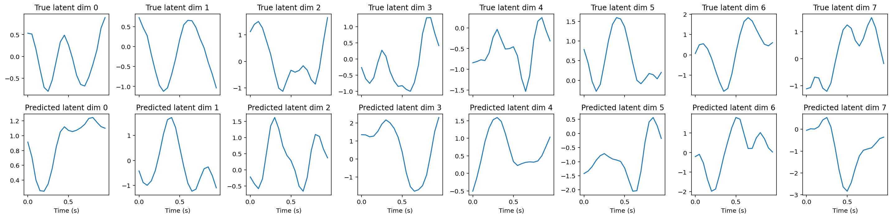
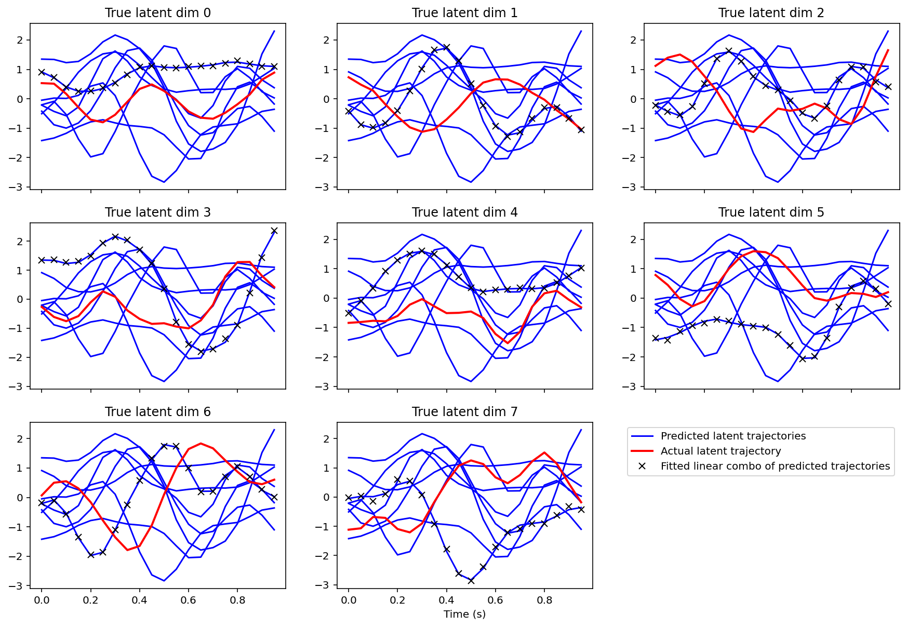
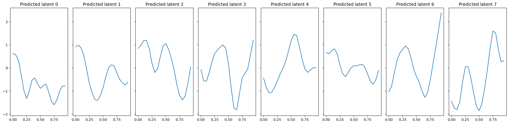
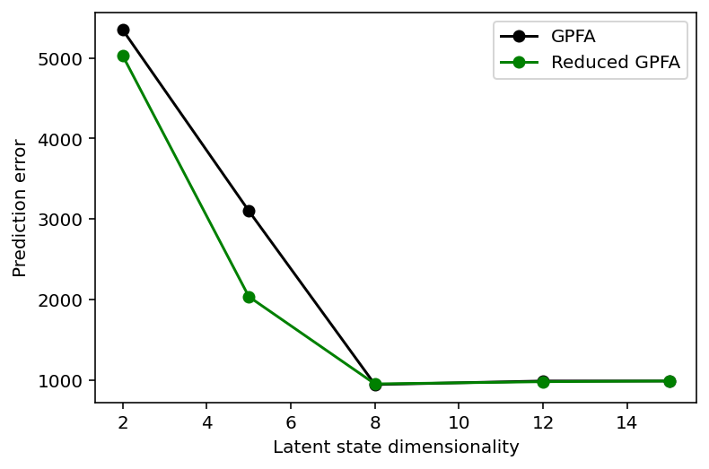
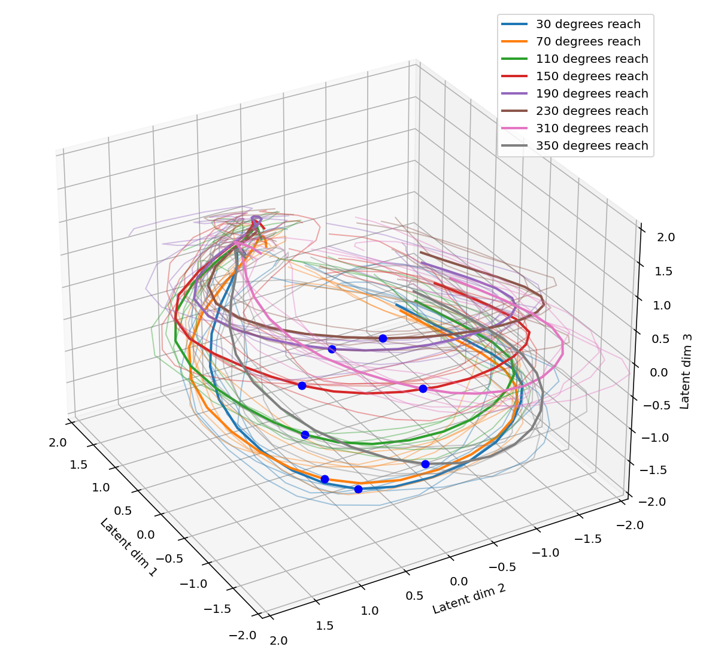

# Exercise 3 Write Up

Joshua Cook

2022-03-30

---

## Section 1: Generate and fit synthetic data from a 1-dimensional latent space

**Look at neural activity in trial 0 and describe the differences you observe between the first 4 neurons.
Inspect equation 1, the data above, and your values for C, d, and R.
Discuss how those parameters affect different aspects of the neural activity.
Could you predict how much a neuron's activity is correlated with the latent trajectory from looking at the parameters?
How?
(You don't have to generate plots to demonstrate this, though you might want to do so if you're not sure of the answer.)**

The latent state and simulated neuron activity are shown in Figure \ref{fig:sim-4-neurons-trial-1}.

The primary difference between the neurons is the amount of noise around the underlying curve of the latent process.
This property of the neuron is predominately controlled by the covariance matrix $R$ for $y|x$.
The larger the value along the diagonal, the more variance in the neuron's activity.

The other difference between neurons is how they are correlated with the latent trajectory.
Some are directly and others are inversely proportional, that is, when the latent trajectory goes up, some neurons reliably increase in activity and others decrease (compare neurons 1 and 3 in Figure \ref{fig:sim-4-neurons-trial-1}).
This is controlled by the sign of the neuron's corresponding value in $C$.
The amplitude of the neurons activity in relation to the latent trajectory is determined by the size of the neuron's value in $C$.

{#fig:sim-4-neurons-trial-1 width=75%}

**In your write-up, discuss how the EM algorithm did at extracting the true parameters.
What would we need to further reduce the error in the extracted parameters?**

GPFA was very good at recovering the true parameters of the simulated data.
This is not surprising as the data was created using the generative model described by GPFA.
Better estimates could probably be obtained by increasing the amount of data or limiting the size of variance parameters.
The main discrepancy between the true and estimated parameters is that the signs for the values of $C$ are inverted.
This is possible because the direction of the latent trajectory and the signs of the elements of $C$ can be inverted simultaneously to produce the same observed neuron activity.

**Compare the true and predicted latent trajectories.
There should be one major difference.
Could you have seen this coming after observing the one major difference between the true and predicted parameters in Section 1.4?
Explain what's going on.**

The major difference is that the real and estimated latent trajectories are inverted (Fig. \ref{fig:sim-real-estimated-latent-trajectories}).
This was expected because the estimated values for $C$ were the inverse of the true values of $C$.
These two entities are multiplied against each other to relate the latent state to the observed neuronal activity.
The estimates are the inverse of the true parameters, but the multiplication results in the same neuronal activity.

{#fig:sim-real-estimated-latent-trajectories width=75%}

## Section 2: Investigating more complex simulated data

**How many latent trajectories were used to create the data?
The time bin size is 50 ms.
How many time bins were used for the latent trajectories?**

There were 8 latent dimensions with 20 time bins.

**The predicted latents don't match the true latents. Did something go wrong or is this expected?**

The predicted and true latents are shown in Figure \ref{fig:mult-latent-real-pred}
This was expected.
The ordering of the latent dimensions is arbitrary, though GPFA may have automatically ordered the predicted latent trajectories by their explained data covariance metric.
In addition, it is possible that the latent space can be described equally well by multiple different sets of latent state trajectories.

{#fig:mult-latent-real-pred width=100%}

**Based on this, do the true and predicted latent trajectories seem to span the same 8-dimensional manifold or not?
Explain why or why not.**

Yes, the predicted latent trajectories spans the true latent manifold.
We know because linear combinations of the true latent trajectories are able to recover the predicted latent trajectories (Fig. \ref{fig:linear-combos-of-latent-states}).
This indicates that they describe the same high-dimensional space.

{#fig:linear-combos-of-latent-states width=75%}

**How does the variance change across non-orthonormalized dimensions 1 through 8?
How does it change across orthonormalized dimensions 1 through 8?
Do you think the fitted model's non-orthonormalized dimension 1 would resemble the ground truth non-orthonormalized dimension 1?
Do you think the fitted model's orthonormalized dimension 1 would resemble the ground truth orthonormalized dimension 1?
Why or why not?**

The variance of the latent dimensions is constrained during fitting to overcome non-identifiability between the scales of $C$ and $\bf{x}$.
Therefore, the variance of the latent dimensions before orthonormalization are all about equal (Fig. \ref{fig:predicted-latents}).
The variance appears to reduce across the orthonormalized dimensions (Fig. \ref{fig:orthonorm-pred-latents}).

It does not appear that the non-orthonormalized nor the orthonormalized latent dimensions resemble the corresponding true latent dimension.
This is expected, though, because the ordering for the true trajectories is random.

{#fig:predicted-latents width=100%}

{#fig:orthonorm-pred-latents width=100%}

**What underlying dimensionality would you assume the neural data has based on these plots?
Do the log-likelihood and prediction errors give similar results?
Why might you use one over the other?**

The test log-likelihood is maximized with 8 dimensions (Fig. \ref{fig:log-likelihood-multilatent-sim}) and the prediction error in leave-neuron-out tests is minimized at 8 dimensions (Fig. \ref{fig:leave-neuron-out-multilatent-sim}) so I would assume there to be 8 latent dimensions in this case.
Both metrics give similar results.
If they were instead different, I would prefer the conclusions from the leave-neuron-out metric because it would indicate if there are neuron trajectories not being accounted for.
Meanwhile, I expect the log-likelihood to continue increasing with more latent dimensions because the model is more able to fit the variability in the data.

{#fig:log-likelihood-multilatent-sim width=50%}

{#fig:leave-neuron-out-multilatent-sim width=50%}

## Section 3: Investigating real neural data

{#fig:movement-through-latent-dims-GPFA width=75%}

**Do you find this visualization technique helpful for getting a handle on what the latent trajectories look like?**

Yes, this visualization (Fig. \ref{fig:movement-through-latent-dims-GPFA}) is helpful, particularly for comparing between reach angle experiments so see how changes in the experiment impact the estimates of the latent space.

**Describe what you see - what happens over time and how does it vary by reach?
Does it seem like the neural trajectories are different for different reaches?
If so, are they well separated?
That is, would you be able to tell what the reach direction was just from observing a single trial trajectory?
Does the relationship of the mean neural trajectories relate to the relationship of the reach directions?**

The plot shows a smooth curve on the axes for latent dimensions 1 and 2 for all reach angle experiments (Fig. \ref{fig:movement-through-latent-dims-GPFA}).
The curves generally start in the same location, but they tend to rise in the 3rd latent dimension as the angle of reach increases.
The mean trajectories for each reach angle are well separated, and it could be possible to determine the angle used in the experiment given the trajectory through these 3 latent dimensions.

## Section 4: Comparing GPFA, PCA & FA on real neural data

**Compare the GPFA trajectories to the PCA and FA plots.
What's the major visual difference (look at the individual trials, not the trial average)?
What difference in the structure of the models explains the visual difference?**

The major visual difference between the latent trajectories of FA (Fig. \ref{fig:movement-through-latent-dims-FA}) and PCA (Fig. \ref{fig:movement-through-latent-dims-PCA}) compared to GPFA is that the trajectories are far smoother in the GPFA visualization.
This is because GPFA is able to take into account the relationship of the data points over time during the dimensionality reduction.
PCA an FA do not account for this relationship between the individual data points.

{#fig:movement-through-latent-dims-FA width=75%}

{#fig:movement-through-latent-dims-PCA width=75%}

**From this plot (Fig. \ref{fig:number-latent-dims-per-model}), what can you conclude about the dimensionality of the latent state driving activity in the recorded neurons?
Do the different models agree or disagree about this dimensionality?
Which result do you think you should trust, and why?**

{#fig:number-latent-dims-per-model width=50%}

It seems like the latent state can be expressed well with between 15 and 20 dimensions using GPFA.
Interestingly, the prediction error of the FA model flattens earlier indicating that we should use fewer latent states for this model.
PCA is likely unreliable in this case for the reasons described by Yu *et al*.
I would use reduced GPFA as it is a good combination of flexibility and regularization and contains FA within it.

**Why are we using prediction error here instead of log-likelihood?**

We cannot use the log-likelihood because PCA is not expressed as a probabilistic model.
Therefore, it does not contain a noise model or likelihood function like FA and GPFA have.

**What is the optimal kernel width for this dataset?**

From the prediction error plots (Fig. \ref{fig:pred-error-bin-width}), it appears that a kernel with a width between 20 and 40 ms would be optimal for FA and 40 ms for PCA.

{#fig:pred-error-bin-width width=75%}
